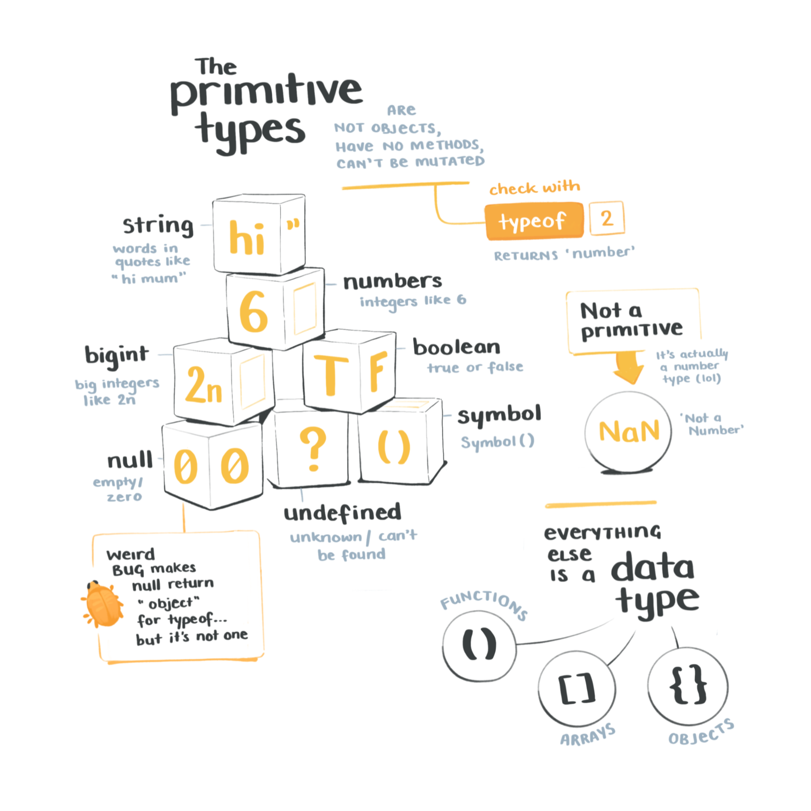
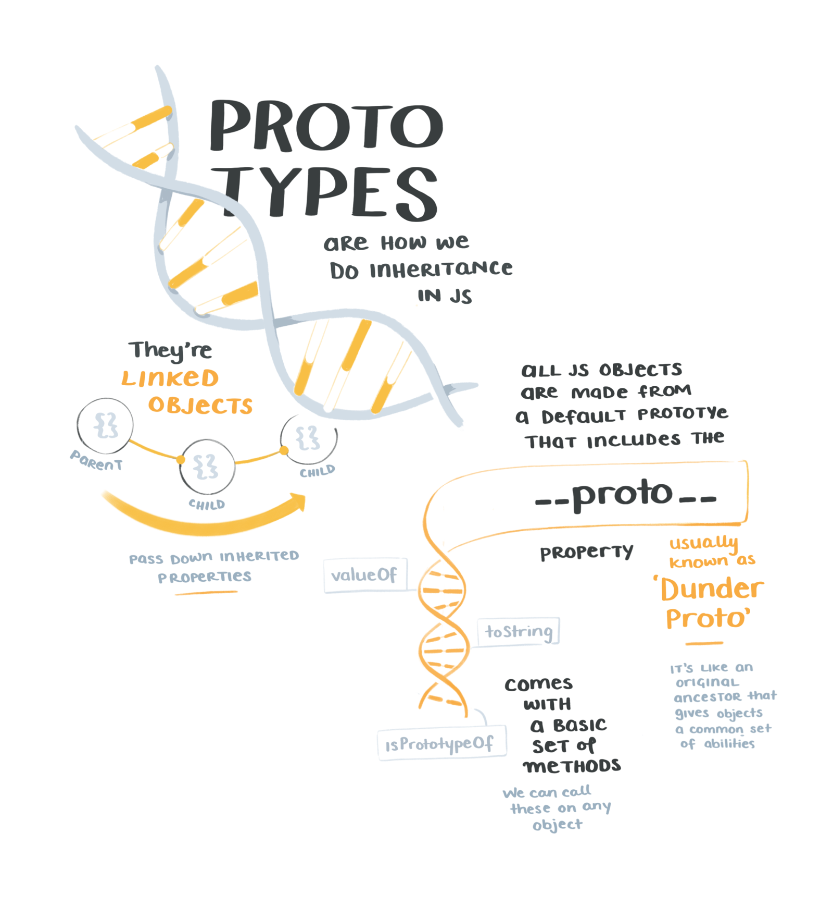
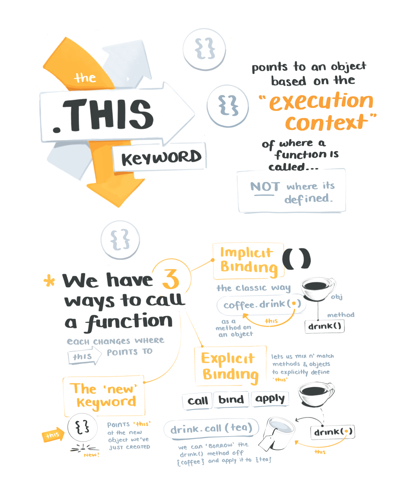

import FullSketchnote from '../../../src/components/mdx/FullSketchnote.js'
import SketchesContainer from '../../../src/components/mdx/SketchesContainer.js'

<SketchesContainer>

The hardest thing about JavaScript is not knowing JavaScript.
So far I've stumbled along without 100% grokking `this` or prototypical inheritance – filled in quite a few holes sketchnoting

 

Fluff fluff fluff

Fluff fluff fluff

Fluff fluff fluff

---

<FullSketchnote coursename="Advanced JavaScript Fundamentals" courselink="http://bit.ly/advanjs">

</FullSketchnote>

</SketchesContainer>