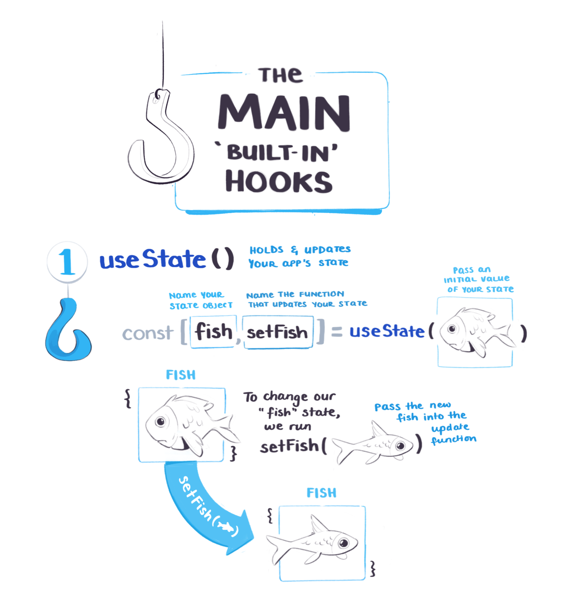
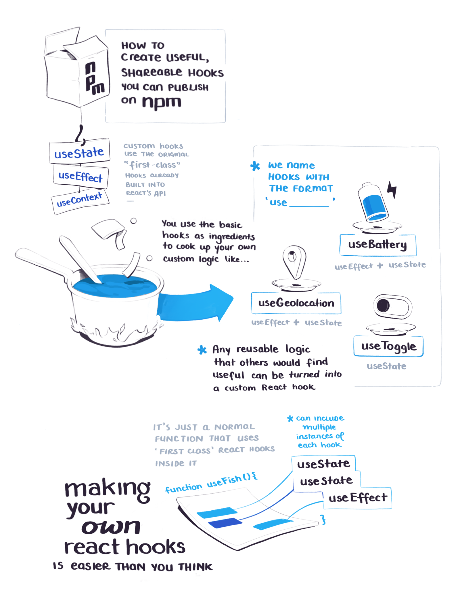
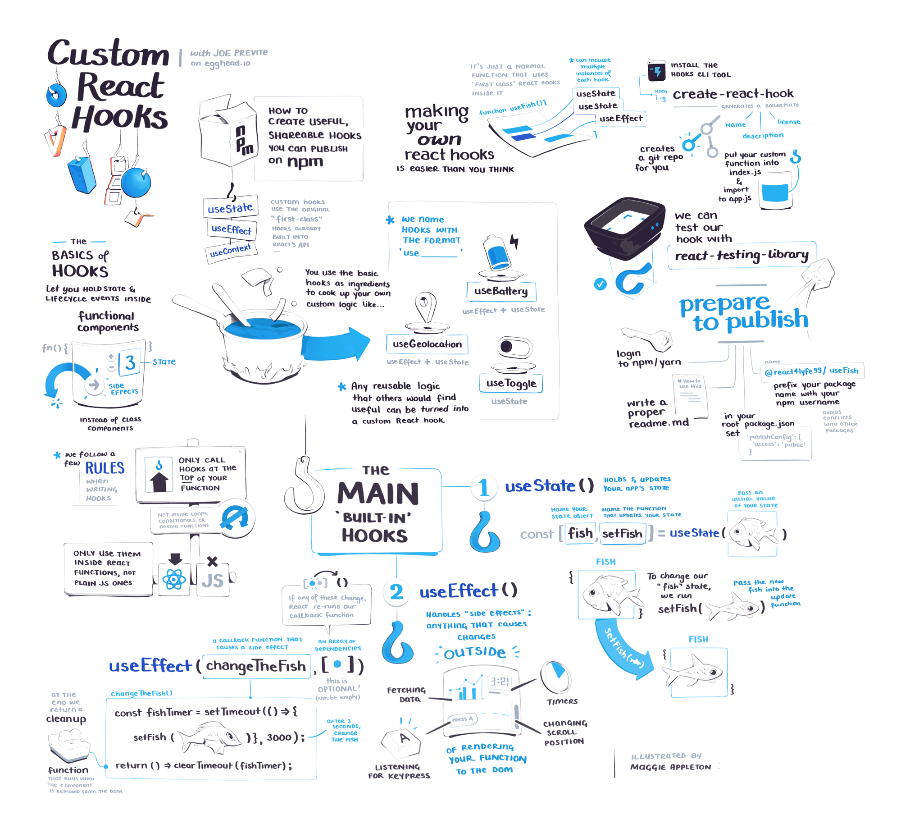

import FullSketchnote from '../../../src/components/mdx/FullSketchnote.js'
import SketchesContainer from '../../../src/components/mdx/SketchesContainer.js'
import Link from '../../../src/components/link.js'

<SketchesContainer>

---

<FullSketchnote coursename="Shareable Custom Hooks in React" courselink="https://egghead.io/courses/shareable-custom-hooks-in-react?rc=272bjb">

</FullSketchnote>

</SketchesContainer>