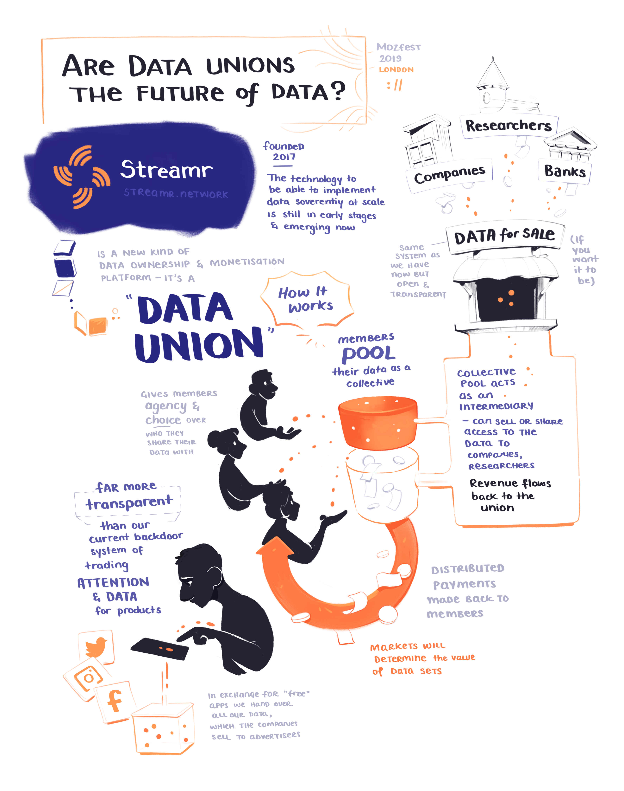

At the end of last year I got to attend [MozFest 2019]() here in London.

[Streamr]()

Have half finished notes in a dropbox PSD file for web monetization. Make it its own post. Basics of what you know about Coil and the Web Monetization API

