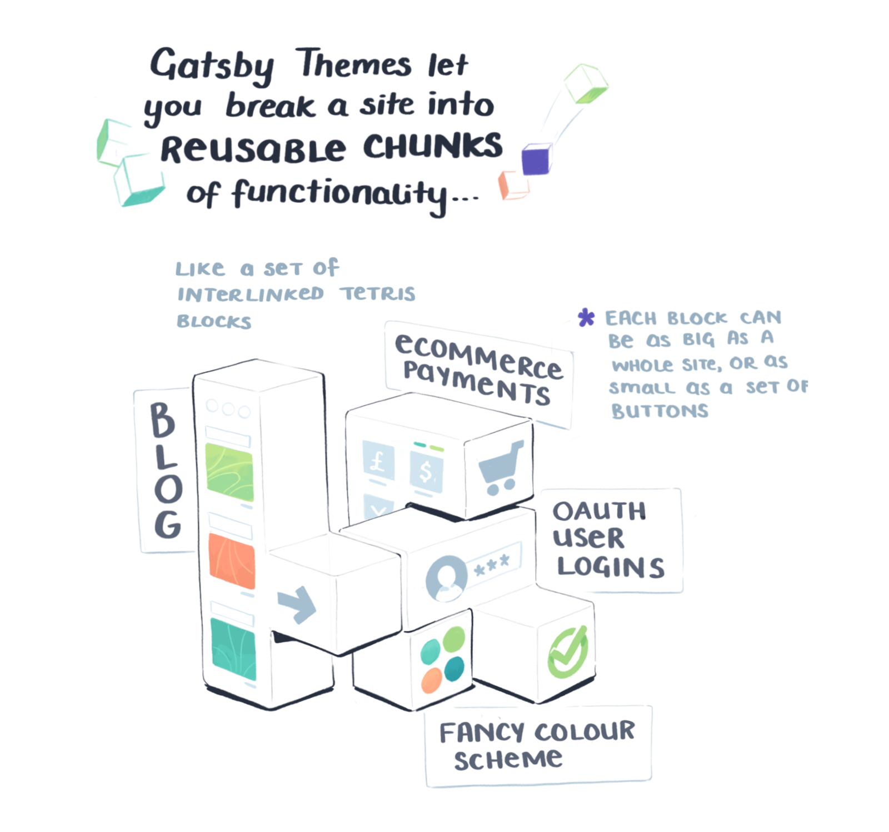
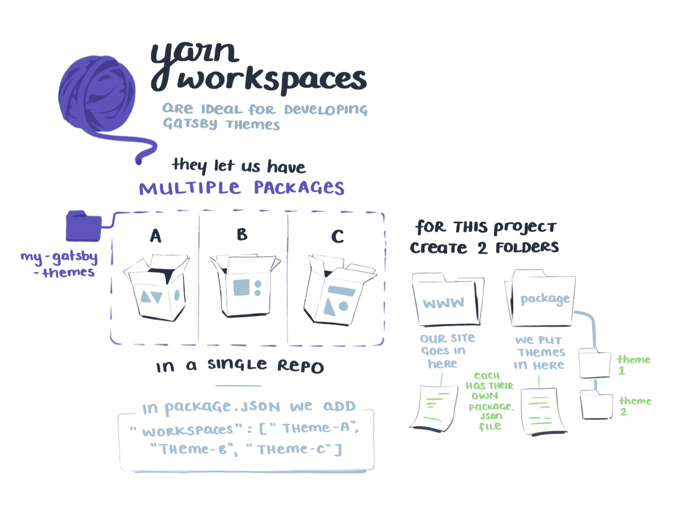
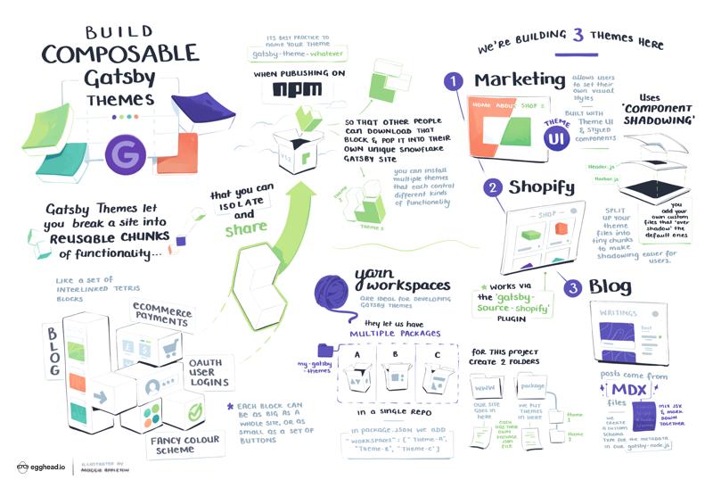

import FullSketchnote from '../../../src/components/mdx/FullSketchnote.js'
import SketchesContainer from '../../../src/components/mdx/SketchesContainer.js'

<SketchesContainer>

More sketchnotes, this time on Gatsby themes!
They're a shiny new feature in @gatsbyjs – little building blocks of site functionality you can mix n' match n' share on NPM.

Fluff fluff fluff

Fluff fluff fluff

Fluff fluff fluff

---

<FullSketchnote coursename="Composing Gatsby Themes" courselink="http://bit.ly/gatsbyt">

</FullSketchnote>

</SketchesContainer>