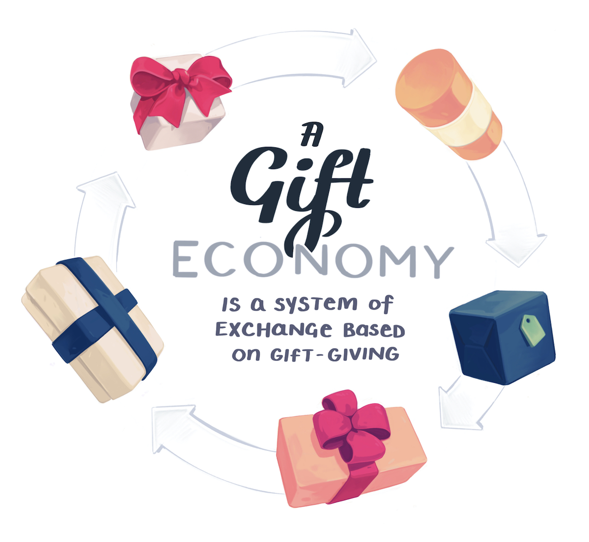

import Link from '../../../src/components/link.js'
import ResourceBook from '../../../src/components/resourceBook.js'
import RefsAndReading from '../../../src/components/mdx/RefsandReading.js'
import RefItem from '../../../src/components/mdx/RefItem.js'
import NotesContainer from '../../../src/components/mdx/NotesContainer.js'

<NotesContainer>

It's one of the <Link to='https://opencollective.com/babel'>largest projects on Open Collective</Link>, running an annual budget of 290,000 USD. And yet it's not a legal company.  
The team of 6 core maintainers are all <Link to="https://babeljs.io/en/team.html">classified as volunteers</Link>, as are the 854 other contributors who have <Link to="https://github.com/babel/babel">contributed to the codebase on Github</Link> .

With over <Link to="https://www.npmjs.com/package/@babel/core">14 million weekly downloads</Link>, it's become such an essential utility in the modern JavaScript toolchain that it blends into the wallpaper.  
Of course you use Babel. Everyone uses Babel.

Babel isn't unique 

In just the past year the ecosystem around Open Source has evolved into some fascinating directions. Github launched <Link to="https://github.com/sponsors/">sponsors</Link> that allows contributions to individuals.
There's been plenty of fuss made over <Link to='https://www.patreon.com/'>Patreon</Link>

<ResourceBook large url='https://www.goodreads.com/book/show/201766.The_Gift' img='https://libcom.org/files/imagecache/article/images/library/9780415267496.jpg' title='The Gift' author='Marcess Mauss' description='Originally published in 1923, Marcel Mauss presented to the world a book which revolutionized our understanding of some of the basic structures of society.' />

---

### References & Further Reading

<RefsAndReading>

<RefItem title="The Plural Economy of Gifts and Markets" url="" />

<RefItem title="Coding Freedom: The Ethics and Aesthetics of Hacking" url="" />

<RefItem title="The Gift" url="" />

<RefItem title="The Moral Economy of Digital Gifts" url="" />

<RefItem author="" title="The Cathedral and the Bazaar" url="" />

<RefItem author="" title="Open Source Beyond The Market" url="" />

</RefsAndReading>

</NotesContainer>