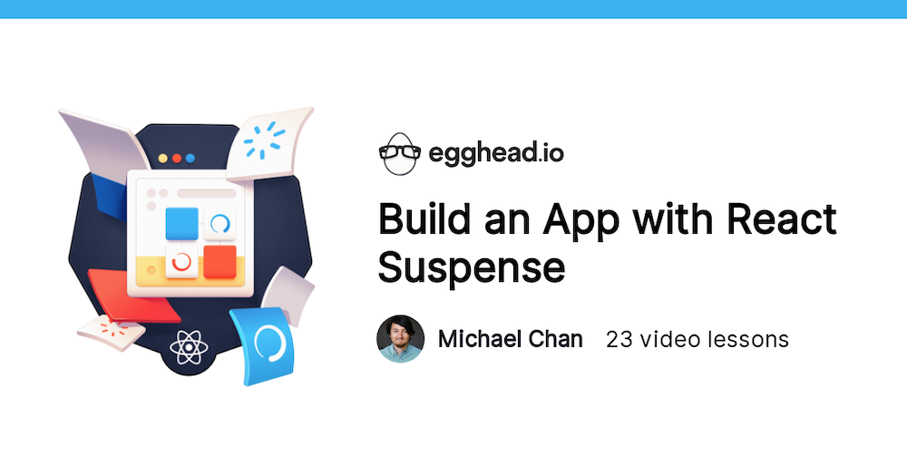
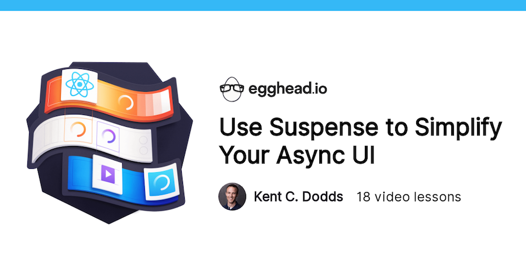
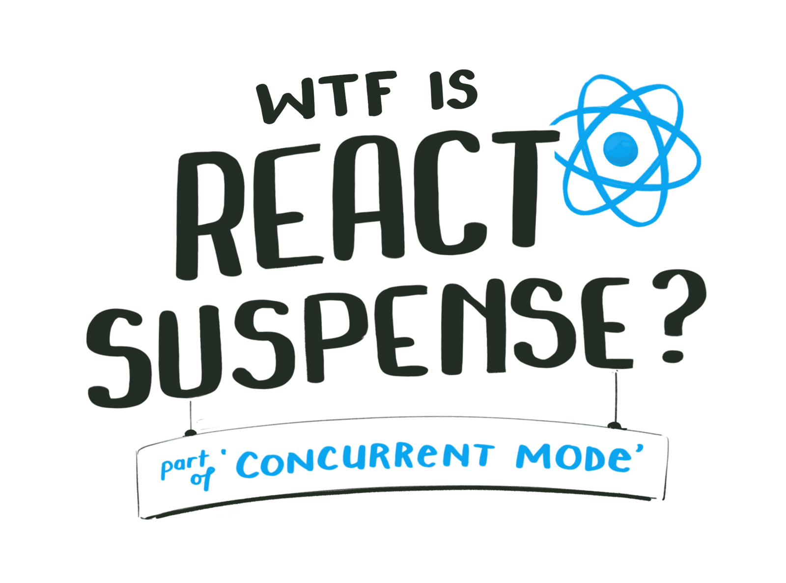
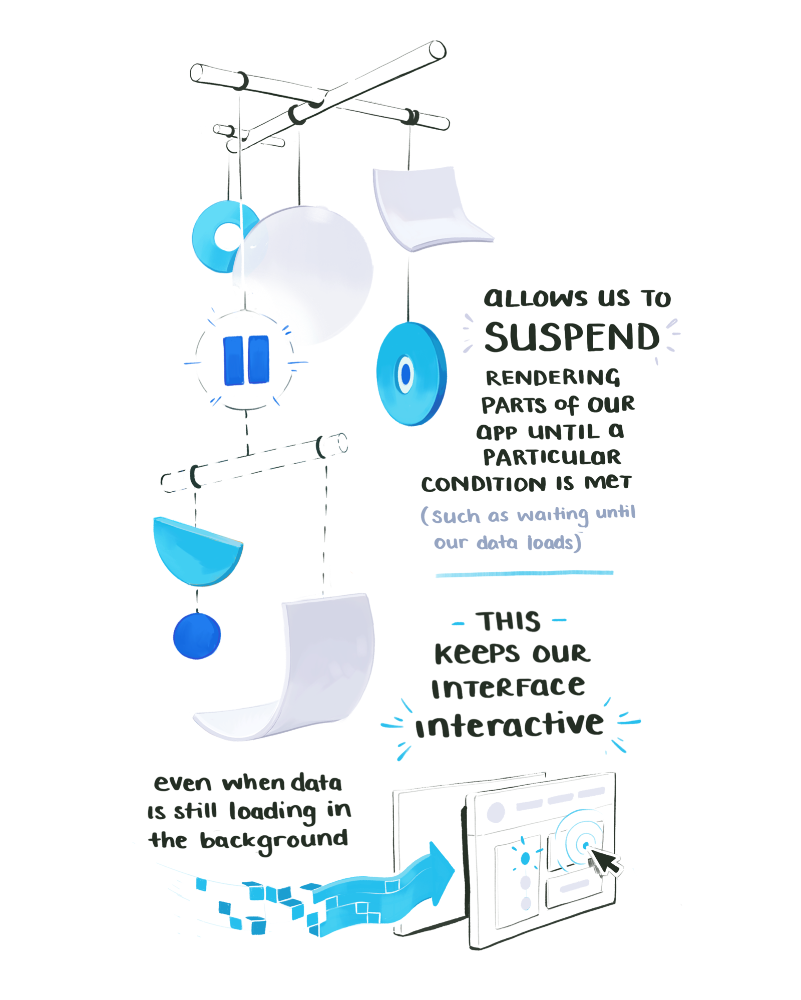
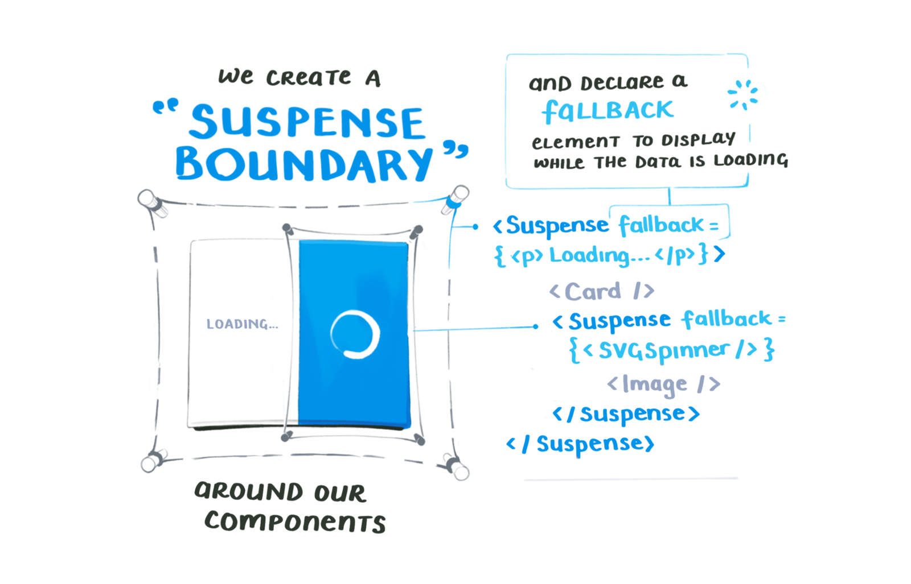
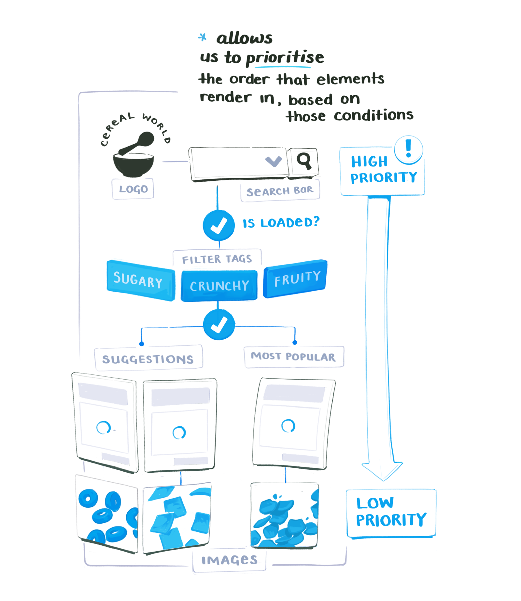
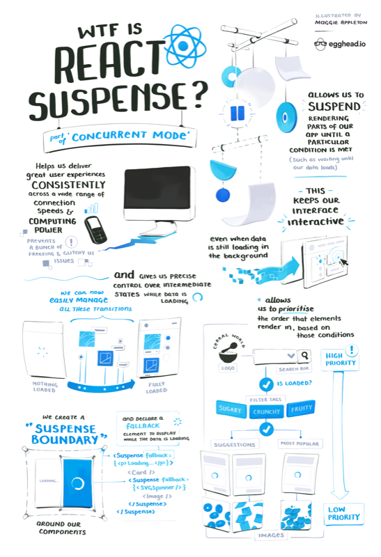

import FullNote from '../../../src/components/mdx/FullNote.js'
import NotesContainer from '../../../src/components/mdx/NotesContainer.js'
import Link from '../../../src/components/link.js'
import SmallCenter from '../../../src/components/mdx/SmallCenter.js'

<NotesContainer>

With all the React Suspense buzz going around, some of you might be wondering WTF it is / why it matters
I made a handy one-page guide to help explain

[Kent C. Dodds](https://twitter.com/kentcdodds)

[Michael Chan](https://twitter.com/chantastic)

Fluff fluff fluff

Fluff fluff fluff

---

<h2 style="text-align: center; margin-bottom: 0;">The Whole Illustrated Note</h2>
  

<h3 style="text-align: center;
          font-size: 1.5em;
          margin-top: 1.2em;">
        Want to learn more?
      </h3>
      

        A high-res & printable version of the notes, plus the full course
        is avaliable here on the{' '}
        <a href='#' rel='noopener noreferrer' target='_blank'>
          The Name
        </a>{' '}
        page.
      

</NotesContainer>

