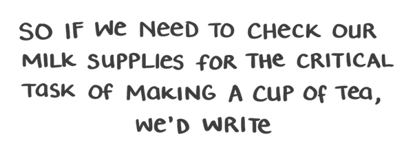

import ThreeColumn from './ThreeColumn'
// // Note to self - styled components in the MDX folder automatically import like this:
// import Divider from 'Divider'

<div style="display: grid;
  grid-gap: 40px;
  grid-template-columns: repeat(auto-fill, minmax(250px, 1fr));
  align-content: center; margin-top: 60px">


<span>

Introduced in ES6 / ES 2015, the ternary operator helps us make decisions about which code to run based on a condition.  

It essentially does the same thing as an if/else statement, but is _way_ shorter and quicker to write.

```jsx
 if (problems > 99) {do this}
 else if (problems < 99) {do that}
 else if (problems === 0) {actually do this}
 else {or maybe this other thing}
```

If you're not familiar with if/else statements [give the docs a quick read](https://developer.mozilla.org/en-US/docs/Web/JavaScript/Reference/Statements/if...else)

</span>

</div>


<br />

In code it looks like this:

<div style="max-width: 70%; margin: 0 auto; marginTop: 120px">



</div>

<hr />

Aside from refilling the milk, it’s commonly used for X, Y, and Z

<ThreeColumn>

<p>Use One</p>

<p>Use Two</p>

<p>Use Three</p>

</ThreeColumn>