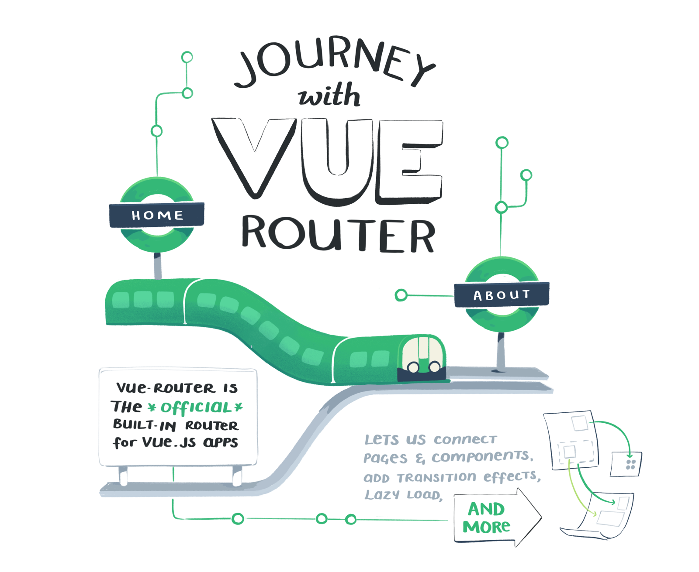
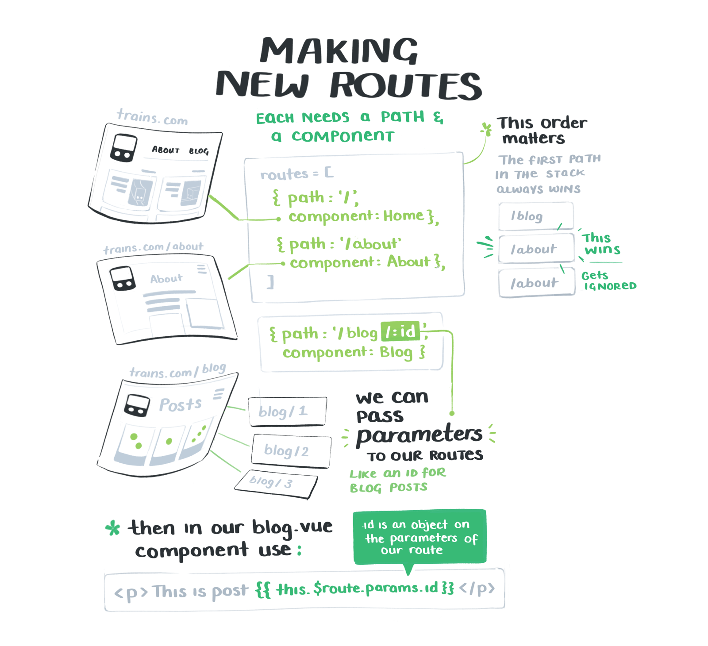
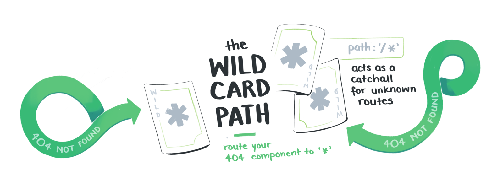
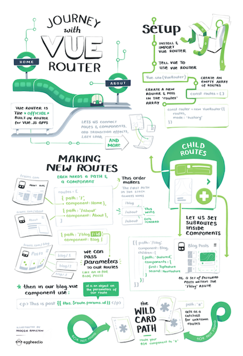

import VerticalSketchnote from '../../../src/components/mdx/VerticalSketchnote.js'
import NotesContainer from '../../../src/components/mdx/NotesContainer.js'

<NotesContainer>

The journey to the centre of the Vue-niverse all starts with routing 🚂🚂🚂🌌

New illustrated notes on @laurieontech's 'Journey with Vue-Router' @eggheadio course – learn to go all the places in @vuejs 👉http://bit.ly/vuerou 

[Laurie Barth](https://twitter.com/laurieontech)

Fluff fluff fluff

Fluff fluff fluff

---

<VerticalSketchnote coursename="Journey with Vue-Router" courselink="http://bit.ly/vuerou">

</VerticalSketchnote>

</NotesContainer>