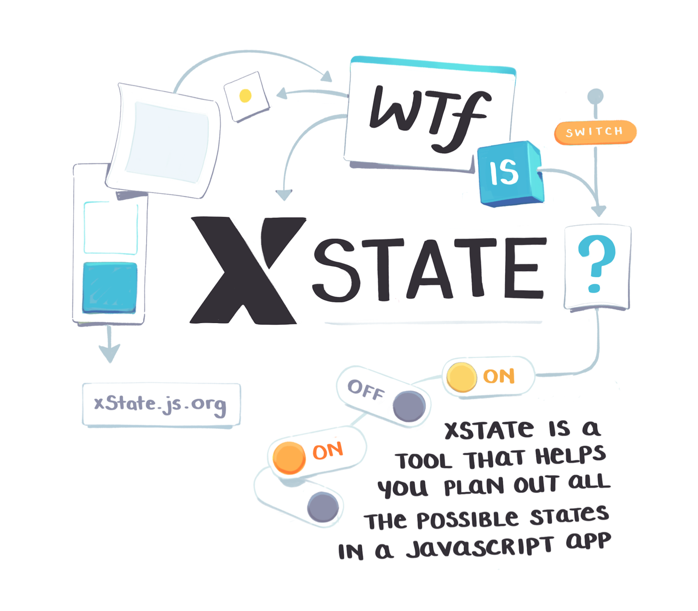
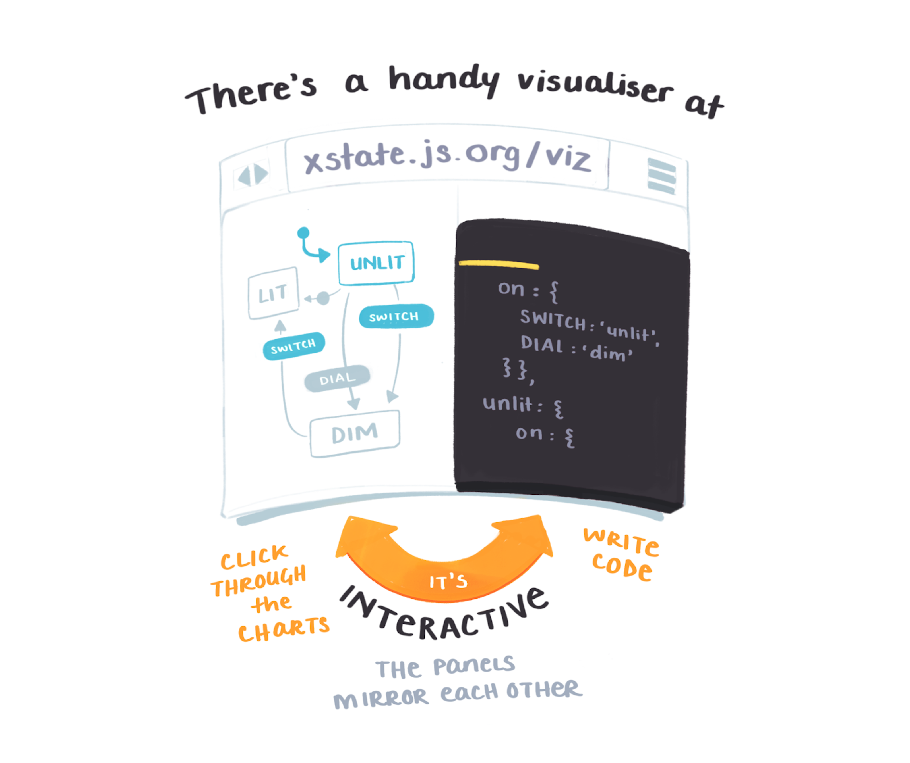
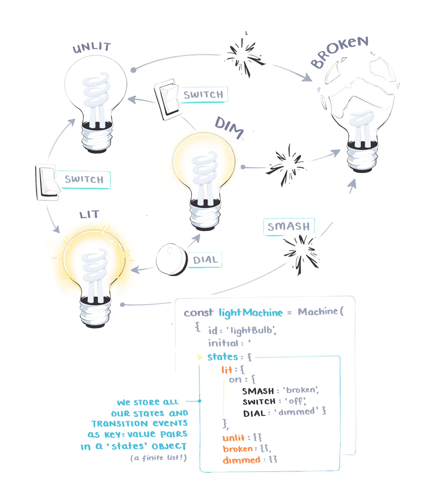
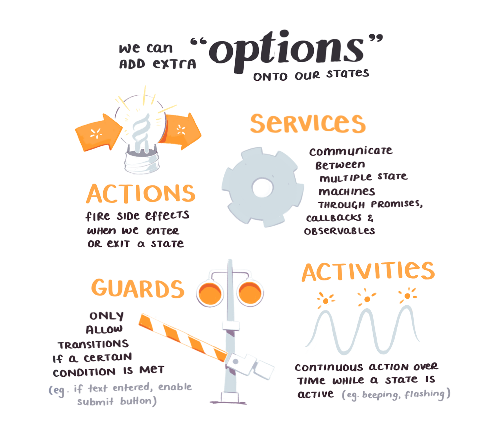
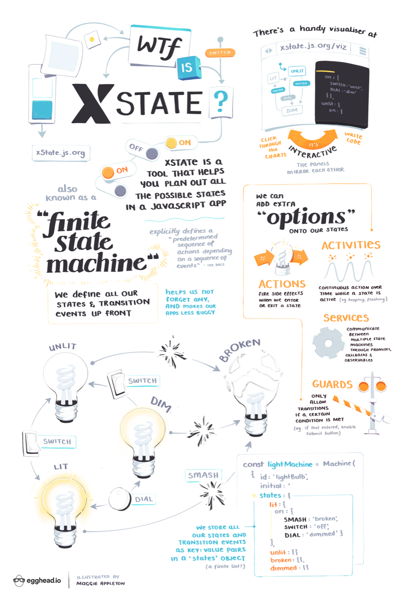

import NotesContainer from '../../../src/components/mdx/NotesContainer.js'

<NotesContainer>

Fluff fluff fluff

Fluff fluff fluff

Fluff fluff fluff

---
[Kyle Shevlin](https://twitter.com/kyleshevlin)

Introduction to State Machines and XState
http://bit.ly/ixstate

[Issac Mann](https://twitter.com/MannIsaac)

Construct Sturdy UIs with XState
http://bit.ly/ui-xstate

<h2 style="text-align: center; margin-bottom: 0;">The Full Sketchnote</h2>
  

<h3 style="text-align: center;
          font-size: 1.5em;
          margin-top: 1.2em;">
        Want to learn more?
      </h3>
      

        A high-res & printable version of the sketchnote, plus the full course
        is avaliable here on the{' '}
        <a href='#' rel='noopener noreferrer' target='_blank'>
          The Name
        </a>{' '}
        page.
      

</NotesContainer>