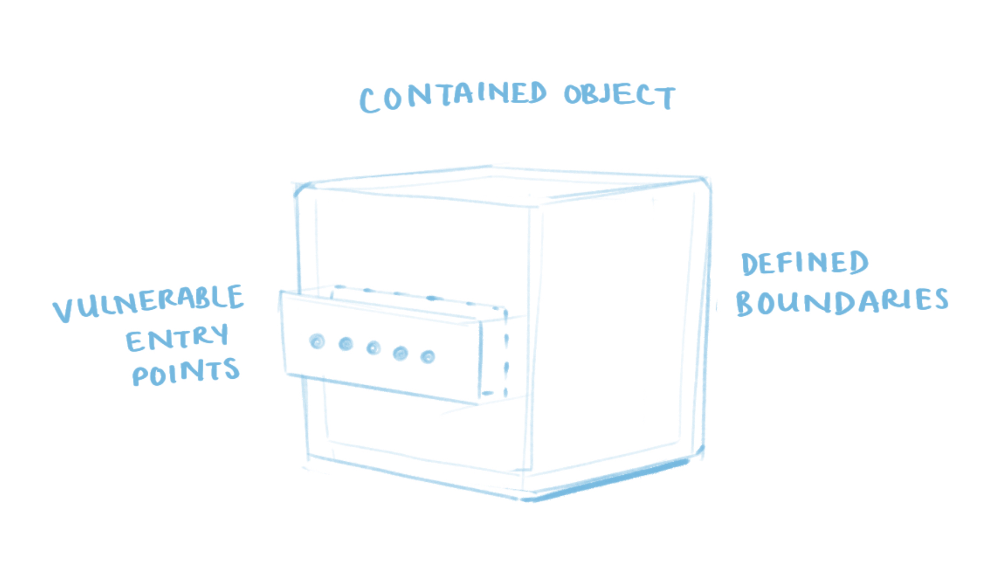
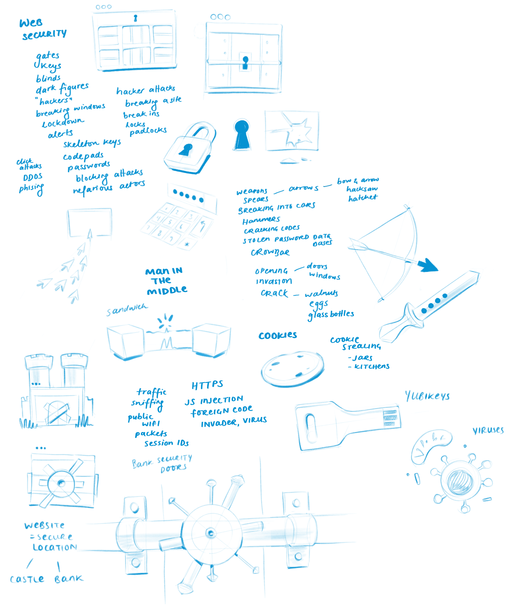
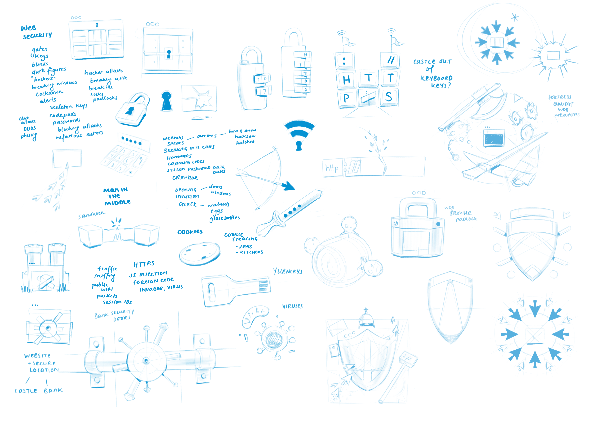

import TwoCol from '../../../src/components/mdx/TwoCol.js'
import SmallCenter from '../../../src/components/mdx/SmallCenter.js'

[Part 1]()  °  [Part 2](#)  °  [Part 3](#)

---

Drawing invisible things is the best and worst job.

This is a case study showing the process of illustrating a course.

Every egghead course gets a big main course illustration.

Like this

[CSS Selectors in Depth](https://egghead.io/courses/css-selectors-in-depth)

Or this

[Reduce Redux Boilerplate with Redux-Actions](https://egghead.io/courses/reduce-redux-boilerplate-with-redux-actions)

Or this.

[A Journey with Vue-Router](https://egghead.io/courses/a-journey-with-vue-router)

So far I've made xxx of these over the last 4 years and can reasonably say I know a little about how to do this.

[Canvas of a whole bunch of them]

They are _always_ on topics that are:  
a) fundamentally asbtract  
b) haven't been around long enough for our culture to develop a set of meaningful icons and visual symbols for them

**Which certainly makes my job interesting.**

Try, for a moment to imagine what "[Typescript with React](https://egghead.io/courses/use-typescript-to-develop-react-applications)" visually looks like.

Or "[A Server-rendered ReactJS Application with Next.js](https://egghead.io/courses/build-a-server-rendered-reactjs-application-with-next-js)"

Or the "[State Monad in JavaScript](https://egghead.io/courses/state-monad-in-javascript)"

I expect many people will be here hoping to learn what pixel size I set my #EAEFF1 brush to in order to careful render a diffuse light across a relfective metallic surface in Photoshop CC 2020 on a 15-inch Macbook Pro 2015 hooked up to a Wacom Cintiq 22HD running OS Catalina 10.15.1.

This is not that blog post. 1

1 (Footnote element: If you would like to learn how, take Sam Neilson's Fundamentals of Lighting on Schoolism. It will drown you in the minutiae of rendering light on surfaces. Also check out the Resources page)

## Part One – What are we doing?

The guinea pig in this walkthrough is [Mike Sherov]()'s upcoming course Web Security Essentials

It is good to make obvious that "Web Security" is not a single, physical, made-of-atoms object in the world.

Thus begins our problem.

# How do you draw a thing that's not a thing?

Good question.  
Capturing the essence of any historically-constructed, fuzzy-edged, evolving cultural concept like "Web Security" is ...

The best answer is **Metaphor**

Conceptual metaphor is the basis of how we draw every single non-literal object. Drawing anything non-physical abstract __thing__ – freedom, financial crashes, racial tension, teamwork, speculation, database management, capitalism, productivity – all relies on conceptual metaphor. 

My job is less about drawing lines and picking colours than it is about designing and building metaphors 

Finding the right visual metaphor is a going to be a glorious scavenger hunt through language, iconography, and cultural association.

### Let's look at these again

Part of getting good at visual metaphors is explicitly realising when you're seeing one and working backwards to break down how it's working.

CSS selectors = picking specific architectural elements of a house to colour in with a historical throwback to the Sims 2 UI

Redux-actions = video game controllers

Vue-router = an underground railway system. Pages in an app are stations.

---

## Part Two – Idea Dumping

Our first order of business is getting a grip on what this course is about.

Mike's [handy workshop outline](https://github.com/mikesherov/web-security-essentials) 

### Dump All the Ideas

Idea dumping is the best way to ...

What this looks like is a freewheeling list of associated words and concepts.

At this point I open up Procreate on my iPad Pro and create a new blank canvas
It's 4000 x 5000 pixel at 144dpi(2) – this gives me a ton of open space to work in. Nothing worse than running out of imaginary digital paper.

(2) The size and dpi of this canvas make absolutely no difference to the quality of the brainstorming we're about to do but someone is going to ask 😉

I start jotting down all the obvious associations that immediately come to mind: 

- Hacking, the dark web, protection, DDOS, click attacks, man in the middle attacks, honeypot wifi, firewalls, breaching systems, botnets, zero day vulnerabilities, exploits, phishing, malware, ransomware, bitcoin ransoms, spoofing, trojan horses, VPNs, white-grey-black hats, password dumps, password cracking, cryptography, algorithms, cookies

- Picking locks, skeleton keys, lock picking kits, padlocks, bike locks, security shutters, Fingerprints, scanners, secure buildings, swipe cards, lanyards

- Breaking in, breaking glass, smashing windows, disabling, turning off systems, glitches, slipping underneath, blowing it all up, shelter, cover, umbrella, raining attacks

- Castles, bricks, thick walls, moats, scanning the landscape, watch towers, fire, torches, great wall of china, signals, catapults, medieval armoury, forts, 

- Shields, barriers, bullet-proof vests, Knights, swords, horses, jousting, Bow & Arrows, arrows in a shield, robin hood, target practice, nail on the head, arrow in the apple, firing click-arrows, guards, Buckingham palace, the panopticon, gates, wrought iron, monitoring, watching, eyes, police, TSA, metal detectors, CCTV cameras, surveillance, warning signs, lasers, MI5, recording devices

- Immunity – immune system, inflammation, disease, cancer, T cells, viruses, microscope images of bacteria, infections, antibiotics, vaccinations

What we're doing here is laying out **a conceptual map** to explore.

It's pretty good but there's one issue with it.  
It's only _my_ assocations with "Web Security."  
And this illustration isn't for me. It's for _you_.

Maybe you personally.  
But in a generalised sense, the large lovely community that revolves around egghead.io and the world of web development.  
It needs to yell "I am about Web Security!" to everyone that sees it.

This requires cultural research. Which is where this gets fun. 

## Part Three - Cultural Ethnography

If we want to find out the general cultural conceptions around "Web Security," we head to the native watering holes of the internet - Hacker News,reddit, and twitter.
What I'm looking for are overarching cultural tropes, touchstones, and metaphorical language.

[r/cybersecurity](https://www.reddit.com/r/cybersecurity/)
[r/cybersecurity](https://www.reddit.com/r/websecurity/)

Some things that jump out – "penetration testing" "risk management" "secure field login" "third-party vendors" "XSS" "vulnerability" "injection"

Overall noticing empahsis on entry points like login forms. It's noticing we speak about websites as contained objects that have physical boundaries and vulnerable entryways into that container.
Chinks in the armour. Gatewatys into the fortness. Cracks in the walls. Underground tunnels into mission control. Injections into the human body - our skin is our container.

### Language Analysis

I am a huge nerd for linguistic analysis tools. These are like a thesaurus on steroids.

<TwoCol>

#### [OneLook](https://www.onelook.com/thesaurus/)

#### [TV Tropes]()

A quick search on here turned up [security blankets](https://tvtropes.org/pmwiki/pmwiki.php/Main/SecurityBlanket), [overreactive TSA agents](https://tvtropes.org/pmwiki/pmwiki.php/Main/OverreactingAirportSecurity), [laser hallways](https://tvtropes.org/pmwiki/pmwiki.php/Main/LaserHallway), and [magical CCTV cams](https://tvtropes.org/pmwiki/pmwiki.php/Main/MagicalSecurityCam)

</TwoCol>

#### [iWeb English Corpora](https://www.english-corpora.org/iweb/)

First, I'm sorry about this one. Someone built this website back in 1994 and hasn't touched it since.  The UX is a horror show and I only understand 37% of how it works.  That 37% is well worth it though.

// Video voiceover of searching on it. 

At this point I have a very generic form in my mind of some kind of __container__ that has __defined boundaries__ and __vulnerable entry points__

It's a rough image in my mind but it's a base set of conditions to build a visual metaphor off.

* The human body
* A gated fortress / secure building
* A biological cell
* Locked box

While doing all this research and idea generation I open up a new blank canvas on my iPad and start loosely jotting down all the themes and visual ideas I'm stumbling across. 

It's words from the idea dummp list, small icons that relate to them

---

# Split here. Next bit goes in Part 2 post

---

## Part Four - Playful Remixing

Now that we have some interesting ingredients on the page we get to start playing.

Edward de Bono's Lateral Thinking had an enourmous influence on me.

[Lateral Thinking summary post]

###### He's written too many books at this point (which frankly are mostly just glorified remixes of the original idea), so I'd suggest only looking at the original ones: Serious Creativity and Lateral Thinking

Thinkertoys was another good one.

There's plenty of different creative brainstorming techniques and I use a few of them interchangeably. For this post I'm just going to focus on my favourite – SCAMPER

[Add printable cheatsheet on SCAMPER]

I start selecting out elements and applying techniques; substitute, combine, adapt, maximise and minimise, eliminate, put to other uses, and rearrange reverse.

Look at our list of "ingredients" and start mashing them together

Here's some more tangible examples of each

### Substitute

Keyboard keys for castle bricks

### Combine

HTTPS letters for padlock dials

### Adapt

### Maximise or Minimize

### Put to Other Uses

### Eliminate

Now our brainstorming page is expanding.

While running through these remix exercises I'm also thinking of all these as "mini-scenes"