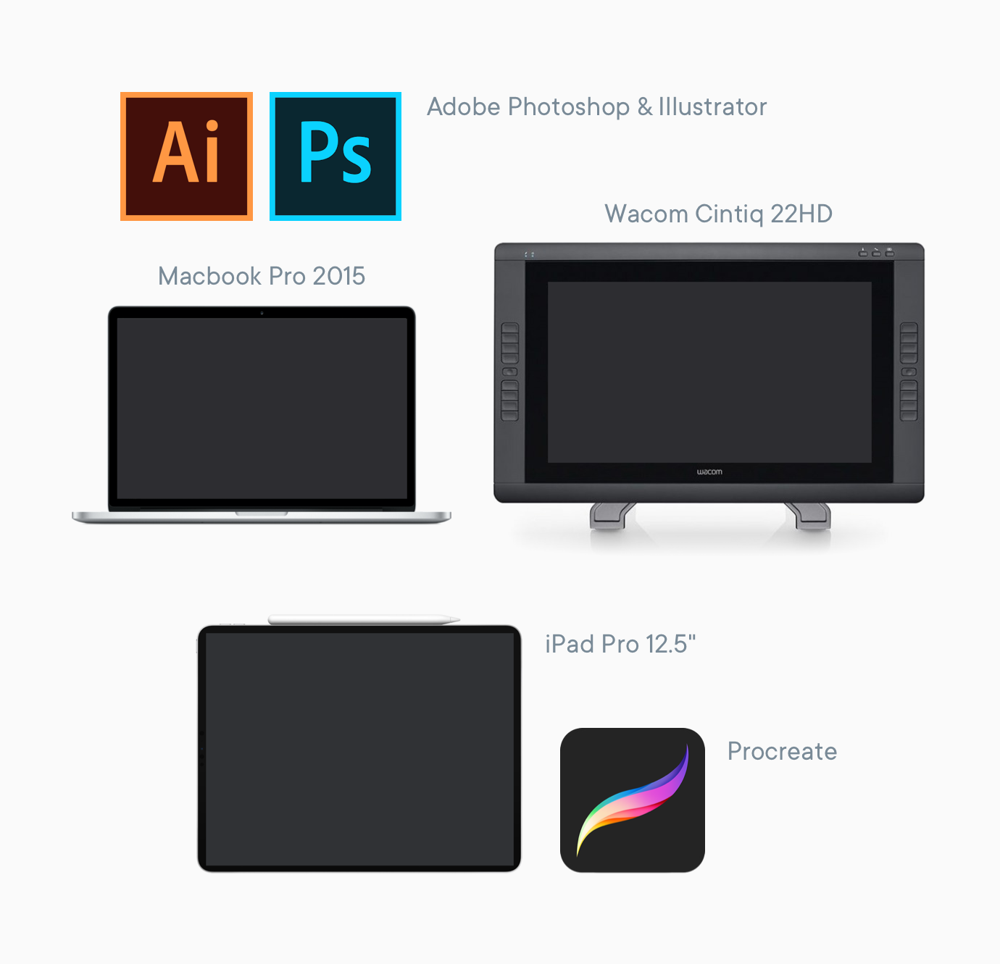
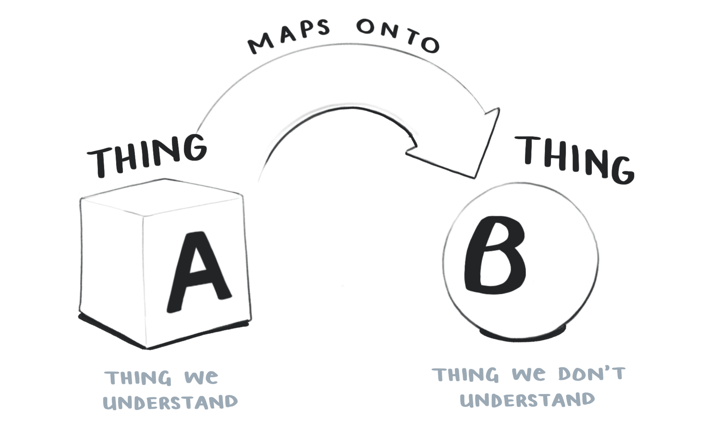
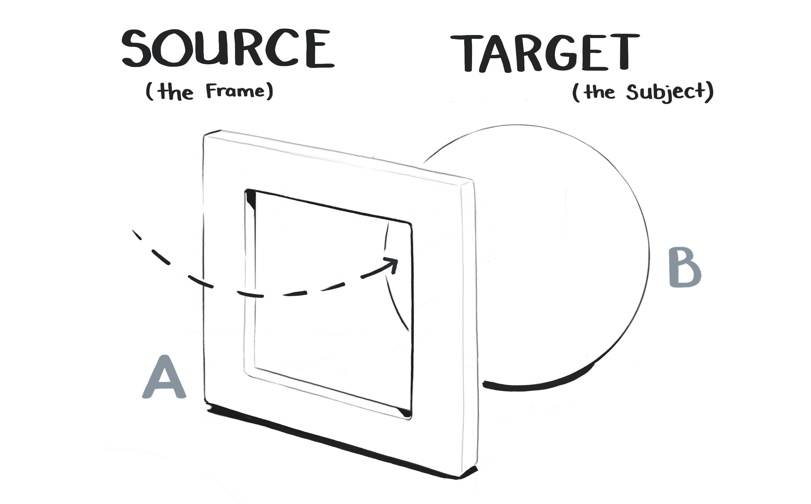
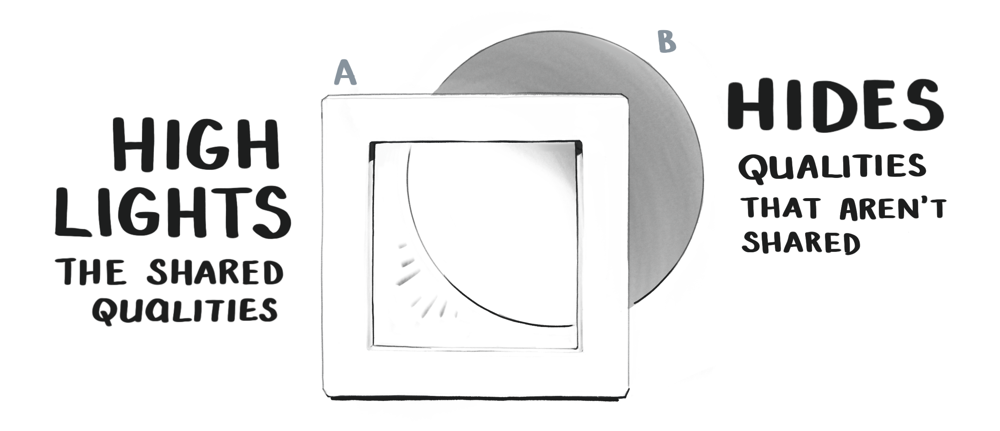
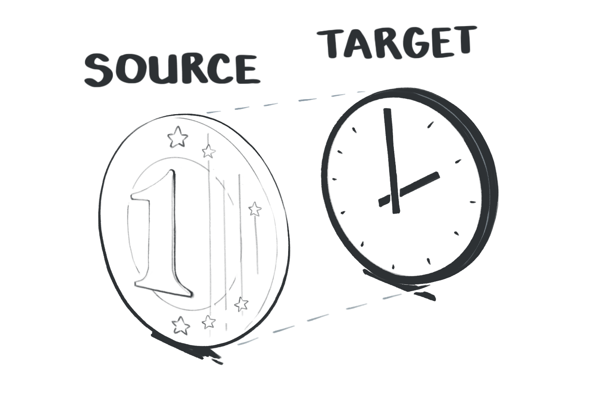

import SmallCenter from '../../../src/components/mdx/SmallCenter.js'
import Feature from './Feature.js'
import FourImageGrid from '../../../src/components/mdx/FourImageGrid.js'
import EggheadCourseCard from '../../../src/components/mdx/egghead-course-card.js'
import MultipartIntro from './MultipartIntro.js'

---

<SmallCenter>

This is a long, overdue case study showing how I make an <Link to="https://egghead.io/">egghead</Link> course illustration.

It spans everything from <Link to="https://en.wikipedia.org/wiki/Conceptual_metaphor">cognitive metaphor theory</Link> to Photoshop rendering so I hope you have a hot, caffienated beverage with you.

<h5>It also comes in four parts</h5>

</SmallCenter>

<MultipartIntro />

<!-- [map of the outline]
[timeline map of he stages of an illustration we're going to walk through - research section. Stating the mission (single point), declaring keywords, building word lists and visual symbols, lateral thinking and playing around, judging yourself, making choices, refining composition, value structure and colour mocks (same step), *enter automatic pilot mode*, video recording of adobe illustrator vector base, vector refining, export to photoshop, painting in photoshop.] -->

## An Introduction

If anyone is new, here's the TLDR:
I'm <Link to="http://maggieappleton.com/">Maggie</Link> and I make all the things on this site. For the last half decade I've also been the art director & lead illustrator over at <Link to="https://egghead.io">egghead</Link>.

We're a company / website / collection of humans who teach web development through a mix of tutorial videos, articles, illustrated notes, workshops, and whatever other medium we feel like.  
As you might expect, it's a whole lot of JavaScript, React, GraphQL, Vue, classic HTML & CSS, and other internety technologies.

My job involves taking all those abstract, hard-to-explain programming concepts and making them visible in a way that helps people understand them. Sometimes through illustrated notes, or animations, or diagrams, or interpretive dance on zoom calls.

One part of that work is making _**course illustrations**_, which are like album cover art for all the courses we publish.  <Tooltip tiptext={I don't make all of our illustrations  – I work with a rotating team of freelancers who help with the load. Lovely folks like <a href="https://dribbble.com/maximebourgeois">Maxime</a> and <a href="https://dribbble.com/Aleksandr_Ageev">Aleksander</a> have made plenty of them.}>1</Tooltip>

Here's a few of them...

<ImageGrid>

<EggheadCourseCard title="CSS Selectors in Depth" url="https://egghead.io/courses/css-selectors-in-depth?af=54fd64" image="https://d2eip9sf3oo6c2.cloudfront.net/series/square_covers/000/000/235/full/EGH_CSSSelectors_Final.png" />

<EggheadCourseCard title="Create Transitions with React Transition Group" url="https://egghead.io/courses/create-smooth-performant-transitions-with-react-transition-group-v2?af=54fd64" image="https://d2eip9sf3oo6c2.cloudfront.net/series/square_covers/000/000/213/full/EGH_React_Transitions_Final.png" />

<EggheadCourseCard title="Reduce Redux Boilerplate with Redux-Actions" url="https://egghead.io/courses/reduce-redux-boilerplate-with-redux-actions?af=54fd64" image="https://d2eip9sf3oo6c2.cloudfront.net/series/square_covers/000/000/140/full/EGH_ReduxActions_1_Final.png" />

<EggheadCourseCard title="A Journey with Vue-Router" url="https://egghead.io/courses/a-journey-with-vue-router?af=54fd64" image="https://d2eip9sf3oo6c2.cloudfront.net/series/square_covers/000/000/354/full/VueRouter.png" />

</ImageGrid>

 

And a couple more...

<FourImageGrid>

</FourImageGrid>

So far I've made over 150 of these things and I'm almost beginning to think I know what I'm doing.

---

## Part Zero – What are we doing?

The guinea pig for this case study is going to be <Link to="https://twitter.com/mikesherov">Mike Sherov</Link>'s course on <Link to="https://egghead.io/courses/web-security-essentials?af=54fd64">Web Security Essentials</Link>.

To give you a brief overview, it's a course that teaches you how to protect a website against classic internet attacks like man in the middle, cross-site scripting, and cookie hijacking.

The first step in starting a design task of any kind – illustration, innovative sandwich recipe, carbon capture technology – is making the challenge you're facing nice and clear. So let's write ourselves a challenge statement:

>Create an illustration that clearly communicates the idea of "Web Security"

That might seem dumb and obvious, but you'd be surprised how easy it is to get off track without stating the goal up front.

At this point it's good to make clear that _"Web Security"_ is not a single, physical, made-of-atoms-and-quarks object in the world.

Thus begins our problem.

### How do you draw a thing that's not a thing?

It's a good question.
One I've been obsessed with for a while.

Drawing well is difficult in its own right. Making a dog look like a dog or hand look like a hand requires a lot of training, practice and patience. 
It's a whole extra challenge to figure out what the _thing_ you're going to draw is in the first place.

How do you take a historically-constructed, fuzzy-edged, evolving cultural concept like "Web Security" and condense it down to a single image?

The answer, in short, is a mix of **cultural symbols** and **visual metaphor**. Though there's a little more to it than that.

Good, meaningful illustration works in four layers.  
I like to think of it as a cake:

You start with a solid base of visual metaphor. Add on a layer of clear, well-constructed drawing. Then you think about designing an aesthetically pleasing composition with <Link to="https://www.smashingmagazine.com/2014/03/design-principles-visual-perception-and-the-principles-of-gestalt/">gestalt principals</Link>. And finally you throw fancy lighting and pretty colours over the top of it. <Tooltip tiptext='Not an official theory of any sort - just IMHO. Feel free to email this to real illustration professors and PhD students so they can burn it on the sacrificial cross of correctness'>3</Tooltip>

### Tool Talk

A whole lot of people ask about the whipped cream and cherries sitting at the very top of that cake.

>"What app is that?"

This happens in every industry – the most visible top layer of any creation feels like the most imporant part of it. Asking what tool someone uses is a very logical and legitimate question.

So let's get the tool talk out of the way. Here's my tech stack:

I do all my brainstorming and sketching in <Link to="https://procreate.art/">Procreate</Link> on an iPad Pro 12.5"
Once I'm ready to make the final, I use a combination of Adobe Illustrator and Photoshop. My main machine is a Macbook Pro 2015, hooked up to a <Link to="https://www.wacom.com/en-us/products/pen-displays/cintiq-22-hd">Wacom Cintiq 22HD</Link> monitor that allows me to hand-paint in details.

These tools are definitely an integral part of making shit look cool (and I am **very** into making shit look cool).  There's inherent power in being able to craft very precise shapes in Illustrator, and paint blending layers in Photoshop that I don't want to disregard.  
But for most of this blog post I'm not going to focus on telling you what pixel size I set my #EAEFF1 brush to in order to careful render a diffuse light across a reflective metallic surface like a pedantic perfectionist. <Tooltip tiptext={If you would like to learn how to do the shiny lighting stuff, take <Link to="https://www.schoolism.com/school.php?id=3">Sam Neilson's Fundamentals of Lighting</Link> on Schoolism. It will drown you in the minutiae of rendering light on surfaces. Also check out the <a href="https://illustrated.dev/resources">Resources</a> page.}>4</Tooltip>

I'll cover them more in Part 4 of this series, but they're not really _The Thing We're Doing_. Which is learning how to draw invisible things. So let's get back to talking about the meaty stuff.

---

## Part One - Making Metaphors

Let's start at the bottom of the cake with *Visual Metaphors*.
 Metaphors are fundamental to how we visualise anything that's a non-physical, abstract __idea__. Drawing an orange is fairly straight forward. Drawing freedom, financial crashes, racial tension, teamwork, speculation, database management, capitalism, or productivity all relies on metaphor.

#### So, what's a Metaphor?

The first step to getting good at visual metaphor is understanding what it is. Let's make sure we're all on the same page:

>A metaphor is when we understand one thing in terms of another.

The power of metaphor is it helps us use something we _know_ to understand something we _don't know_.

 We may not 100% understand Thing B. But we know enough about Thing A, and can **map** its qualities onto Thing B. Which at least gives us a starting point.

I can tell you <Link to="https://www.wired.com/video/watch/5-levels-4">a quantum computing bit is like a spinning coin that is neither nor heads or tails, but kind of both</Link>. And now you're 1% closer to understanding how a quantum computer works.

Sometimes we might actually know a lot about Thing B, but thinking about it in terms of Thing A gives us insight we never realised before. 

In metaphor nerd terms we call Thing A the **source** and Thing B the **target**. The source is like a _frame_ that we look at the target object through. It "frames" how we see Thing B. 

Just like a window frame, the **source** frame gives us a limited view of the world. Anything outside the frame is *hidden*, while anything within the frame is *highlighted*.

Qualities that both the source and target share are *highlighted*. While qualities they don't share are *hidden* away outside the frame.

Let's look at an example of this in action.  
We often talk about **time** through the metaphorical frame of **money**. 

> That delayed flight _cost_ me an hour.  
> Can I _steal_ a few minutes of your time?  
> I don't know if _spending_ all day on that is _worth_ my while.

The way we speak about time shows we project the qualities of money onto our idea of time.

Our _Time is Money_ metaphor specifically highlights the qualities of time that overlap with money: 

* Time is a quantifiable substance we can count
* Time is a valuable, limited resource
* Time is a something we can give to, and take from other people

There are plenty of time's qualities hidden by the frame of money.  Unlike money, we all experience time as a relative, amorphous flow that shifts form and length based on where we are, who we're with, what we're doing. One minute in a freezing cold shower does not feel the same one minute in the midst of a deep Netflix binge. One minute is not one minute in the same way one pound is one pound.

Money isn't the only metaphor for time. We also compare it to a moving object when we say _"that hour flew by,"_ or a container when we say _"tomorrow is pretty full."_
We're perfectly capable of using multiple, overlapping metaphors for a single concept. And we're able to easily switch between them without confusing ourselves. Very handy.

> Which metaphor we pick is simply down to what qualities we want to highlight or hide. It focuses us on what's _important_ about the target right now, and downplays irrelevent details.

This is why metaphors are so good for explaining complex ideas. They gives us fine-grained control over what's most important about the concept, and cut out all the noise.

<!-- Our metaphors are also deeply cultural, rather than being "natural" or "inherent." There are plenty of cultures where time isn't thought of in this kind of rigid, segmented, and quantifable way. It comes from the historical context of a Western, post-Enlightenment, Capitalist society.

It's important to rememeber there is always a cultural context to metaphor – our metaphors emerge in a particular historical times and places, and serve particular purposes and particular people.

Beyond just being useful for learning complex concepts, and framing old ideas in new ways, metaphor is the basis of nearly every thought we have. It's a fundamental building block of human cognition that shapes the way we percieve and interact with the world. <Tooltip tiptext={This goes a bit too deep to elaborate on here, but <Link to="https://en.wikipedia.org/wiki/Conceptual_metaphor">Cognitive Metaphor Theory</Link> is beautifully mind-blowing and worth exploring when you have time. A good starting point is the book <Link to="https://en.wikipedia.org/wiki/Metaphors_We_Live_By">Metaphors We Live By</Link> written by <Link to="https://en.wikipedia.org/wiki/George_Lakoff">George Lakoff</Link> and <Link to="https://en.wikipedia.org/wiki/Mark_Johnson_(philosopher)">Mark Johnson</Link>.}>5</Tooltip>

Given that it's essential to all human thought, it turns out metaphor matters to how we think about programming. -->

### Programming the Metaphors

Metaphorical thinking is _especially_ useful when we're trying to explain and illustrate programming concepts.

The kind of topics we teach at egghead are always fundamentally abstract, and haven't been around long enough for our culture to develop a set of meaningful icons and visual symbols for them.

Try, for a moment to imagine what "[Typescript with React](https://egghead.io/courses/use-typescript-to-develop-react-applications)" visually looks like.  
Or "[A Server-rendered ReactJS Application with Next.js](https://egghead.io/courses/build-a-server-rendered-reactjs-application-with-next-js)".  
Or the "[State Monad in JavaScript](https://egghead.io/courses/state-monad-in-javascript)"

Not exactly a vivid picture in your mind, right?

Programming is an inherently abstract activity. It has to be.  

Taken literally, programming involves firing off enormously complex sequences of electrical currents on a microscopic scale inside our machines.

That world isn't terribly human friendly. It's one we can neither perceive nor control without a thick layer of symbolic software in the middle. Compilers, IDEs, GUIs, syntax, languages, libraries, and frameworks all combine into a metaphorical mesh that allow us to make the magic happen.  

If we want to really go down the wormhole, it's interesting to realise programming languages *themselves* are the metaphor.  
`const fruit = banana`  _maps onto_ a specfic set of electrical pulses firing deep the hardware. <Tooltip tiptext={Here's a terribly nerdy MIT PhD thesis about it if you want to go down the rabbit hole... <Link to="http://alumni.media.mit.edu/~mt/thesis/mt-thesis.html">Programming with Agents: New metaphors for thinking about computation</Link>}>6</Tooltip>

It's abstractions all the way down.  
I think of our egghead illustrations as just adding one more layer to the human-friendly stack. 

---

### Learning to Metaphorically See

Now that you're thoroughly soaked in trippy metaphor theory, let's bring it back down the earth with some familiar examples.

One of best techniques I've developed for honing my visual metaphor skills is explicitly realising when I'm seeing one, and working backwards to break down it's inner workings.

Let's take another look at some of these course illustrations, and figure out exactly how the metaphors work...

 

<TwoCol>

<Image alt="" src="https://d2eip9sf3oo6c2.cloudfront.net/series/square_covers/000/000/235/full/EGH_CSSSelectors_Final.png" />

 
<h5>Advanced CSS Selectors</h5>

The webpage (the target) is a customisable house (the source).   
    Individual elements on the webpage are different parts of the house. Targetting web elements with specific CSS styles is selectively painting parts of the house various colours. <Tooltip tiptext='Yes, this whole metaphor is taking place inside a game of The Sims'>7</Tooltip>

<Image src="https://d2eip9sf3oo6c2.cloudfront.net/series/square_covers/000/000/140/full/EGH_ReduxActions_1_Final.png" />

 
<h5>Reduce Redux Boilerplate with Redux-Actions</h5>

Redux (the target) is the 1980's video game Space Invaders (the source). The Redux-Actions library is a combination of the joystick, and the two tiny spaceships it controls. Boilerplate redux code that we want to get rid of is an army of space invader aliens, being zapped into oblivion by the Redux-Action spaceships.

<Image src="https://d2eip9sf3oo6c2.cloudfront.net/series/square_covers/000/000/354/full/VueRouter.png" />

 
<h5>Journey with Vue-Router</h5>

Vue-Router (target) is an underground railway system moving around caravans of train cars (source). The pages in a Vue application are stations. 

</TwoCol>

<!-- Vue-router = an underground railway system. Pages in an app are stations.
Vue-router - metaphor that routers move you from one area of a website to another. Websites are physical locations we physically move through. 
This also plays off the historical metaphor of the "internet superhighway" where internet content travels down a road to reach us.
Added on the storytelling detail layer of the London Underground.
This could have worked with rivers, canals, and boats. Amsterdam canals. -->

 

I know this is a little like telling a joke, and then explaining why the joke was funny. It kind of sucks the fun out of it.  But breaking down the visual metaphors behind visuals is one of the best ways I've found to getting better at thinking in them. 

I do this every time I see a terribly clever editorial piece on a news or media site, and keep a giant collection of them for reference.

There are plenty of editorial illustrators who are masterful at this kind of work – two my favourites are <Link to="https://www.emilianoponzi.com/">Emiliano Ponzi</Link> and <Link to="https://chasematt.com/">Matt Chase</Link>. Take a look at at a few of these and the metaphorical breakdowns.

<Feature imageURL='https://freight.cargo.site/w/1000/q/67/i/23fd2f1b61b3007efc04b7048bc578e43defebaec4cb27acdaccc084537dacce/matt-chase-new-york-times-sunday-review-political-hobbyism.jpg' sourceURL='https://chasematt.com/NYT-Sunday-Review-Hobbyism' sourceTitle='Political Hobbyism' illustrator='Matt Chase'>
Polticial action (target) is a speaking through a megaphone (source). Hobbyism and passivity (target) is lounging around on the couch (source).
</Feature>

<Feature imageURL='https://www.emilianoponzi.com/wp-content/uploads/2018/06/The-Snake-Oil-of-the-Second-Act-Industry-Emiliano-Ponzi.jpg' sourceURL='https://www.nytimes.com/2018/06/22/opinion/sunday/job-training-midlife-career-change.html' sourceTitle='Snake Oil Job Training for Midlife Career Changers' illustrator='Emiliano Ponzi'>
A career (target) is a journey along a road (source). Facing trouble on a a career journey (target) is a the road turning into a wall (source). Snake oil training services (target) are a road running upsidedown and backwards (source).
</Feature>

<Feature imageURL='https://freight.cargo.site/w/1000/q/67/i/56cbf1a6224ca60f5b3ea1eaa8183db72b064929dec20b8ba725b58b5f5983bb/matt-chase-human-rights-watch-2000px.jpg' sourceURL='https://chasematt.com/Human-Rights-Watch' sourceTitle='Prolonged Prosecutions in Guatemalan Courts' illustrator='Matt Chase'>
The justice system (target) is a set of balance scales (source). Prolonged and corrupt court cases (target) are a tangled mess (source).
</Feature>

<Feature imageURL='https://www.emilianoponzi.com/wp-content/uploads/2016/12/Geo-Opener.jpg' sourceURL='https://www.emilianoponzi.com/portfolio/the-art-of-improvisation-%E2%80%A2-geo-magazine/%20/' sourceTitle='The Art of Improvisation' illustrator='Emiliano Ponzi'>
Look here's some lovely analysis. Such good words breaking down the metaphors behind this.
</Feature>

<Feature imageURL='https://freight.cargo.site/w/1000/q/67/i/458499fe14a72b6281b148d299bb845be319d8b7f00d0c38e8faa4f5366b373d/matt-chase-politico-america-ideas.jpg' sourceURL='https://chasematt.com/Politico-Ideas' sourceTitle='Is America a nation of ideas, or blood and soil?' illustrator='Matt Chase'>
The Constitution is the United States. Arrows are conflict and tribalistic attitudes.
</Feature>

You might have noticed how the metaphors build on themselves as we move into their details.
This is how you learn to backwards engineer how the image works.

It also breaks the magic. You stop operating on autopilot and understand there's a logical process in moving from abstraction to concrete visuals. One I use all the time and you can too.

This isn't just useful for illustration. Metaphors come in many forms, and designing good ones is useful for writing tutorials or documentation, talking to non-technical co-workers who need the big picture idea, or just your mother asking what it is you do again.

In Part Two I'll cover my specific techniques for metaphor hunting, lateral thinking, and cultural research.

## [Read Part 2](http://localhost:8000/drawinginvisibles2)