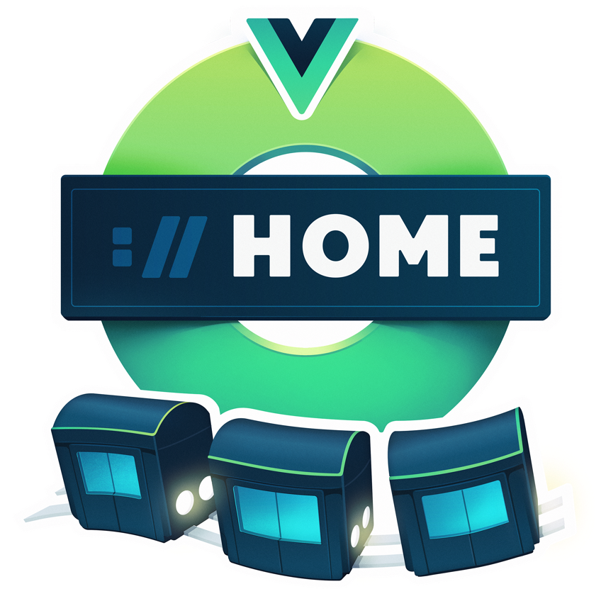

import TwoCol from '../../../src/components/mdx/TwoCol.js'
import SmallCenter from '../../../src/components/mdx/SmallCenter.js'

---

Drawing invisible things is the best and worst job.

This is a case study showing the process of illustrating a course.

Every egghead course gets a big main course illustration.

Like this

<SmallCenter>

[CSS Selectors in Depth](https://egghead.io/courses/css-selectors-in-depth)

Or this

[Reduce Redux Boilerplate with Redux-Actions](https://egghead.io/courses/reduce-redux-boilerplate-with-redux-actions)

Or this.

[A Journey with Vue-Router](https://egghead.io/courses/a-journey-with-vue-router)

</SmallCenter>

So far I've made xxx of these over the last 4 years and can reasonably say I know a little about how to do this.

[Canvas of a whole bunch of them]

I expect many people will be here hoping to learn what pixel size I set my #EAEFF1 brush to in order to careful render a diffuse light across a relfective metallic surface in Photoshop CC 2020 on a 15-inch Macbook Pro 2015 hooked up to a Wacom Cintiq 22HD running OS Catalina 10.15.1.

<SmallCenter>

</SmallCenter>
 
This is not that blog post. 1

1 (Footnote element: If you would like to learn how, take Sam Neilson's Fundamentals of Lighting on Schoolism. It will drown you in the minutiae of rendering light on surfaces. Also check out the Resources page)

---

They are _always_ on topics that are:  
a) fundamentally asbtract  
b) haven't been around long enough for our culture to develop a set of meaningful icons and visual symbols for them

**Which certainly makes my job interesting.**

Try, for a moment to imagine what "[Typescript with React](https://egghead.io/courses/use-typescript-to-develop-react-applications)" visually looks like.

Or "[A Server-rendered ReactJS Application with Next.js](https://egghead.io/courses/build-a-server-rendered-reactjs-application-with-next-js)"

Or the "[State Monad in JavaScript](https://egghead.io/courses/state-monad-in-javascript)"

## Part One – What are we doing?

The guinea pig in this walkthrough is [Mike Sherov]()'s upcoming course Web Security Essentials

Whenever you're starting a design challnege of any kind – illustration, app, carbon capture technology – it's a good idea to make the challenge you're facing nice and clear. So let's write ourselves a challnege statement.

_We want to create an illustration that clearly communicates the idea of "Web Security"_

It is good to make obvious that "Web Security" is not a single, physical, made-of-atoms object in the world.

Thus begins our problem.

# How do you draw a thing that's not a thing?

Good question.  
Capturing the essence of any historically-constructed, fuzzy-edged, evolving cultural concept like "Web Security" is a fascinating challenge.

There's plenty of ways to approach it, but my personal flavour of it is through **Visual Metaphors**.

While much of my work does involve drawing shapes correctly and picking nice colours and rendering lighting effects, those are very much the top layer of the cake. Visual metahpors are the base.

## What's a Metaphor?

Conceptual metaphor is the basis of how we draw every single non-literal object. Drawing an orange is fairly straight forward. Drawing anything non-physical abstract __thing__ – freedom, financial crashes, racial tension, teamwork, speculation, database management, capitalism, productivity – all relies on conceptual metaphor. 

Finding the right visual metaphor is a going to be a glorious scavenger hunt through language, iconography, and cultural association.

### Let's look at these again

Part of getting good at visual metaphors is explicitly realising when you're seeing one and working backwards to break down how it's working.

<SmallCenter>
CSS selectors = picking specific architectural elements of a house to colour in with a historical throwback to the Sims 2 UI

Redux-actions = video game controllers

Vue-router = an underground railway system. Pages in an app are stations.

</SmallCenter>

I know this is a little like telling a joke, and then explaining why the joke was funny. It kind of sucks the fun out of it. But breaking down the visual metaphors behind visuals is one of the best ways I've found to getting better at thinking in them.

You want to backwards engineer how the image works.

One of my favourite editorial illustrators 

