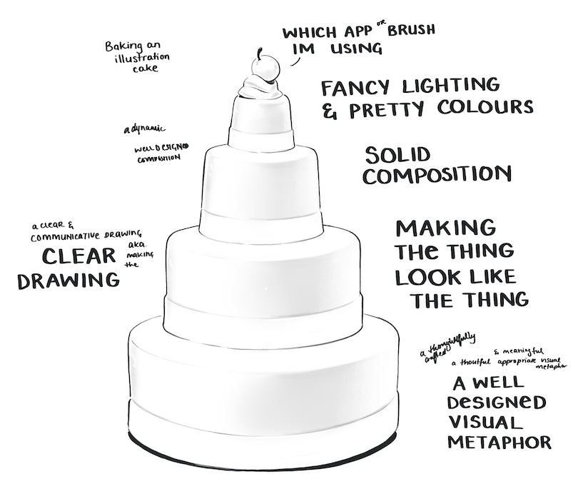
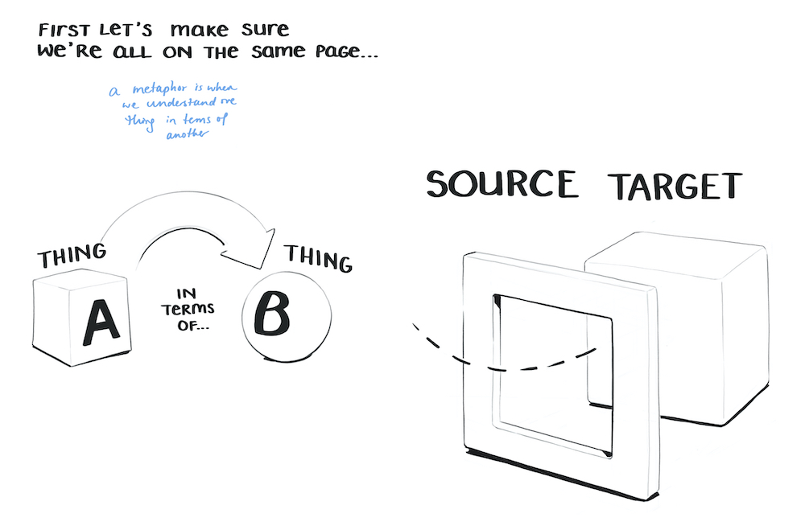

import TwoCol from '../../../src/components/mdx/TwoCol.js'
import SmallCenter from '../../../src/components/mdx/SmallCenter.js'
import Tooltip from '../../../src/components/mdx/Tooltip.js'
import Feature from './Feature.js'
import ImageGrid from '../../../src/components/mdx/ImageGrid.js'
import EggheadCourseCard from '../../../src/components/mdx/egghead-course-card.js'
import Link from '../../../src/components/mdx/Link.js'

---

## Part One - Making Metaphors

How do you take something that's not a physical, tangible made-of-atoms object in the world, and draw it?

It's a good question.
One I've been obsessed with for a while.

As the art director & lead illustrator at <Link to="https://egghead.io">egghead.io</Link>, it's also one I have to answer on a daily basis.

We're is a site that teaches web development through a mix of tutorial videos, articles, illustrated notes, workshops, and whatever other medium we feel like. As you might expect, it's a whole lot of JavaScript, React GraphQL, Vue, classic HTML & CSS, and other internety technologies.

My job involves taking all those abstract, hard-to-explain programming concepts and making them visible in a way that helps people understand them.

That includes everything from making cover illustrations for every course we release, drawing illustrating notes (eg. everything on this website), and animating helpful diagrams

---

These images are all course illustrations - essentially album art for our workshops. <Tooltip tiptext={I don't make all of our illustrations  – I have a wonderful team that includes <a href="#">Maxime</a> and <a href="#">Aleksander</a> who help with the load.}>1</Tooltip>

<ImageGrid>

<EggheadCourseCard title="CSS Selectors in Depth" url="https://egghead.io/courses/css-selectors-in-depth?af=54fd64" image="https://d2eip9sf3oo6c2.cloudfront.net/series/square_covers/000/000/235/full/EGH_CSSSelectors_Final.png" />

<EggheadCourseCard title="Create Transitions with React Transition Group" url="https://egghead.io/courses/create-smooth-performant-transitions-with-react-transition-group-v2?af=54fd64" image="https://d2eip9sf3oo6c2.cloudfront.net/series/square_covers/000/000/213/full/EGH_React_Transitions_Final.png" />

<EggheadCourseCard title="Reduce Redux Boilerplate with Redux-Actions" url="https://egghead.io/courses/reduce-redux-boilerplate-with-redux-actions?af=54fd64" image="https://d2eip9sf3oo6c2.cloudfront.net/series/square_covers/000/000/140/full/EGH_ReduxActions_1_Final.png" />

<EggheadCourseCard title="A Journey with Vue-Router" url="https://egghead.io/courses/a-journey-with-vue-router?af=54fd64" image="https://d2eip9sf3oo6c2.cloudfront.net/series/square_covers/000/000/354/full/VueRouter.png" />

</ImageGrid>

This is a long overdue case study showing how I go about illustrating one of these.

It spans everything from cognitive metphor theory to Photoshop rendering so I hope you have a hot, caffienated beverage with you.

It also comes numerous parts:

Part 1 Making Metaphors
Part 2 Cultural Research
Part 3 Creative Play
Part 4 Composition, Colour and Completion

[map of the outline]
[timeline map of he stages of an illustration we're going to walk through - research section. Stating the mission (single point), declaring keywords, building word lists and visual symbols, lateral thinking and playing around, judging yourself, making choices, refining composition, value structure and colour mocks (same step), *enter automatic pilot mode*, video recording of adobe illustrator vector base, vector refining, export to photoshop, painting in photoshop.]

I've been doing it for half a decade now and am almost starting to think I know what I'm doing.

---

## Part One – What are we doing?

The guinea pig in this walkthrough is [Mike Sherov]()'s upcoming course Web Security Essentials

Whenever you're starting a design challenge of any kind – illustration, app, carbon capture technology – it's a good idea to make the challenge you're facing nice and clear. So let's write ourselves a challenge statement.

_We want to create an illustration that clearly communicates the idea of "Web Security"_

It is good to make obvious that "Web Security" is not a single, physical, made-of-atoms object in the world.

Thus begins our problem.

# How do you draw a thing that's not a thing?

Capturing the essence of any historically-constructed, fuzzy-edged, evolving cultural concept like "Web Security" is a fascinating challenge.

Drawing well is difficult in its own right. Making a dog look like a dog or hand look like a hand requires a lot of training, practice and patience. 
There's a whole extra layer to the challenge when you don't even know what that _thing_ is yet.

Good meaningful illustration works on three layers - conceptual metaphor, clear visual communication, and - making it look cool. 
A whole lot of people ask how to making things look cool. Which is a legitimate desire. I am very into making shit look cool.

In fact a significant number of few people will be here hoping to learn what pixel size I set my #EAEFF1 brush to in order to careful render a diffuse light across a reflective metallic surface in Photoshop CC 2020 on a 15-inch Macbook Pro 2015 hooked up to a Wacom Cintiq 22HD running OS Catalina 10.15.1.

<SmallCenter>

</SmallCenter>

This is not that blog post. <Tooltip tiptext={If you would like to learn how, take <a href="">Sam Neilson's Fundamentals of Lighting</a> on Schoolism. It will drown you in the minutiae of rendering light on surfaces. Also check out the <a href="https://illustrated.dev/resources">Resources</a> page.}>2</Tooltip>

This is instead about Metaphors. Specifically, **Visual Metaphors**.

While much of my work does involve drawing shapes correctly and picking nice colours and rendering lighting effects, those are very much the top layer of the illustration cake. Visual metaphors are the base.

## What's a Metaphor?

The first step to getting good at visual metaphor is understanding what it is.

Conceptual metaphor is the basis of how we draw every single non-literal object. Drawing an orange is fairly straight forward. Drawing anything non-physical abstract __thing__ – freedom, financial crashes, racial tension, teamwork, speculation, database management, capitalism, productivity – all relies on metaphor. 

---

Programming in particular poses some unique visual challenges.  

Our topics are _always_:  
a) fundamentally abstract  
b) haven't been around long enough for our culture to develop a set of meaningful icons and visual symbols for them

Try, for a moment to imagine what "[Typescript with React](https://egghead.io/courses/use-typescript-to-develop-react-applications)" visually looks like.  
Or "[A Server-rendered ReactJS Application with Next.js](https://egghead.io/courses/build-a-server-rendered-reactjs-application-with-next-js)".  
Or the "[State Monad in JavaScript](https://egghead.io/courses/state-monad-in-javascript)"

## Internet Metaphors

Since we're working in the land of the internet, it's important to make clear how we use metaphor to think about the digital world – enter *cyberspace*

[gif of internet thumbs up / 1990s explainations]

Our basic understanding of internet space can be summed up in these glorious nineties GIFs. The legacy of cyberspace laid the foundations for the physical shape of our digital world.

That might sound odd. *Physical* shape of the *digital*?

But it's true. We think the internet is a physical space. When we look closely at the language we use to talk about the internet, our words reveal we are clearly physical bodies moving through a landscape when we "surf the web."

We *visit* websites. We *go* to google. We *follow* links. We *go into* sub-menus. We *go back* and *forwards* between pages. We ask if you've *been on* Twitter lately. We're *deep in* the comments section of r/showerthoughts. We *up*load memes to The Cloud™ above us, and *down*load podcasts from it.

[image of internet space]

Alas the dream of disembodied cyperspace freed from our meat packages hasn't evolved the way we thought it might. We bring the meat packages with us. The entire thing is an embodied experience.

Let's move one layer up in this inception matrix though.
There's a second metaphorical layer to the internet that *blends* with our first. This is best known as the *desktop metaphor*

In the 1970s, The Star project team at Xerox PARC developed the idea that our machines are an extention of our office tables. Folders, files, wallpapers, and windows replaced the old call-and-reponse command line screens.

[images of both]

(Someone developed the material design understanding of stacked cards and paper)

TLDR - we think the internet is a stack of paper and cards we're shuffling around. *Pages*, *cards* flipping over. 

It's strangely a stack of paper. Which might seem odd but it's an example of *blended metaphor* which were all very good at.

[diagram of the internet being above us, future to the right, backwards to the left, the desktop is a desk in front of us, websites are paper documents, cards are the size and shape of playing cards, changing state is movement , the internet is a physical space we move through, ... show examples of this on some of your work. Paper, clouds]

--

All of this metaphorical layers turns out to be fantastic quality when we're trying to draw internet stuff.
The entire place comes pre-baked with an inherent set of physical relationships and materials we can use to explain it.

All of my illustrations build off them. There are cards moving up and down

[Show examples of you doing this]

---

Finding the right visual metaphor is a going to be a glorious scavenger hunt through language, iconography, and cultural association.

### Let's look at these again

Part of getting good at visual metaphors is explicitly realising when you're seeing one and working backwards to break down how it's working.

_{Do cake breakdowns of the three egghead illos in a carousel-like set of arrow images. You click through and different cake layers highlight. Makes explicit the conceptual metaphor layer (CSS styles control how specific areas of a website look. abstract away concept of "thing that selects individual areas to change their visual appearance". Could be paint confined to an area - paint by numbers) the clear visual communication layer(image references, clear composition), and the making it look cool layer (point out nice colour palette, light effects)_

_Vue-router - metaphor that routers move you from one area of a website to another. Websites are physical locations we physically move through.}_

<SmallCenter>
CSS selectors = picking specific architectural elements of a house to colour in with a historical throwback to the Sims 2 UI

Redux-actions = video game controllers

Vue-router = an underground railway system. Pages in an app are stations.

</SmallCenter>

I know this is a little like telling a joke, and then explaining why the joke was funny. It kind of sucks the fun out of it. But breaking down the visual metaphors behind visuals is one of the best ways I've found to getting better at thinking in them.

You want to backwards engineer how the image works.

I do this every time I see a terribly clever editorial piece on a news or media site, and keep a giant collection of them for reference.

## Let's Get Analytical

Here's a handful of editorial illustration whose work I admire:

<Feature name="Emiliano Ponzi" url="https://www.emilianoponzi.com/">

[Source](https://www.nytimes.com/2018/06/22/opinion/sunday/job-training-midlife-career-change.html)

[Source](https://www.emilianoponzi.com/portfolio/the-art-of-improvisation-%E2%80%A2-geo-magazine/%20/)

[Source](https://www.emilianoponzi.com/portfolio/nature-outlook/%20/)

</Feature>

<Feature name="Matt Chase" url="https://chasematt.com/">

[Source](https://chasematt.com/NYT-Sunday-Review-Hobbyism)

[Source](https://chasematt.com/Human-Rights-Watch)

[Source](https://chasematt.com/Politico-Ideas)

</Feature>

---

## [Read Part 2](http://localhost:8000/draw-the-invisible-2)