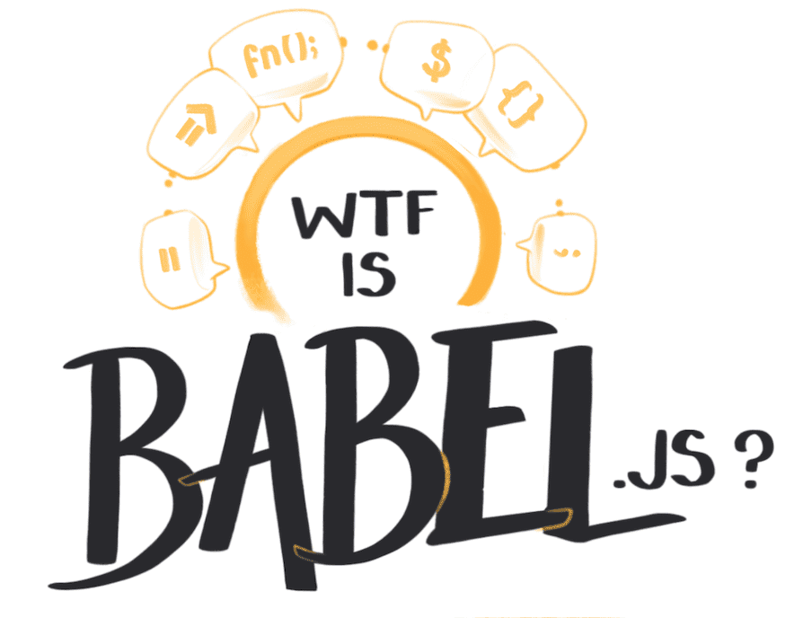

import Link from '../../../src/components/link.js'
import ResourceBook from '../../../src/components/resourceBook.js'
import NotesContainer from '../../../src/components/mdx/NotesContainer.js'

<NotesContainer>

A few weeks ago I got the chance to chat to <Link to='https://twitter.com/hzoo'>Henry Zhu</Link> on his  <Link to="https://maintainersanonymous.com/">Maintainers Anonymous</Link> podcast.  It's a show about people who maintain things in the world.  Whether it's code, cities, infrastructure, or museum archives, someone has to keep the decks clean and the engine stoked.
 

<iframe src='https://share.transistor.fm/e/9d389287' width='100%' height='180' frameborder='0' scrolling='no' seamless='true' style='width:100%; height:180px;'></iframe>

I'm not a maintainer (the only thing I reliably maintain is an obsessive tea habit), but I went on to chat to Henry about the overlap between the <Link to="https://en.wikipedia.org/wiki/Open-source-software_movement">open source software</Link> and the anthropological theory of <Link to='https://en.wikipedia.org/wiki/Gift_economy'>gift economies</Link>.

Gift theory, reciprocity, and economic anthropology are all side obsessions of mine. I originally trained as a cultural anthropologist, and it's still an enourmous part of how I understand and operate in the world.  
Like any good cult, once you're indoctrinated you can never leave. 

---

Henry and I began discussing the parallels between gift economies and open source software (OSS) last summer.  
At the time I knew barely anything about OSS. Which made me fairly typical. 99.9% of the world haven't a clue about the rich, dramatic cultural history of Linux, or Xerox PARC, or the browser wars.

<TwoCol>

Henry has earned his stripes in the OSS world as the core maintainer of <Link to="https://babeljs.io/">Babel.js</Link>  – an open-source javascript <Link to="http://illustrated.dev/compilers">transpiler</Link> used by the vast majority of javascript-based websites.  

The Babel project, and Henry as its steward, is a fascinating case study in the open source software economy.

<h4>Not sure what Babel is?</h4>
<h6 style="text-align: center; ">Take a quick look at my <a href="./babel">WTF is Babel?</a> illustrated explanation.</h6>

</TwoCol>

It's one of the <Link to='https://opencollective.com/babel'>largest projects on Open Collective</Link>, running an annual budget of 290,000 USD. And yet it's not a legal company.  
The team of 6 core maintainers are all <Link to="https://babeljs.io/en/team.html">classified as volunteers</Link>, as are the 854 other contributors who have <Link to="https://github.com/babel/babel">contributed to the codebase on Github</Link> .

With over <Link to="https://www.npmjs.com/package/@babel/core">14 million weekly downloads</Link>, it's become such an essential utility in the modern JavaScript toolchain that it blends into the wallpaper.  
Of course you use Babel. Everyone uses Babel.

In just the past year the ecosystem around Open Source has evolved into some fascinating directions. Github launched <Link to="https://github.com/sponsors/">sponsors</Link> that allows contributions to individuals.
There's been plenty of fuss made over <Link to='https://www.patreon.com/'>Patreon</Link>

We touch on
* Thing
* Thing
* Thing

<ResourceBook large url='https://www.goodreads.com/book/show/201766.The_Gift' img='https://libcom.org/files/imagecache/article/images/library/9780415267496.jpg' title='The Gift' author='Marcess Mauss' description='Originally published in 1923, Marcel Mauss presented to the world a book which revolutionized our understanding of some of the basic structures of society.' />

---

### References & Further Reading

<TwoCol>

<Link to="">The Plural Economy of Gifts and Markets</Link>
<Link to="">Coding Freedom: The Ethics and Aesthetics of Hacking</Link>
<Link to="">The Gift</Link>

<Link to="">The Moral Economy of Digital Gifts</Link>
<Link to="">The Cathedral and the Bazaar</Link>
<Link to="">Open Source Beyond The Market</Link> by DHH

</TwoCol>

</NotesContainer>

