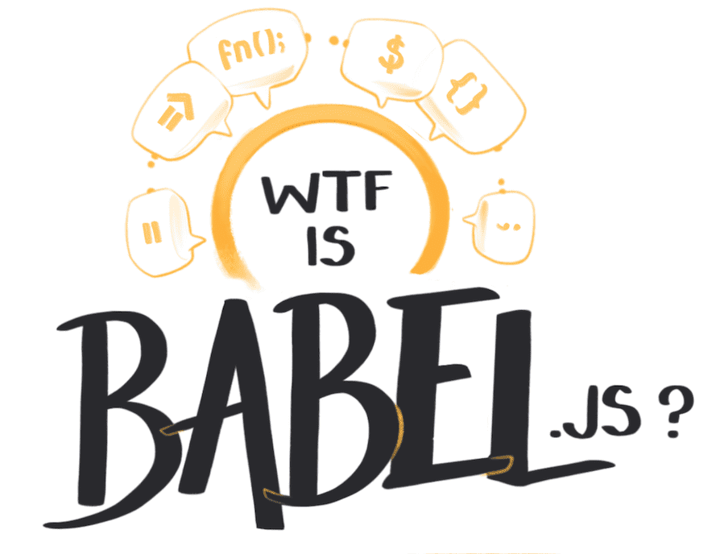

import Link from '../../../src/components/link.js'
import NotesContainer from '../../../src/components/mdx/NotesContainer.js'
import ResourceBook from '../../../src/components/resourceBook.js'

<NotesContainer>

A few weeks ago I got the chance to chat to <Link to='https://twitter.com/hzoo'>Henry Zhu</Link> on his  <Link to="https://maintainersanonymous.com/">Maintainers Anonymous</Link> podcast.  It's a show about people who maintain things in the world.  Whether it's code, cities, infrastructure, or museum archives, someone has to keep the decks clean and the engine stoked.
 

<iframe src='https://share.transistor.fm/e/9d389287' width='100%' height='180' frameborder='0' scrolling='no' seamless='true' style='width:100%; height:180px;'></iframe>

I'm not a maintainer (the only thing I reliably maintain is an obsessive tea habit), but I went on to chat to Henry about the overlap between the <Link to="https://en.wikipedia.org/wiki/Open-source-software_movement">open source software</Link> and the anthropological theory of <Link to='https://en.wikipedia.org/wiki/Gift_economy'>gift economies</Link>.

Gift theory, reciprocity, and economic anthropology are all side obsessions of mine. I originally trained as a cultural anthropologist, and it's still an enourmous part of how I understand and operate in the world.  
Like any good cult, once you're indoctrinated you can never leave. 

---

Henry and I began discussing the parallels between gift economies and open source software (OSS) last summer.  

At the time I barely knew anything about OSS. Which made me fairly typical. 99.9% of the world haven't a clue about the rich, dramatic cultural history of Linux, or Xerox PARC, or the browser wars.   Researching the movement has been fascinating and eye opening to say the least. 

<TwoCol>

Henry earned his striped in the OSS world as the core mainainer of <Link to="https://babeljs.io/">Babel.js</Link> - an open-source javascript <Link to="http://illustrated.dev/compilers">transpiler</Link> that's used by the vast majority of javascript-based websites.  

The Babel project, and Henry as its steward, is a fascinating case study in the open source software economy and where it's headed.

<h4>Not sure what Babel is?</h4>
<h6 style="text-align: center; ">Take a quick look at my <a href="./babel">WTF is Babel?</a> illustrated explanation.</h6>

</TwoCol>

It's a wide ranging discussion where we're both thinking out loud and exploring ideas, rather than coming to insightful or profound conclusions. We're doing some follow-up episodes in the coming months as well. <Link to="https://maintainersanonymous.com/">Subscribe to the podcast</Link> if you don't want to miss them.

## Things we Mention in the Episode

- <Link to="https://en.wikipedia.org/wiki/Emic_and_etic">Emic vs. Etic</Link> types of research in anthropology
- The three types of <Link to="https://en.wikipedia.org/wiki/Reciprocity_(cultural_anthropology)">reciprocity</Link>: Generalised, Balanced, and Negative. 
 <Tooltip tiptext={Proposed by anthropologist Marshall Sahlins in <Link to="https://www.goodreads.com/book/show/28254.Stone_Age_Economics">Stone Age Economics</Link>}>1</Tooltip>
- The <Link to="https://en.wikipedia.org/wiki/Kula_ring">Kula Ring</Link> of the Trobriand islands as the prototypical anthrolopogy example of a gift economy.
- The <Link to="https://allcontributors.org/">All Contributors</Link> system that acknowledges open source contributions for a wide range of skills
- 

---

### Recommended Reads on Gift Economies and Open Source Software

<ResourceBook large url='https://en.wikipedia.org/wiki/The_Cathedral_and_the_Bazaar' img='https://upload.wikimedia.org/wikipedia/en/c/c4/Cathedral-and-the-Bazaar-book-cover.jpg' title='The Cathedral and the Bazaar' author='Eric Raymond' description='...' />

<ResourceBook large url='https://www.goodreads.com/book/show/14891812-coding-freedom' img='https://i.gr-assets.com/images/S/compressed.photo.goodreads.com/books/1354772013l/14891812.jpg' title='Coding Freedom: The Ethics and Aesthetics of Hacking' author='Gabriella Coleman' description='...' />

<ResourceBook large url='https://www.goodreads.com/book/show/201766.The_Gift' img='https://libcom.org/files/imagecache/article/images/library/9780415267496.jpg' title='The Gift' author='Marcess Mauss' description='Originally published in 1923, Marcel Mauss presented to the world a book which revolutionized our understanding of some of the basic structures of society.' />

</NotesContainer>

