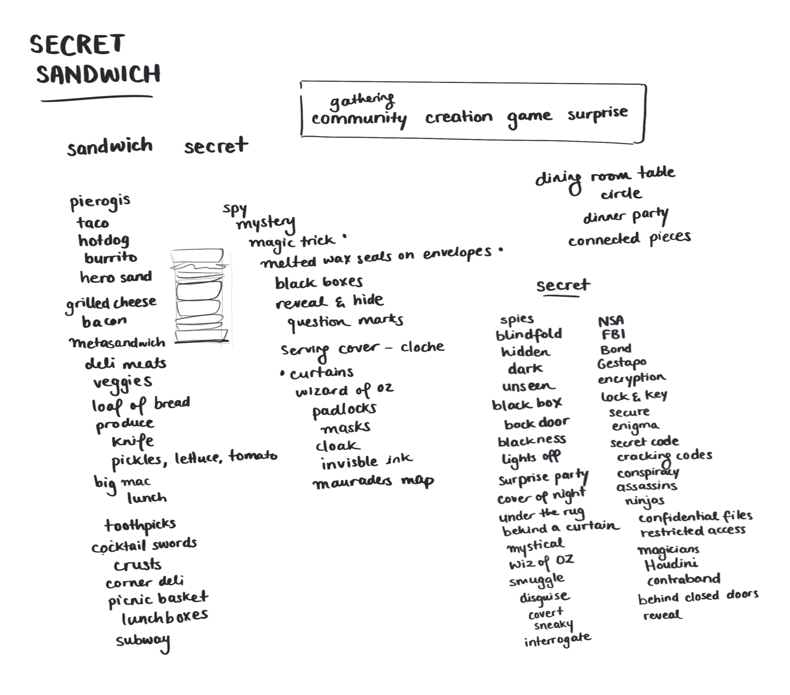
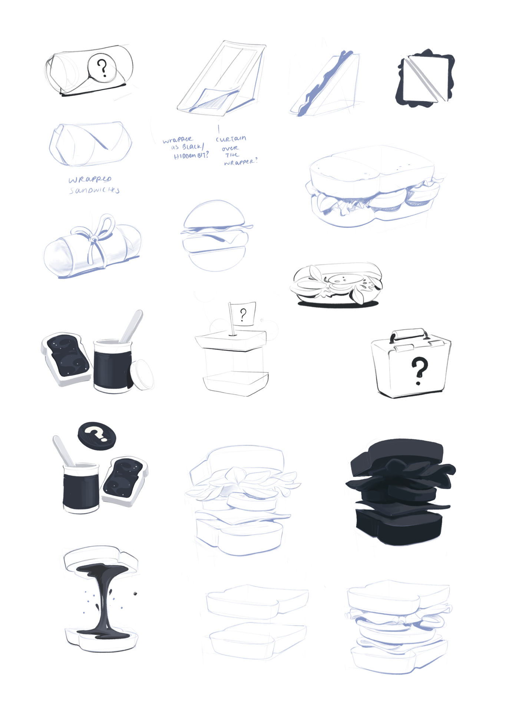
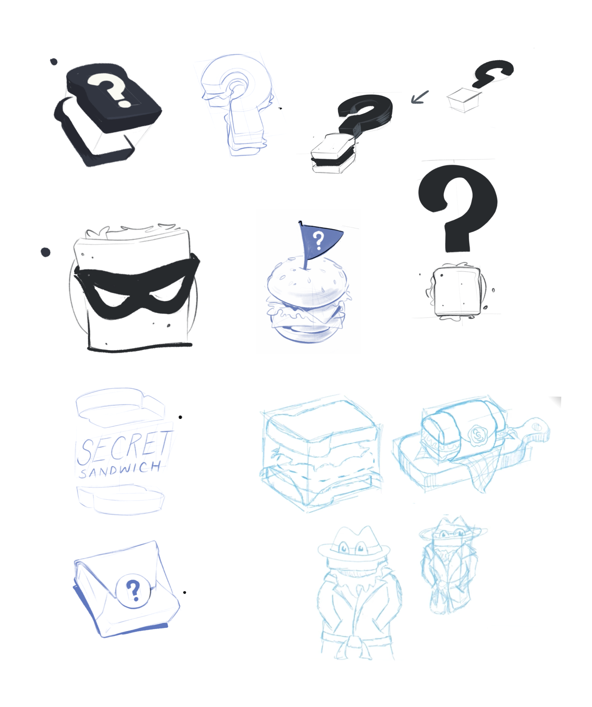

import FullSketchnote from '../../../src/components/mdx/FullSketchnote.js'
import SketchesContainer from '../../../src/components/mdx/SketchesContainer.js'
import Link from '../../../src/components/link'
import InlineSignUp from '../../../src/components/inlineSubscribe.js'
import ResponsiveEmbed from 'react-responsive-embed'

<SketchesContainer>

Earlier this year I had the pleasure of joining [Jason Lengstorf](https://lengstorf.com/) on his regular livestream series [*Learn With Jason* on Twitch](https://www.twitch.tv/jlengstorf).

Usually he hosts developers building impressive demos like [three.js animations](https://www.youtube.com/watch?v=mXcawneCRHY), [serverless GraphQL functions](https://www.youtube.com/watch?v=U6trl0_ynuM), and [data vizualisations in React](https://www.youtube.com/watch?v=Bdeu-BFisJU&t=3271s).
There's a whole [YouTube archive you can pour over](https://www.youtube.com/channel/UCnty0z0pNRDgnuoirYXnC5A/videos).

### Watch the livestream video

<ResponsiveEmbed src='https://www.youtube.com/embed/4mrrNAjiTvk' allowfullscreen />

We were sketching logo ideas for an app/website/project called **Secret Sandwich** that Jason's been building on the stream with various guests.

Here's the quick pitch – it's an app you can use to host sandwich-themed dinner parties.  It follows the same rules as [Secret Santa](https://en.wikipedia.org/wiki/Secret_Santa) – everyone is assigned another person, and you have to make a surprise sandwich you think your sandwichee would enjoy.

It was mostly a fun hour of us mashing together associative ideas based around *sandwiches* and *secrets*. 

I'm not going to claim the sketches are terribly impressive or ingenius, but at least the livestream session was a good time!  

## The Process

Both Jason and I were sketching on iPads which we hooked up to our zoom call and livestreamed onto twitch. ✨Technological magic ✨

We started by tossing around a few associative ideas around our core themes of **sandwiches** and **secrets**. This included perogies, metasandwiches, NSA cryptography, the Wizard of Oz, and [Super secret secret squirrel](https://en.wikipedia.org/wiki/Secret_Squirrel) 

We mostly jammed off our own free assocaition ideas, but I snuck in a quick demo of my favourite *"word nerd"* tools that I use for exploring concepts.

1. OneLook Thesaurus is my favourite: (https://www.onelook.com/thesaurus/](https://www.onelook.com/thesaurus/)

    

    Show how it links through to [Rhymezone](http://www.rhymezone.com) for example sentences, phrases, descriptive words

    

2. Searching English Corpuses – A Corpus is just an enourmous collection of words.
I mostly use the iWeb Corpus since it searches the word across a vast swath of the internet.
Avaliable on [https://www.english-corpora.org/](https://www.english-corpora.org/)
Which as built by a bunch of academics and has horrendous UX but is great to dig through once you figure out how to use it.

3. Wordnik - [https://www.wordnik.com/](https://www.wordnik.com/)

4. Etymology Dictionary – [https://www.etymonline.com/](https://www.etymonline.com/)

5. Metaphor Eye and Metaphor Magnet
[http://ngrams.ucd.ie/metaphor-eye/](http://ngrams.ucd.ie/metaphor-eye/index.jsp)
[http://ngrams.ucd.ie/metaphor-magnet-acl/index.jsp](http://ngrams.ucd.ie/metaphor-magnet-acl/index.jsp)
All the design awards for these.

These are all build by an academic called Tony Veale ([http://afflatus.ucd.ie/](http://afflatus.ucd.ie/)) who teaches in the computer science department at University College Dublin. He does fascinating work at the intersection of programming, creativity, and metaphor. It's all weird and wonderful.
They break / go offline a lot but I've never found any other tools like them. Wish there were more!

Once we had set of long wordlists based off our keywords. 

<InlineSignUp />

</SketchesContainer>

