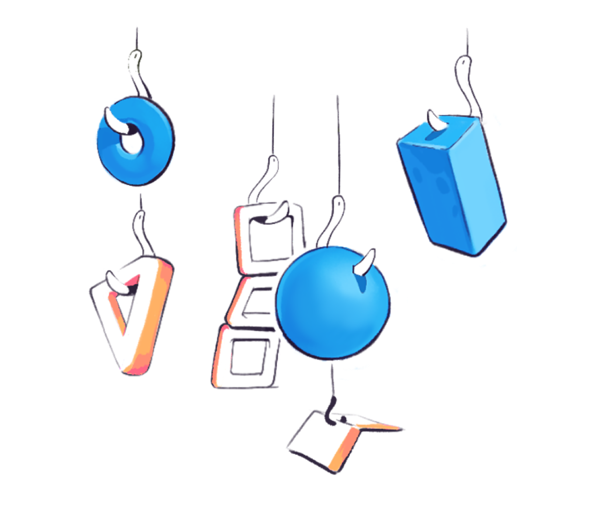

<NotesContainer>

<TwoCol>

You probably haven't heard, but <Link to="https://reactjs.org/docs/hooks-intro.html">React</Link> released a minor feature last year called "hooks".

It mostly flew under the radar, but I think it's pretty a useful addition and wanted to visually explain how it works.

</TwoCol>

Luckily <Link to="https://twitter.com/jsjoeio">Joe Previte</Link> was on my wavelength.

He's one of the instructors at <Link to="https://egghead.io/">egghead</Link> who put together a whole course on creating your own custom React hooks (next level!)

You can take a look at <Link to="https://egghead.io/courses/shareable-custom-hooks-in-react?af=54fd64">Shareable Custom Hooks in React</Link> if you're curious about building and publishing your own hooks on NPM.

 

---

The course is great in and of itself... but I know why you're here – _illustrations_!

I diligently worked through Joe's material and turned a few of the  highlights into illustrated notes.

The course doesn't cover much about the basics of hooks. So I added some TLDR explanations of what hooks do, including how everyone's faves **useState** and **useEffect** work.
The notes are more of a primer than a comprehensive summary of what Joe dives into.

---

For those already comfortable with hooks, you'll like the sections that cover the publishing pipeline – how to isolate your personal hooks, and prepare them for public use on NPM.

If you're tossing around ideas for what to build, I'd recommend checking out collections like  <Link to="https://usehooks.com/">useHooks</Link> and  <Link to="https://github.com/rehooks/awesome-react-hooks">Awesome React Hooks</Link> to get a sense of the possibilities.

I'll make sure to let you know if React changes anything else in the codebase. These things tend to get lost while the community is busy fawning over jQuery updates...

---

<FullNote coursename="Shareable Custom Hooks in React" courselink="http://bit.ly/3av6FvK">

</FullNote>

</NotesContainer>