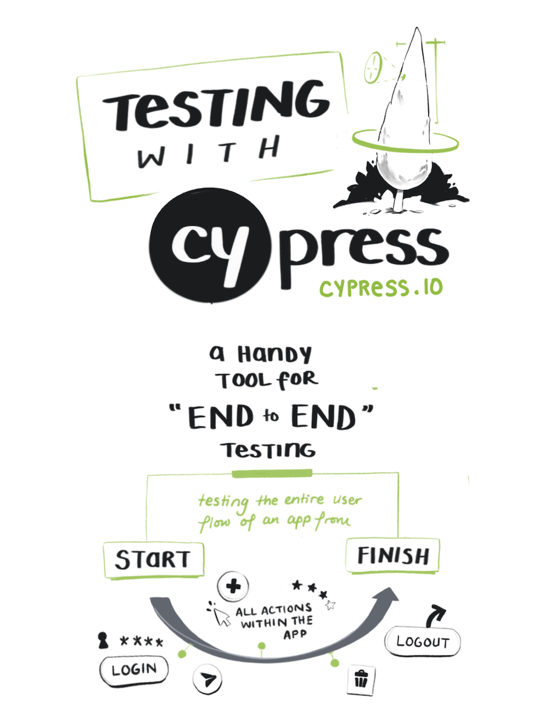
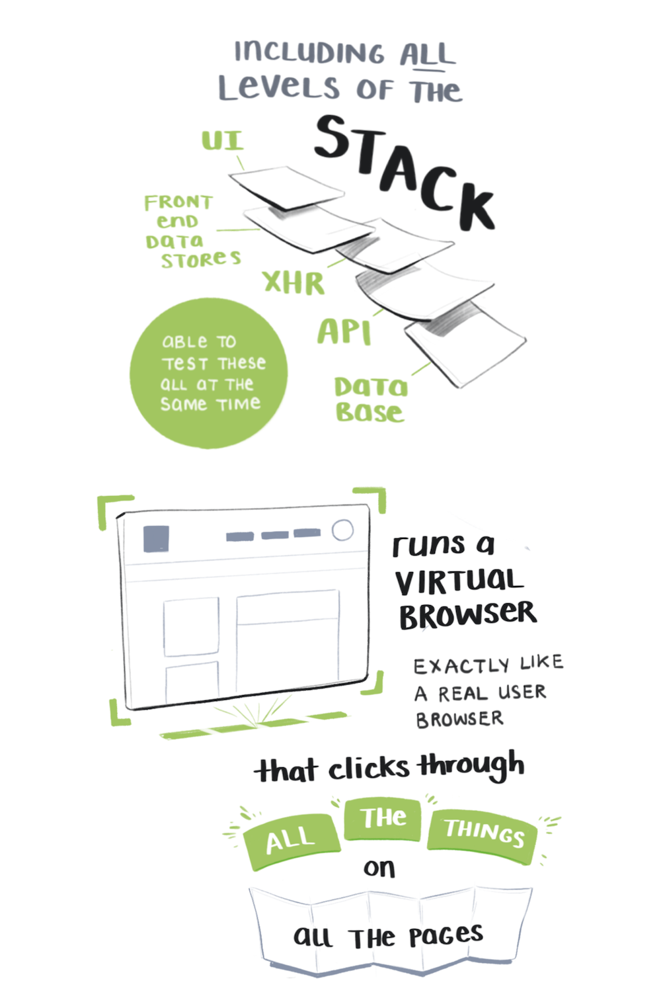
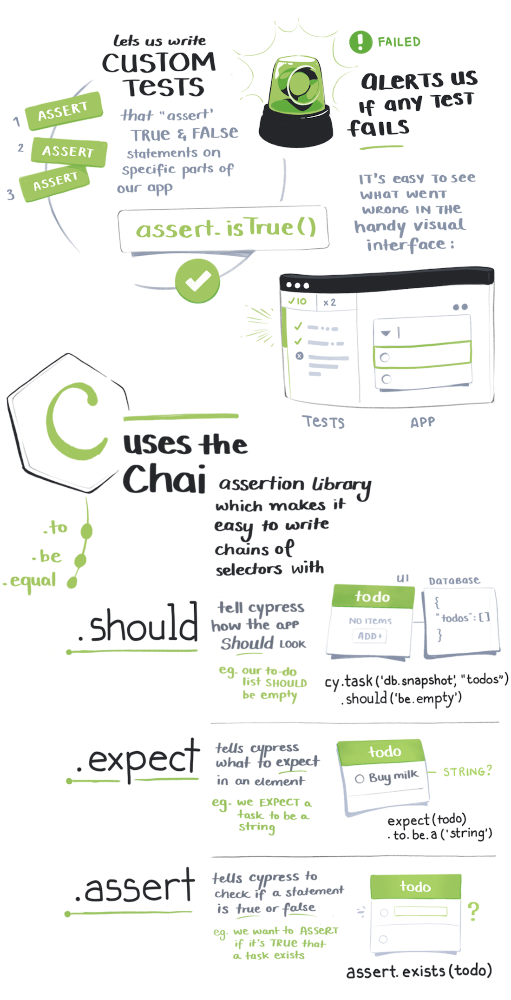
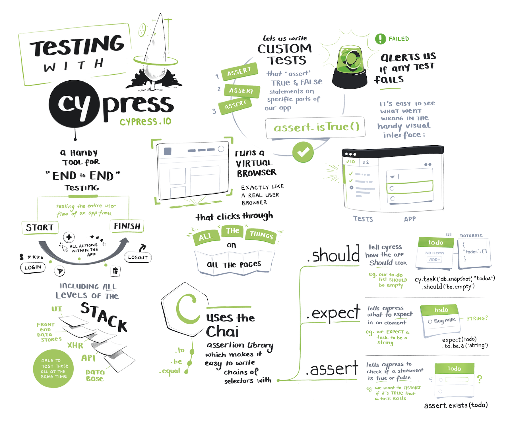

As part of my everyday [egghead](https://egghead.io) work, I make a lot of notes. Illustrated in particular.

Everytime we have a new course in production, I'll watch all the video lessons and illustrate the major points.  
These help me give ideas for visuals and diagrams we can build on top of the lessons. 

At the moment we've got one in the pipeline by [Brett Cassette](http://twitter.com/brettcassette) all about testing with [Cypress.io](https://www.cypress.io/).

Here's a small preview of it:

---

<h2 style="text-align: center;">The Whole Illustrated Note</h2>

 

A giant, printable version will be posted on the [Test Production Ready Apps with Cypress](https://egghead.io/courses/test-production-ready-apps-with-cypress?rc=272bjb) course when it's released later this month.

