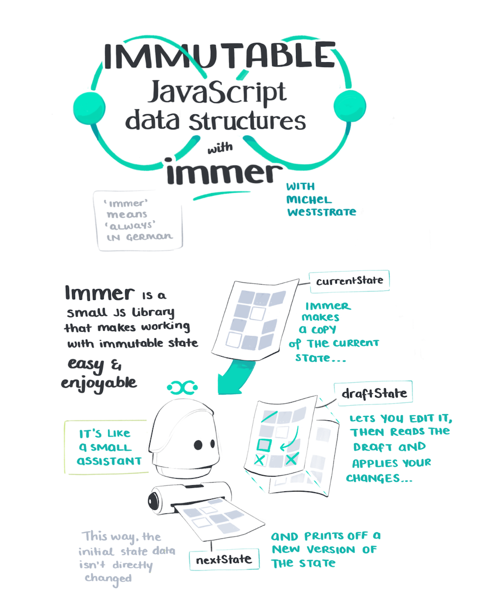
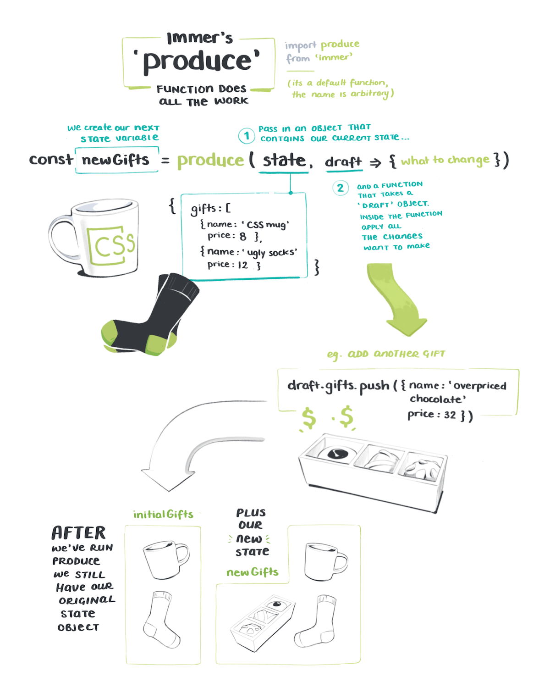
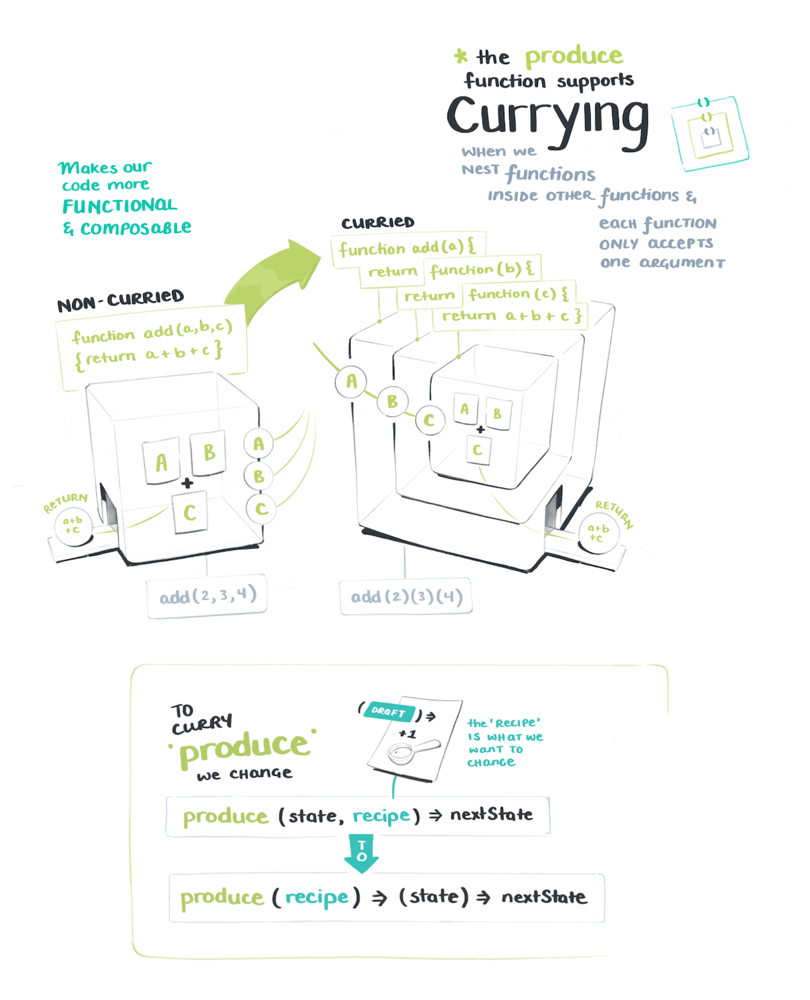
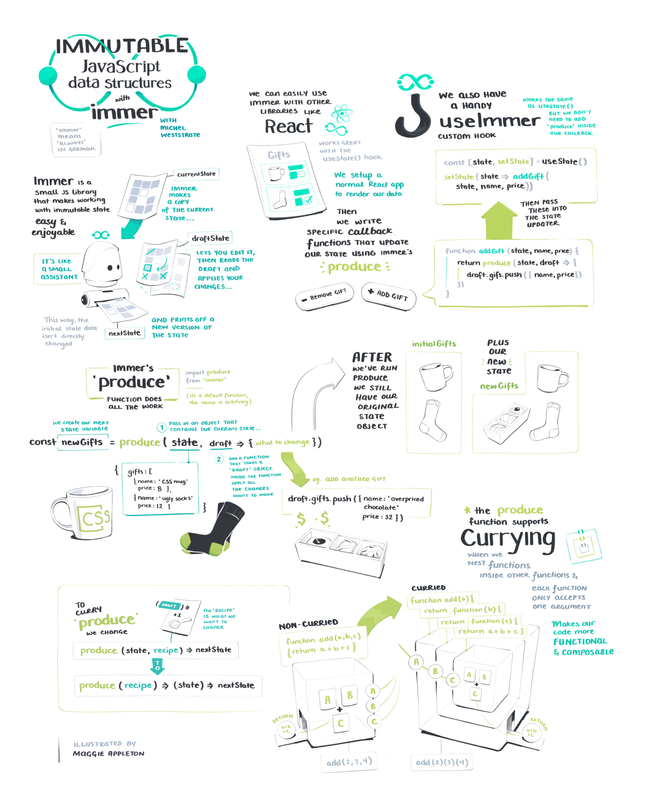

import FullNote from '../../../src/components/mdx/FullNote.js'
import NotesContainer from '../../../src/components/mdx/TwoCol.js'
import TwoCol from '../../../src/components/mdx/NotesContainer.js'
import Link from '../../../src/components/link.js'

<NotesContainer>

### Today we're going to look at **immutable data**. With socks. And personal assistant bots.

I know, you're already so excited.

**Immutability** and **state **are two developer buzzwords it took me forever to "get."

Their underlying meanings aren't necessarily that complex.  
But it's tough to fully comprehend what they mean, and why they're important, until you see them in action.

 
<Link to="https://en.wikipedia.org/wiki/State_(computer_science)"><b>State</b></Link> just means the way an application is at a single point in time.

For example, if we've typed _"how does CSS grid work"_ into the search bar, and there are three checkboxes ticked, and we have a dropdown menu open that's the current "state" of things.  
If we close the menu that's a state change. 

Behind the scenes in apps we have to account for every state an app could be in (which gets expontential very quicky). This is usually called <Link to="https://codeburst.io/state-management-in-javascript-15d0d98837e1">"managing state"</Link> and <Link to="https://medium.com/razroo/the-history-of-javascript-state-management-in-2019-161491d588ed">appears to be a neverending problem</Link>.

---

### **Immutable State** is one approach to solving our complex state problem – it simply means making a second copy of things before you change them.  

It's the same as copying and pasting a new _ImportantThing_Version2_Draft.md_ document before liberally changing enourmous chunks of it.
Then when you realise your poor editing choices and want to go back to the original version, it's there waiting for you.

Writing <Link to="https://en.wikipedia.org/wiki/Immutable_object">immutable code</Link> is a  <Link to="https://medium.com/tribalscale/understanding-immutability-fdd627b66e58">wildly</Link>  <Link to="https://itnext.io/why-concept-of-immutability-is-so-damn-important-for-a-beginner-front-end-developer-8da85b565c8e">popular</Link> concept in general. And a good idea when you don't want to muck everything up.  

---

Okay now you're all caught up on the jargon, lets get to some sketchnotes!

These are from a course  <Link to="https://twitter.com/mweststrate">Michel Weststrate</Link> made about their elegant new tool  <Link to="https://immerjs.github.io/immer/docs/introduction">Immer</Link> – it helps handle manage immutable state in a sane way.

The course is up as a **free community resource** on egghead, and is aptly named  <Link to="https://egghead.io/courses/immutable-javascript-data-structures-with-immer?af=54fd64">Immutable JavaScript Data Structures with Immer</Link>

Despite my allegic intolerance towards thinking about _state_ and _immutability_, this course turned out to be a delight.  
 
 Michel walks us through building a gifting app with React & Immer that seamlessly handles all the messy state work.

Visually drawing out how all the functions and drafts and edits fit together was essential for this one. I wouldn't have grokked it otherwise.

<TwoCol>

Yes the cup in the illustration is based on this classic CSS one that I don't own, but kind of want to.

</TwoCol>

If you're currently allergic to state & immutability as well, it might be the time to re-test your tolerances and <Link to="https://egghead.io/courses/immutable-javascript-data-structures-with-immer?af=54fd64"> see if Immer can help cure it.</Link>

---

<FullNote coursename="Immutable JavaScript Data Structures with Immer" courselink="https://egghead.io/courses/immutable-javascript-data-structures-with-immer?af=54fd64">

</FullNote>

</NotesContainer>