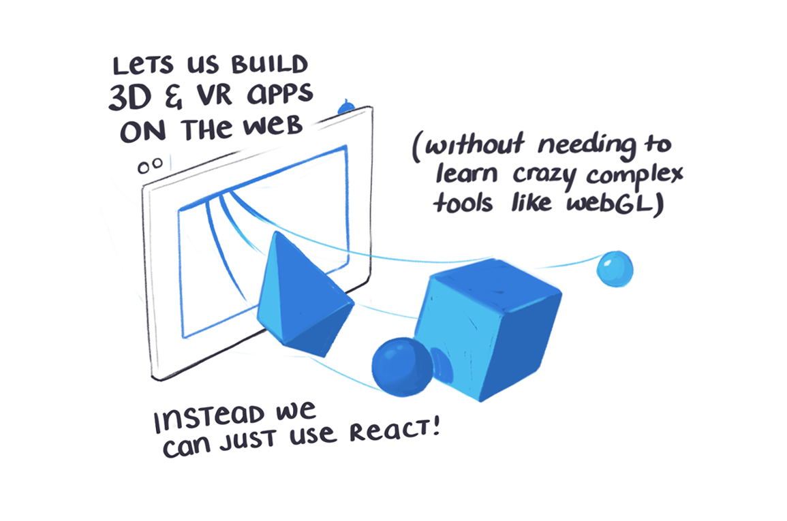
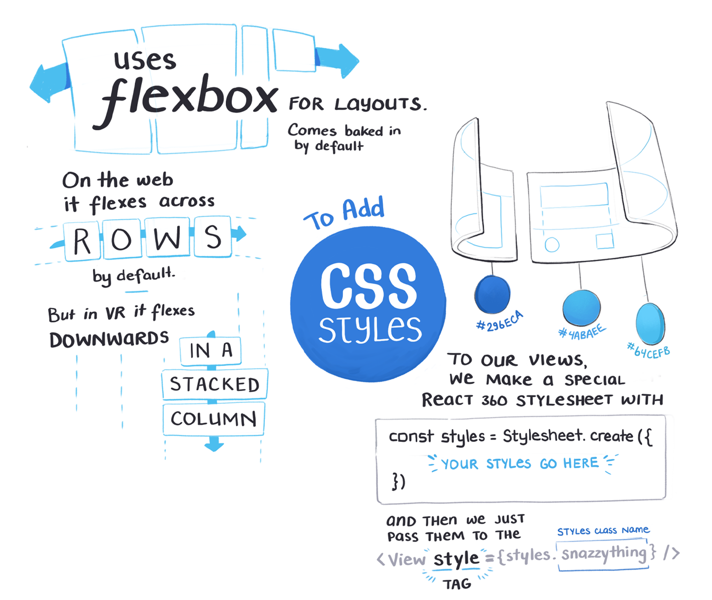
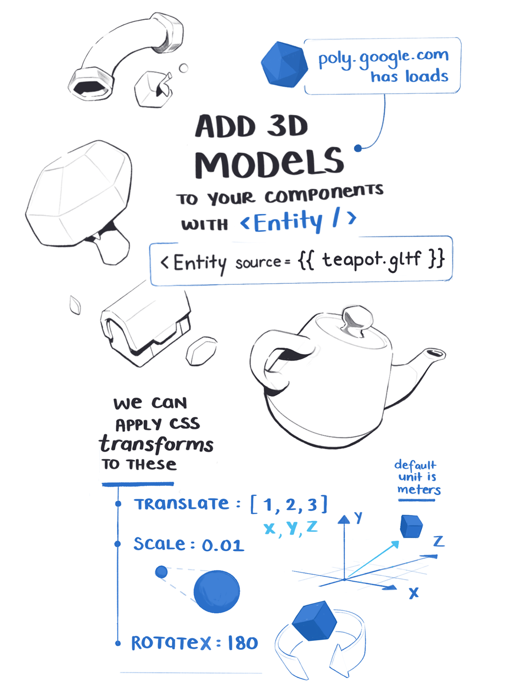
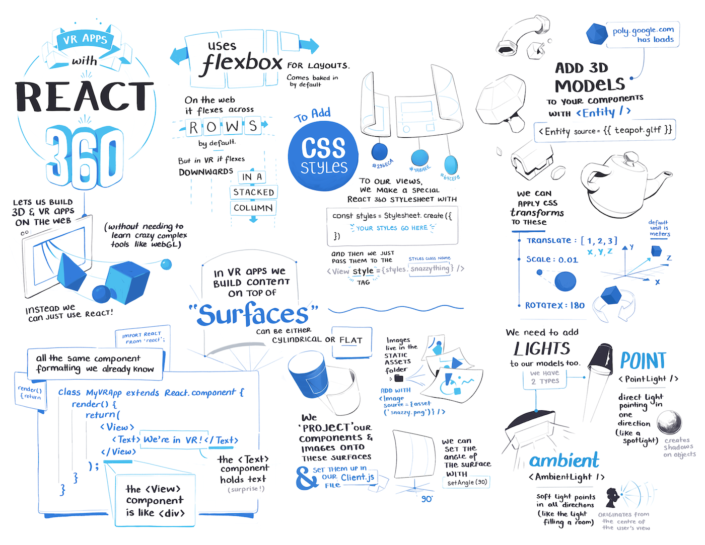

import Link from '../../../src/components/link.js'
import FullNote from '../../../src/components/mdx/FullNote.js'
import NotesContainer from '../../../src/components/mdx/NotesContainer.js'

<NotesContainer>

Turns out you can build almost anything in React now... including VR and AR apps inside a web browser.

There's a version of React called '<Link to="https://facebook.github.io/react-360/">React 360</Link>' that simplifies the otherwise niche and overly-complex challenge of making things fly around in virtual 3D space.

<Link to="https://egghead.io/instructors/tomasz-lakomy">Tomasz Lakomy</Link> made an entire egghead course that walks you through building <Link to="https://egghead.io/courses/vr-applications-using-react-360?af=54fd64">VR Applications Using React 360</Link>

<Link to="https://egghead.io/courses/vr-applications-using-react-360?af=54fd64">

</Link>

I've been sketching out notes on some of the basic concepts while watching the lessons.

---

<FullNote coursename="VR Applications Using React360" courselink="https://egghead.io/courses/vr-applications-using-react-360?af=54fd64">

</FullNote>

</NotesContainer>
