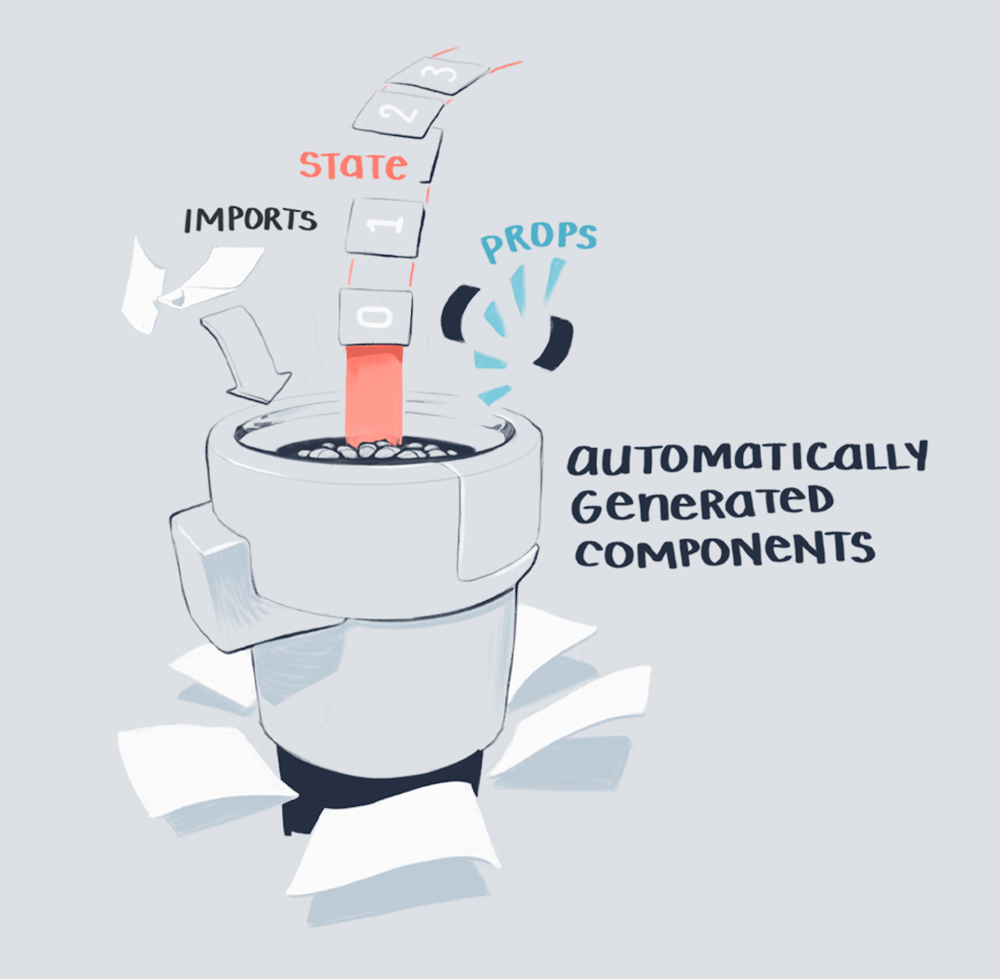
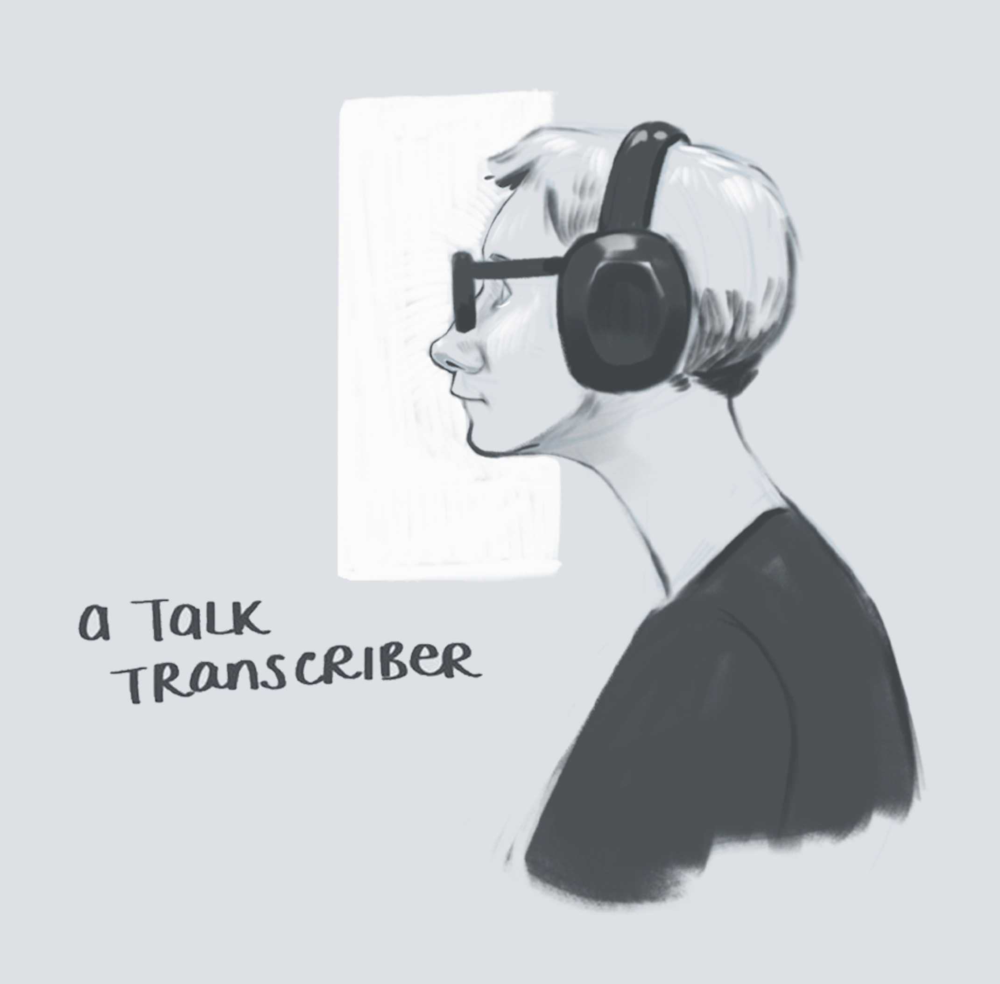
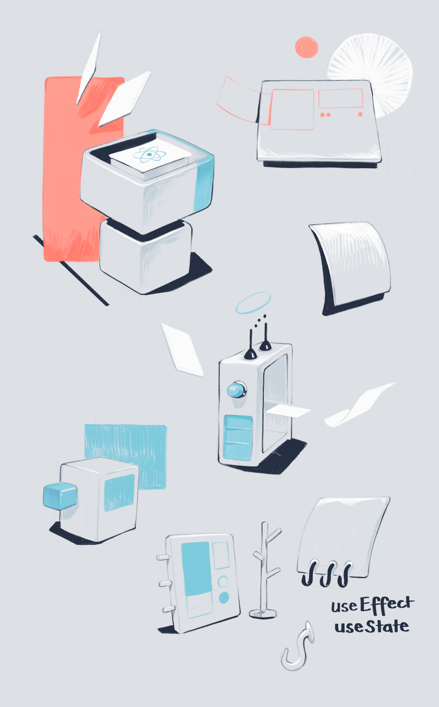
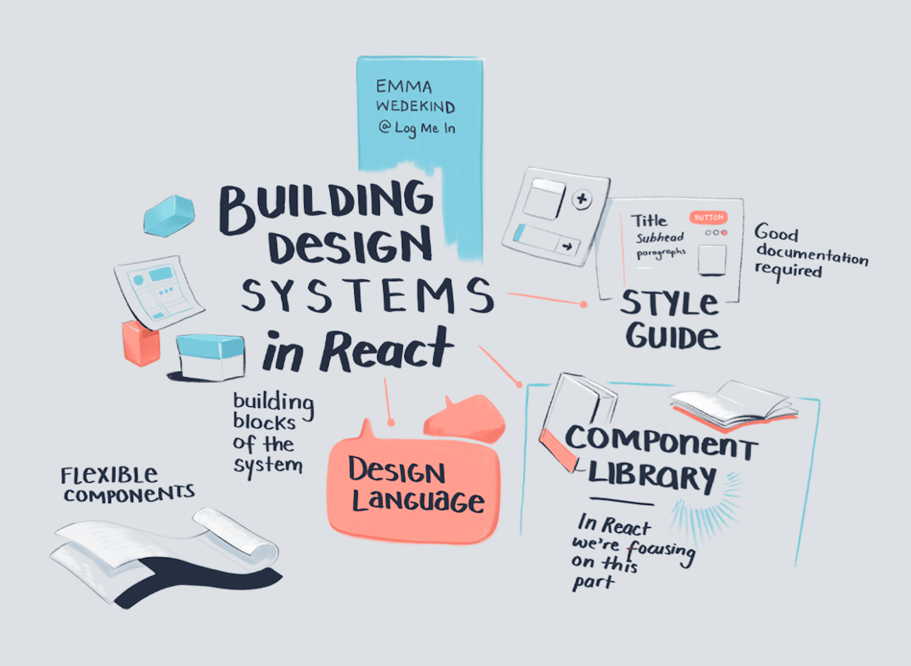

<NotesContainer>

Earlier this year I was lucky enough to attend the  <Link to="https://reactjsgirls.com/">ReactJS Girls Conference</Link> here in London.  
As you might have guessed, it involved a lot of React and a lot of great female speakers.

While listening to  <Link to="https://twitter.com/manjula_dube">Manjula Dube</Link> explain React hooks, and  <Link to="https://marcysutton.com/">Marcy Sutton</Link> walk us through making React components accessible, I spent the day doodling flying components and functions and props on my iPad.

  

I always enjoy fun-drawing at conferences where I'm just an attendee, and not there as an official sketchnoter (<Link to="https://maggieappleton.com/event-sketchnotes">something I occasionally do professionally</Link>)

<SmallCenter>

</SmallCenter>

These aren't well-crafted summaries of the content.  
They're just a product of me relaxing while listening.  
Though they loosely relate to what's happening on stage.

</NotesContainer>
