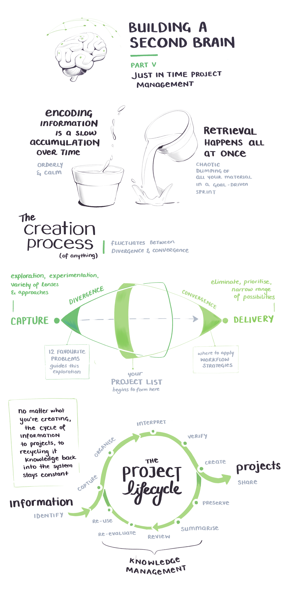
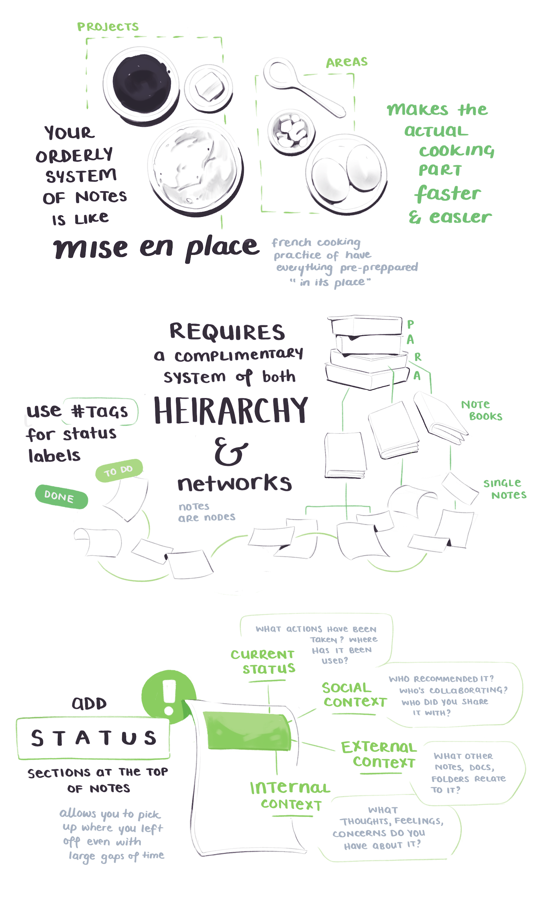
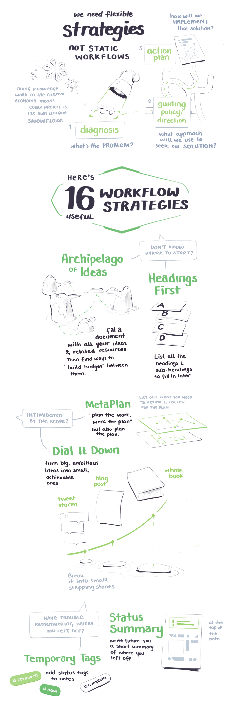
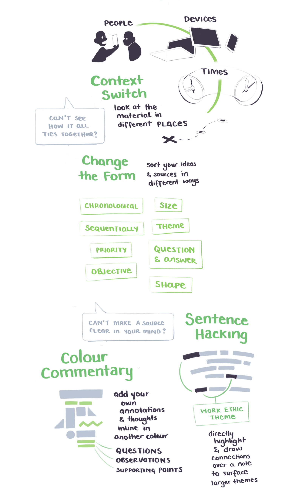
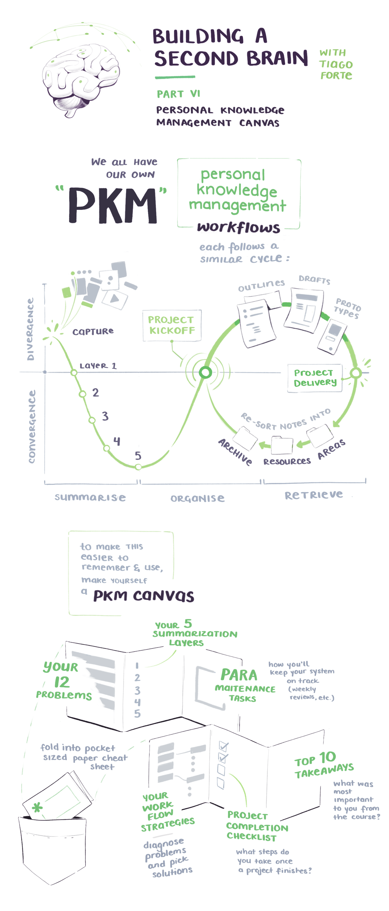

import InlineSignUp from '../../../src/components/inlineSubscribe.js'

<NotesContainer>

After a slight delay and many, many email requests, I've finished off my illustrated notes on the <Link to='https://www.buildingasecondbrain.com/'>Building a Second Brain</Link> course. Thank you everyone for the gentle nudges to get these published 😉

<SmallCenter>
<h3>If you haven't read Part 1 yet, <Link to="/secondbrain1">head there first 👉</Link></h3>
</SmallCenter>

---

Since taking the course in September of 2019, I've been continously building and evolving my second brain.

Much like any well-integrated tool, the mental distance between you and the system grows small.  
It's a lovely little closed feedback loop – <Link to="https://en.wikipedia.org/wiki/Cybernetics">a cybernetic system</Link>.  
At this point almost all of my daily workflow revolves around my second brain. Links, articles, books, papers, podcasts, and half-formed thoughts go in.  
These build into notes and develop over time – they merge, meander, and mature into talks and blog posts and illustrations.  
It is hard to remember what my workflow looked like without it.

For tools I'm currently using <Link to="https://roamresearch.com/">Roam Research</Link>, backed up by <Link to="https://www.keyboardmaestro.com/main/">Keyboard Maestro</Link> for some fancy automation elements.

These notes cover the last two sections of the course. Enjoy!

---

---

---

<InlineSignUp />

</NotesContainer>