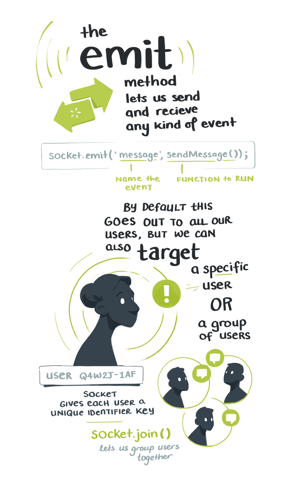

import FullNote from '../../../src/components/mdx/FullNote.js'
import NotesContainer from '../../../src/components/mdx/NotesContainer.js'
import Link from '../../../src/components/link.js'

<NotesContainer>

The *intantness* of chat apps has always been a mystery to me.  
The technical details of moving emojis through The Internet Pipes and across continents in 0.004 miliseconds is well beyond my paygrade.

But I got a tiny window of insight into the magic this week while illustrating notes for <Link to="https://egghead.io/courses/vue-and-socket-io-for-real-time-communication?af=54fd64">Mark Barton's new course</Link>

<Link to="https://egghead.io/courses/vue-and-socket-io-for-real-time-communication?af=54fd64">

</Link>

It's on building an instant chat app with  <Link to="https://vuejs.org/">Vue.js</Link> and  <Link to="https://socket.io/">Socket.io</Link>.

Turns out it's not magic, but instead done through  <Link to="https://en.wikipedia.org/wiki/WebSocket">websockets</Link>. Which are like little portals that hold open a consistent connection between two machines.

I obviously still haven't a clue what goes on inside that dark little portal. Thankfully using tools like Vue & Socket.io save us from that level of depth. 

---

<FullNote coursename="Vue and Socket.io for Real-Time Communication" courselink="https://egghead.io/courses/vue-and-socket-io-for-real-time-communication?af=54fd64">

</FullNote>

</NotesContainer>