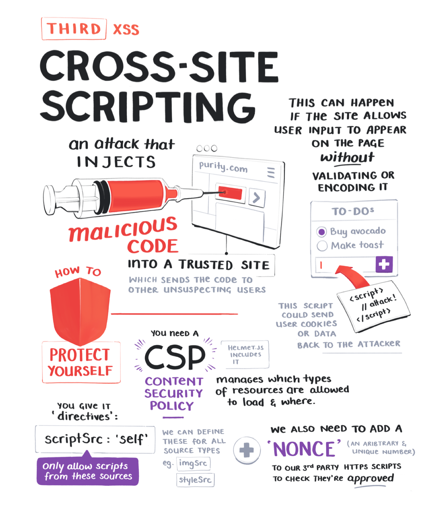

import NotesContainer from '../../../src/components/mdx/NotesContainer.js'
import FullNote from '../../../src/components/mdx/FullNote.js'

<NotesContainer>

## Man in the Middle

## Cross-Site Request Forgery

## Cross-Site Scripting

</NotesContainer>

<FullNote coursename="Web Security Essentials" courselink="https://egghead.io/courses/web-security-essentials?af=54fd64">

</FullNote>