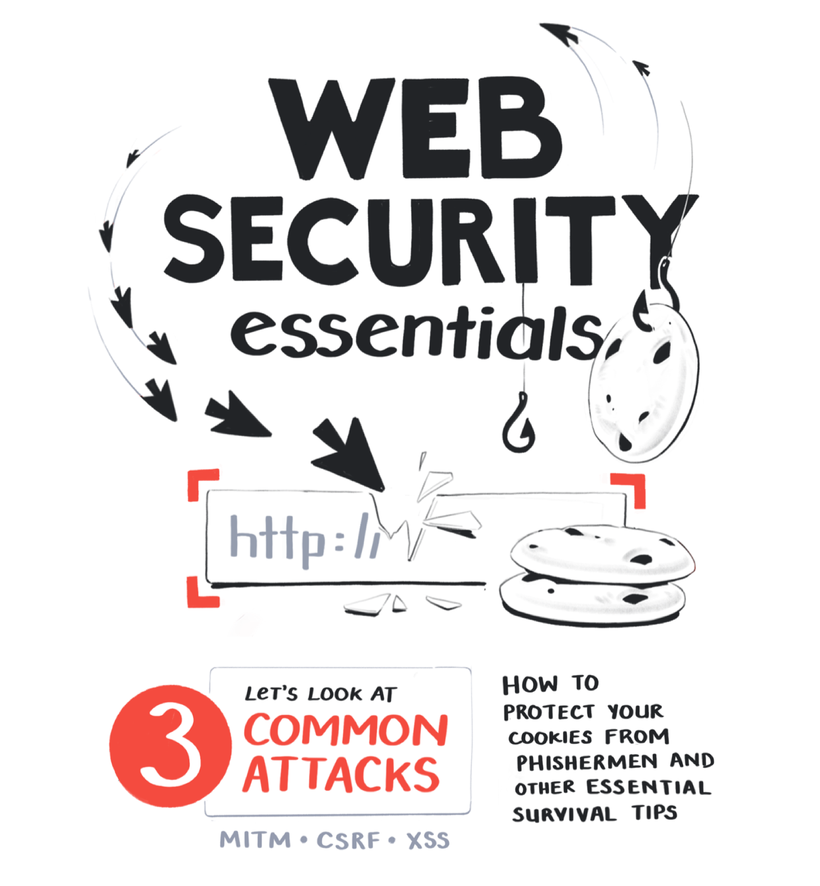
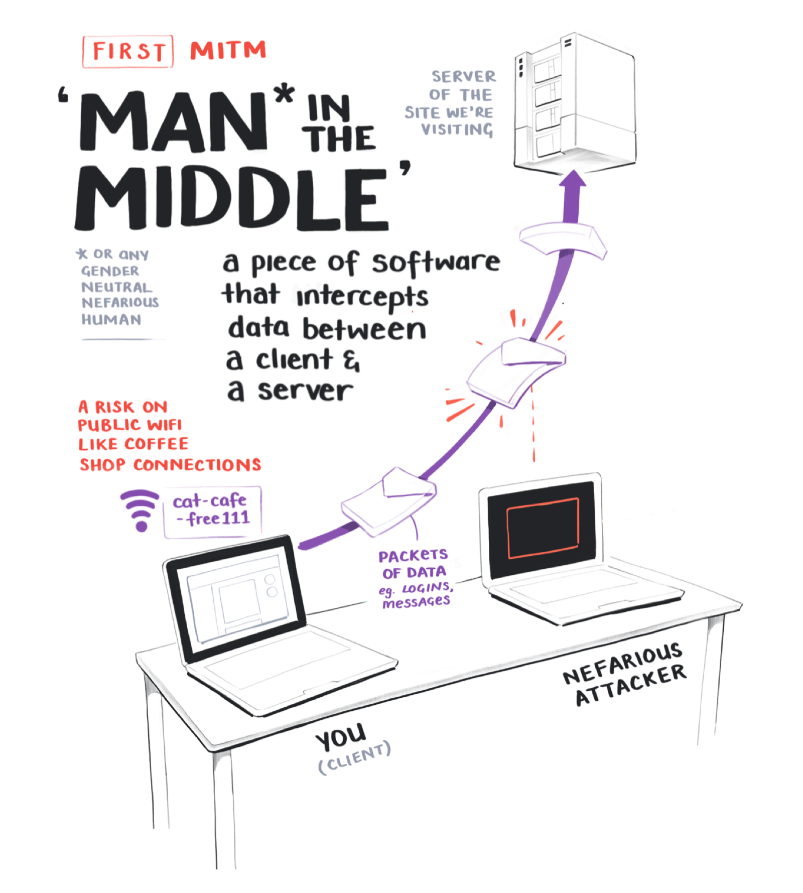
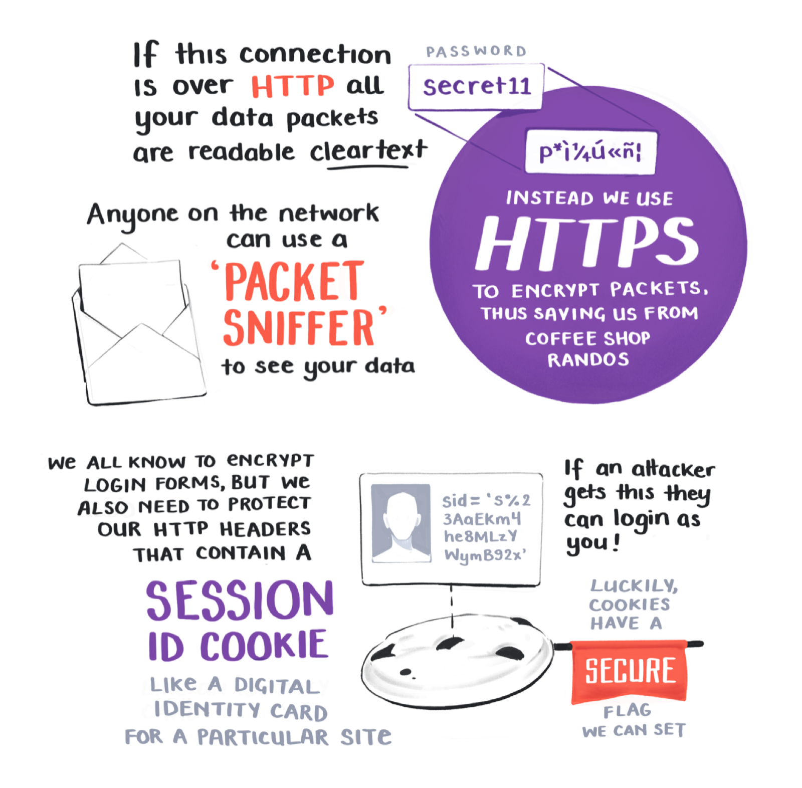
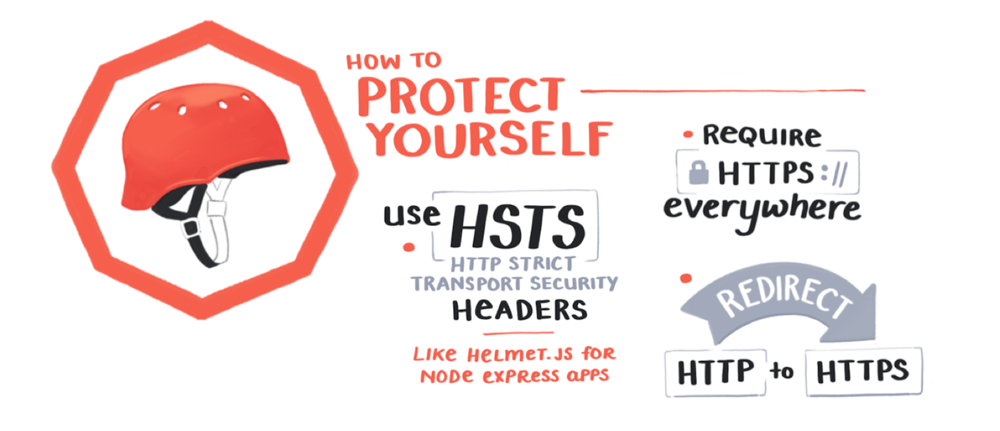
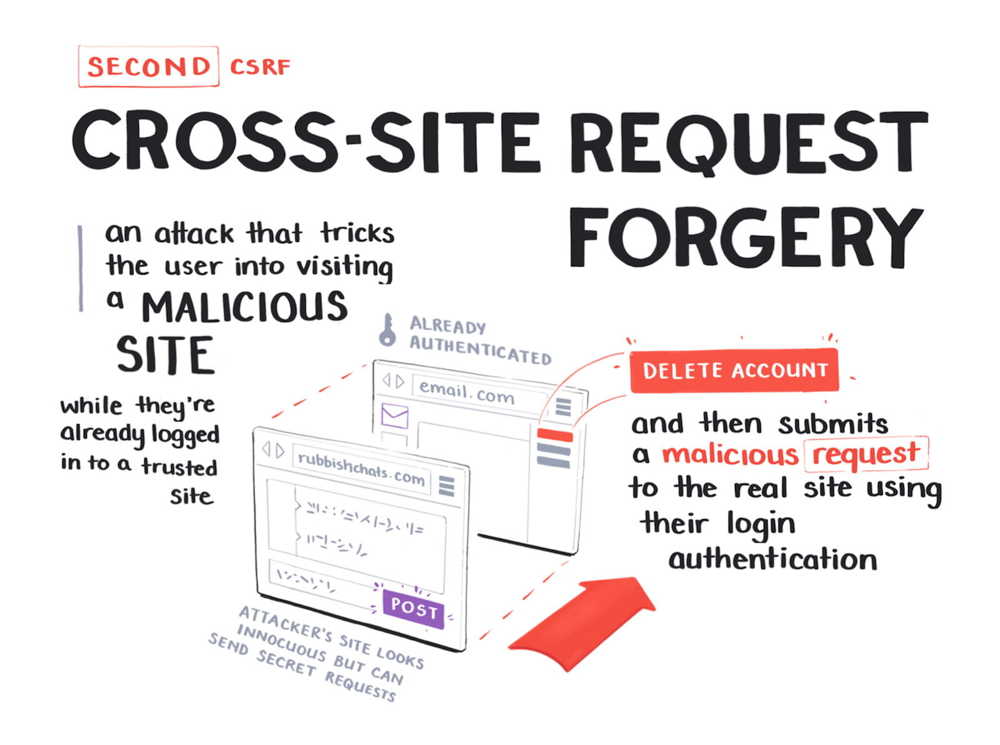
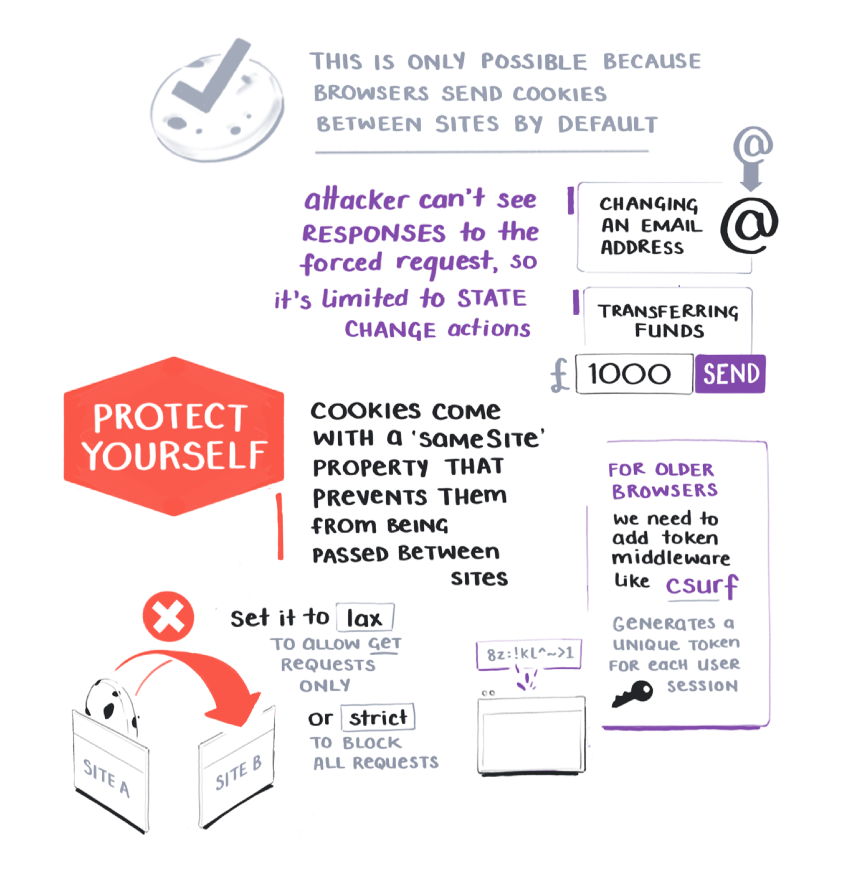
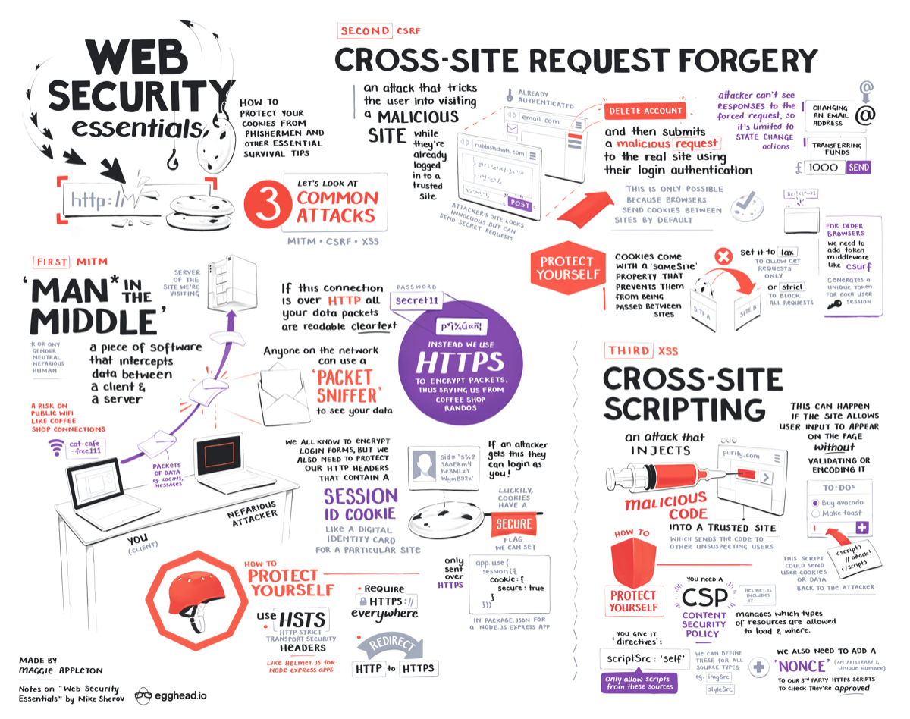

import NotesContainer from '../../../src/components/mdx/NotesContainer.js'
import FullNote from '../../../src/components/mdx/FullNote.js'
import Link from '../../../src/components/link.js'

<NotesContainer>

Between IoT botnet attacks, Bitcoin ransomware, and the weekly cadence of high-profile data breaches, doing anything on the internet feels like playing Russian Roulette.

And that's just for normal people using it.  

If you're a developer, you're partially **responsible** for protecting all those normal people from the horrors of whatever <Link to="https://en.wikipedia.org/wiki/LulzSec">LulzSec</Link> are up to right now.  
The least you can do is make sure your website isn't an accessory to their nefarious activites.

Thankfully, you do not have to brave the black hat darkness alone.

<Link to="https://twitter.com/mikesherov">Mike Sherov</Link> recently put out a course that covers all the <Link to="https://egghead.io/courses/web-security-essentials-mitm-csrf-and-xss?af=54fd64">Web Security Essentials</Link> you might need.

<Link noToolTip to="https://egghead.io/courses/web-security-essentials-mitm-csrf-and-xss?af=54fd64">

</Link>

I am (thankfully) not responsible enough for anyone to put me in charge of security for an important website.  But I was still curious.  

I wanted to know what the current landscape of internet risk looks like. How, _exactly_, is LulzSec going to hack into my mainframe in 2020?

Here's my illustrated notes from Mike's course that should give you a big picture overview of what to should look out for.

Turns out there's a small set of fairly well-known and easy to defend attacks that we can protect ourselves from:
* Man in the Middle (MITM)
* Cross-Site Request Forgery (CSRF)
* Cross-Site Scripting (XSS)

Shielding yourself from these three is a great starting point. It's at least enough to keep the <Link to="https://en.wikipedia.org/wiki/Script_kiddie">script kiddies</Link> out.

---

---

Keeping out this trio of attacks will go a long way.

If (unlike me) you _are_ responsible enough to be in charge of security for a moderately-sized website, it might be worth double checking you have these protections in place.  

Better safe than sorry. Especially when sorry means you end up on the front page of Hacker News in this week's edition of obviously preventable security breaches.

---

</NotesContainer>

<FullNote coursename="Web Security Essentials" courselink="https://egghead.io/courses/web-security-essentials?af=54fd64">

</FullNote>