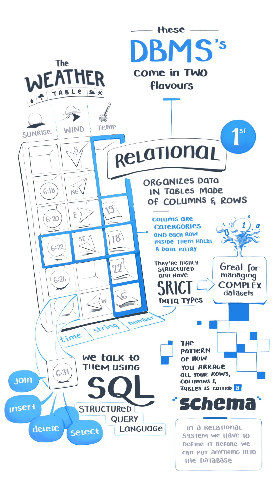

import DB6 from './DB_Interactive'

<DB6 />

----

##### Keep Learning 

* [SQL Fundamentals](https://egghead.io/courses/sql-fundamentals) course with Tyler Clark

* [Get Started With PostgreSQL](https://egghead.io/courses/get-started-with-postgresql) course with Brett Cassette

##### References 

* [Basics of NoSQL Databases ](https://medium.freecodecamp.org/nosql-databases-5f6639ed9574) by freeCodeCamp

* [Databases 101](https://thomaslarock.com/2018/07/databases-101/) by Thomas LaRock

* [SQL vs NoSQL: The Differences](https://www.sitepoint.com/sql-vs-nosql-differences/) from SitePoint

* [What is NoSQL?](https://www.mongodb.com/nosql-explained) from MongoDB

