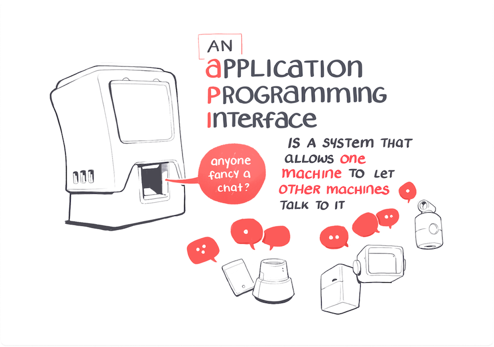
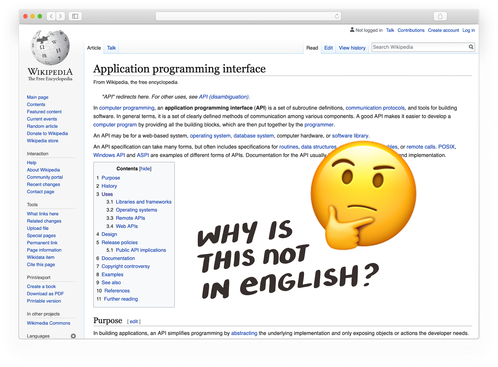
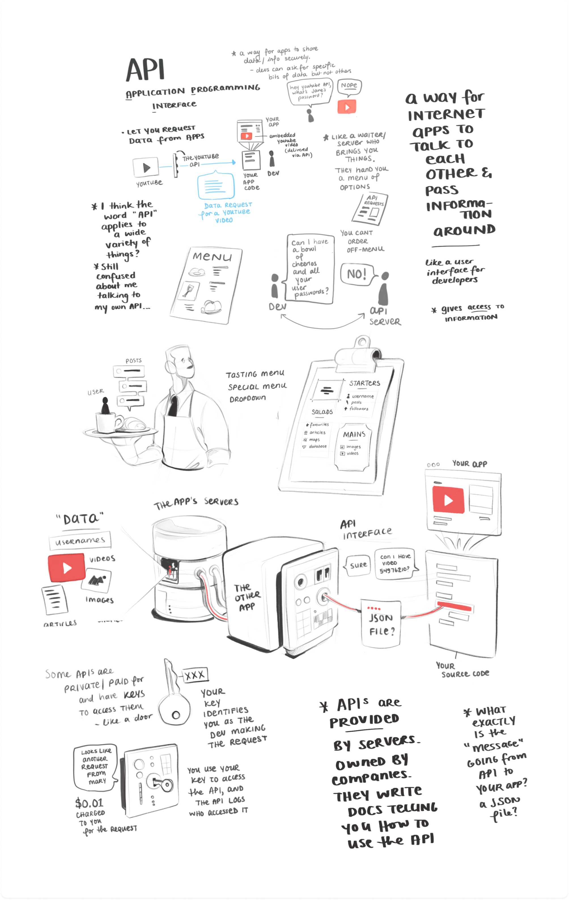
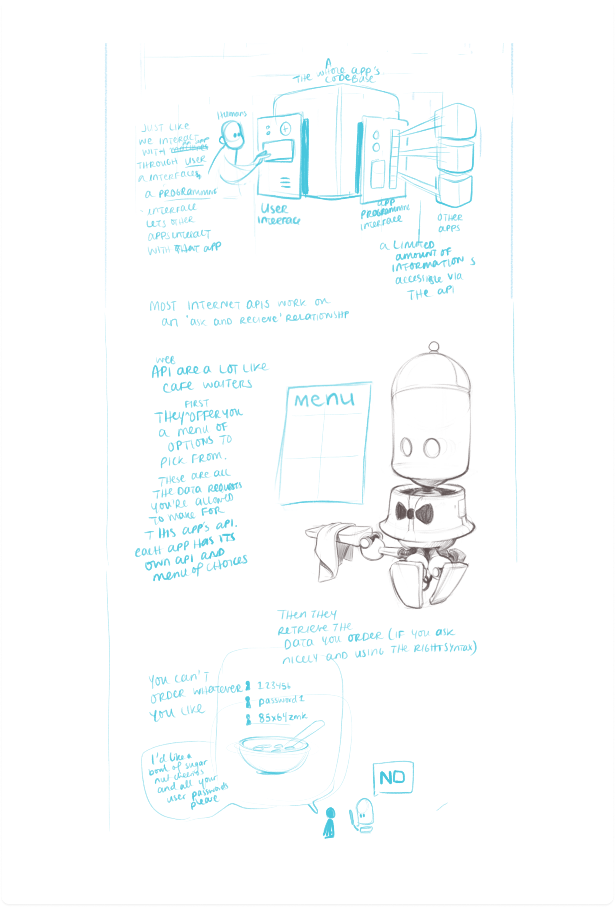
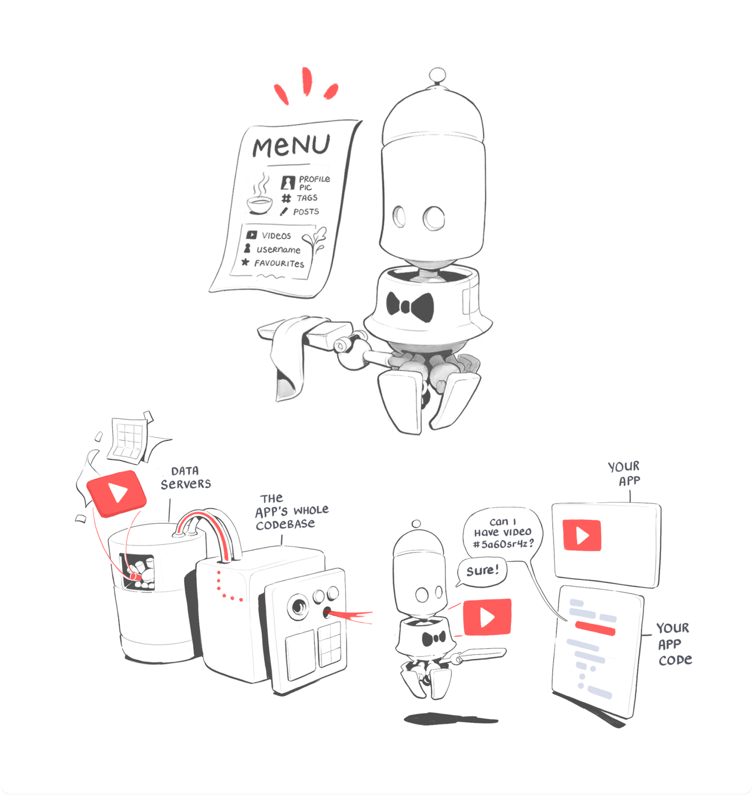

This week I've been drawing APIs —or to use their thrilling real name, **application programming interfaces.**

APIs have been on my list of things I pretend to understand for a while.
The *yeah-i-kinda-sorta-know-what-that-is-but-not* list.

But then I started learning [GraphQL](https://www.graphql.com/), a tool that improves how we talk to APIs.

And was promptly smacked in the face by my abysmal foundational API knowledge.

It was clearly time to fix it.

---

So I went where we all go to learn stuff: the internet.

Sadly, it’s hell-bent on giving explanations of API's drier than a cracker left on Ayer's Rock 400 years ago.

*“APIs are a set of functions and procedures allowing the creation of applications that access the features or data of an operating system, application, or other service.”*

I don't know about you, but I zoned out on word #7.

Explanations like this make sense if you’re already a veteran database engineer. But for the rest of us they lead nowhere.

But I needed to figure it out. So I made the written-for-humans explanation of APIs I personally needed.

By drawing it.

---

Research started with 99 tabs open and a sprawling page of rubbish notes as I tried to make sense of all the explanations I was finding.

Which matured into a rough outline, centred around the metaphor that API's are a lot like cafe waiters offering you a menu of options.

And if you’re going to draw a waiter, you may as well make them a tiny robotic waiter…

(Golden rule: If you spot an opportunity to draw a robot, do it!)

I hope this saves you from ever having to read Wikipedia's API page.
Or at least give you a sense of what it’s actually trying to say.
 

