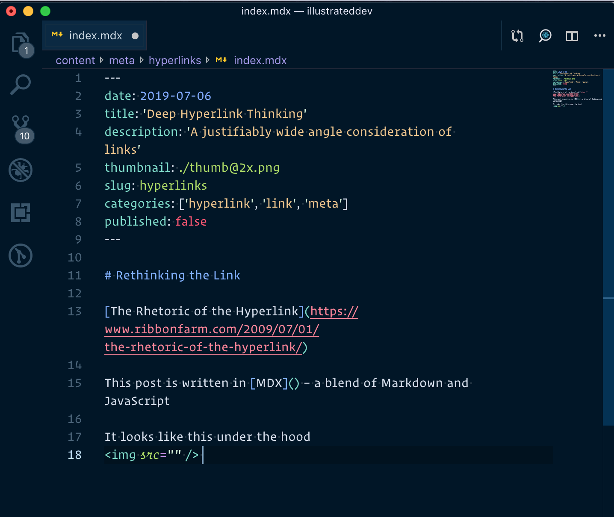

# Rethinking the Link

[The Rhetoric of the Hyperlink](https://www.ribbonfarm.com/2009/07/01/the-rhetoric-of-the-hyperlink/)

The hyperlink as a medium
The invitation to context switch
Contextual asides

If you're ever read a David Foster Wallace article <Footnote>I strongly suggest *A Supposably Fun Thing I'll Never Do Again">/Footnote>, you'll be familiar with his footnote-as-entire-book-in-itself format.

This post is written in [MDX]() – a blend of Markdown and JavaScript
<Footnote>The full tech stack is built in [Gatsby]() – a site builder that uses [React]() and [GraphQL]()</Footnote>

It looks like this under the hood
 