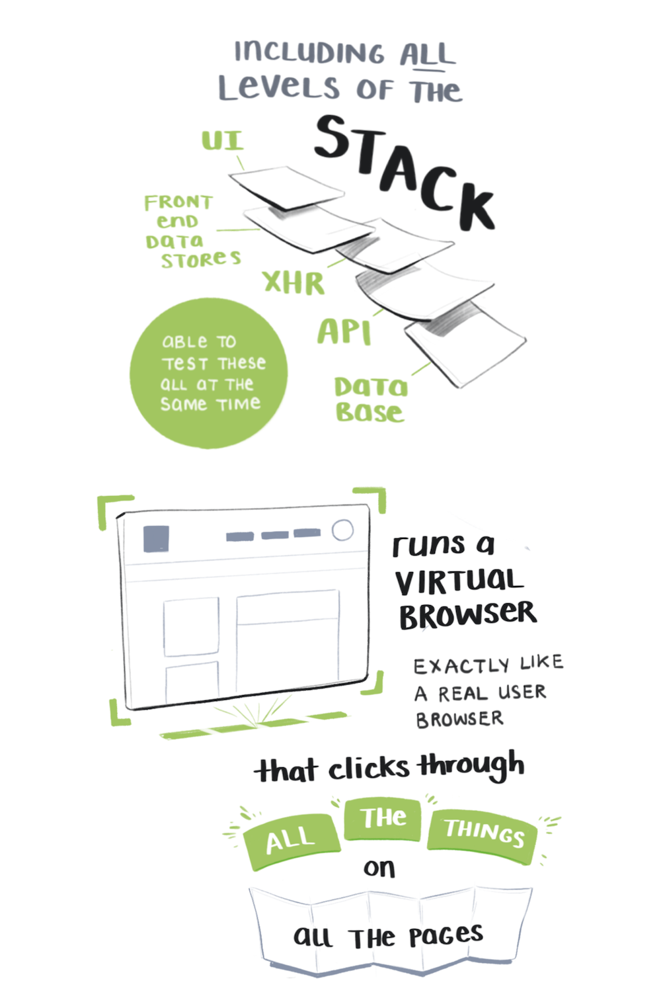
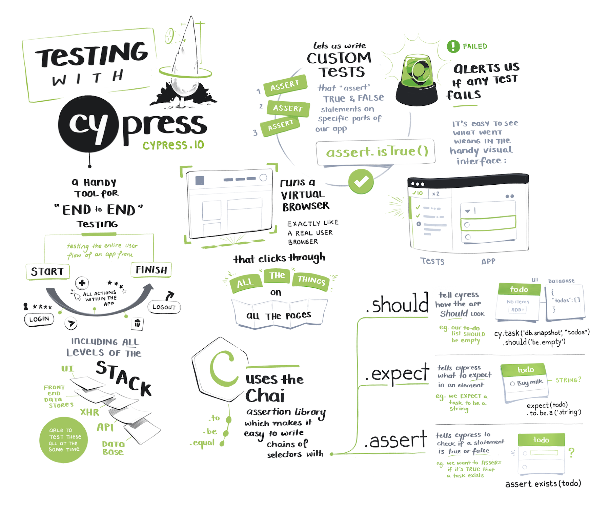

import DownloadSection from './DownloadSection.js'

<!-- To make the <DownloadSection /> component work, you have to put the image as an inline MDX component. Renders through {props.children}.
Leaving empty lines between the component tags and the inline image is also necessary  -->
<DownloadSection header='The Full Sketchnote' subheader='Cypress.io Testing'>

</DownloadSection>