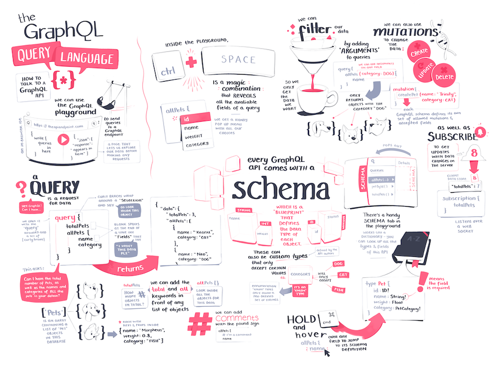

import FullSketchnote from '../../../src/components/mdx/FullSketchnote.js'
import SketchesContainer from '../../../src/components/mdx/SketchesContainer.js'

<SketchesContainer>

![] (./graphql1.png)

![] (./graphql2.png)

![] (./graphql3.png)

<FullSketchnote coursename="GraphQL Query Language" courselink="https://egghead.io/courses/graphql-query-language">

</FullSketchnote>

</SketchesContainer>

