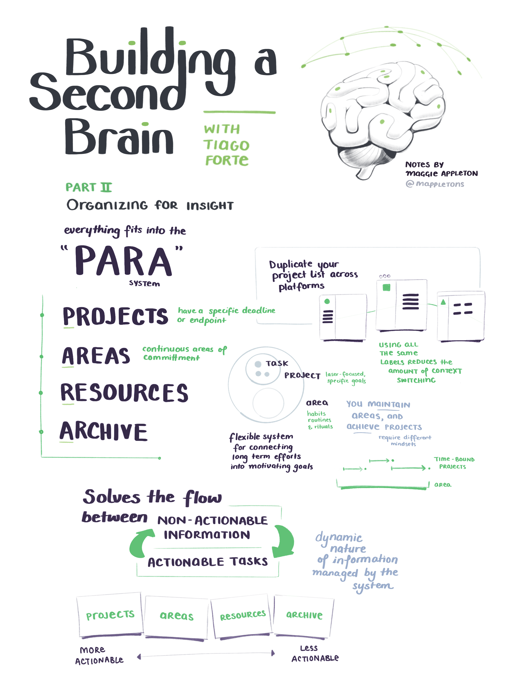
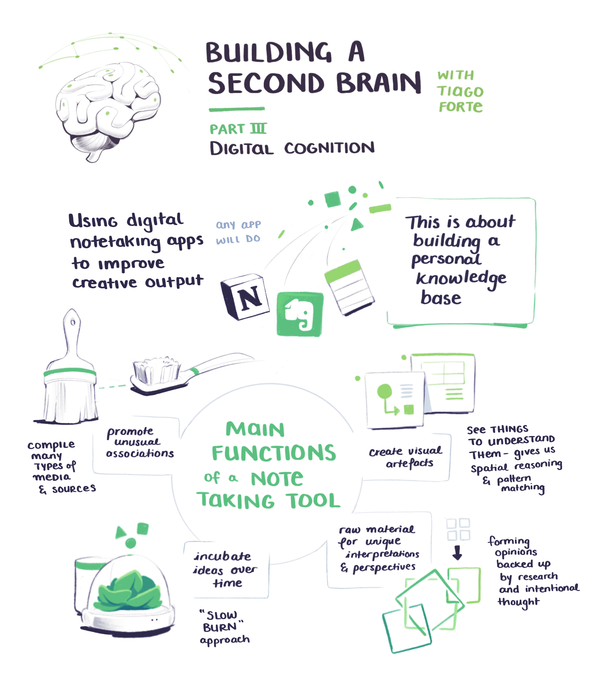
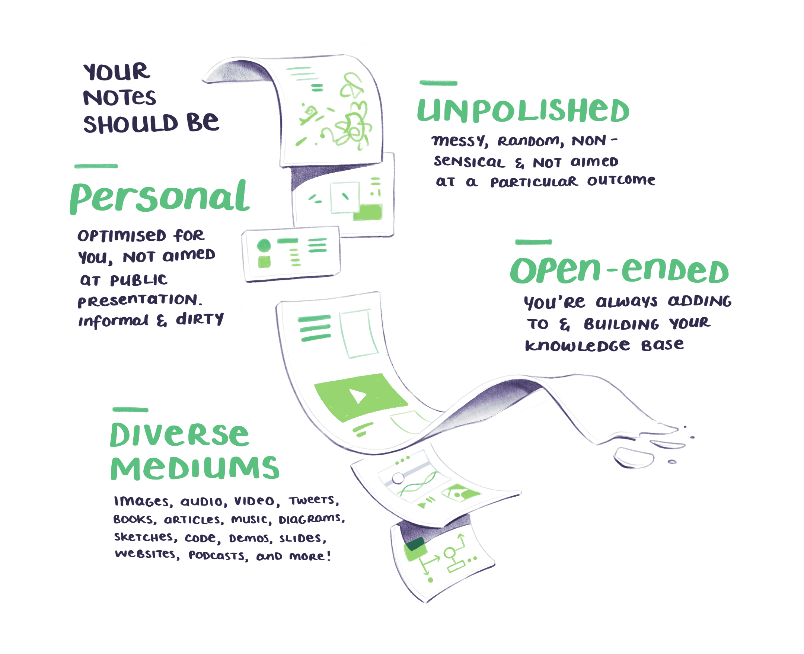
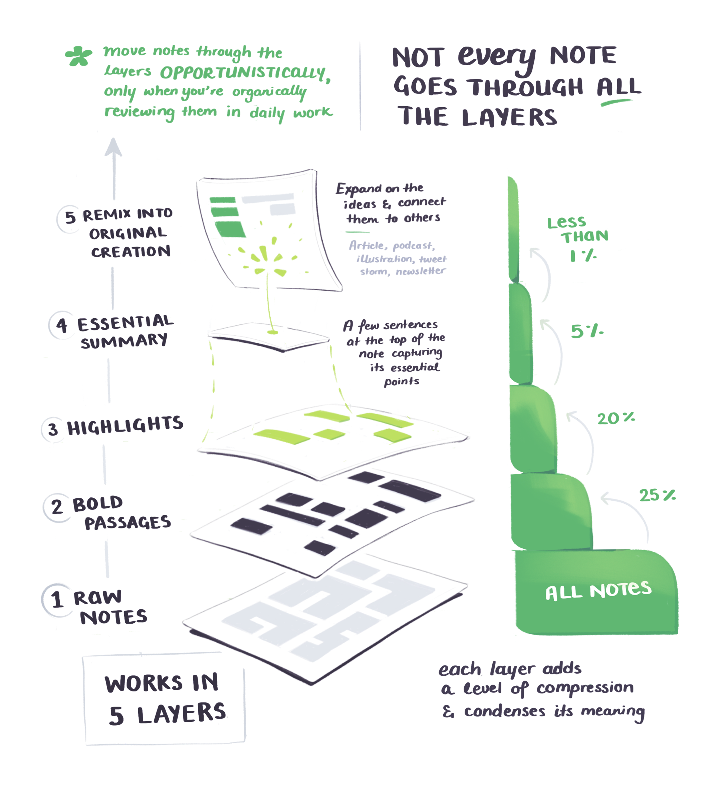
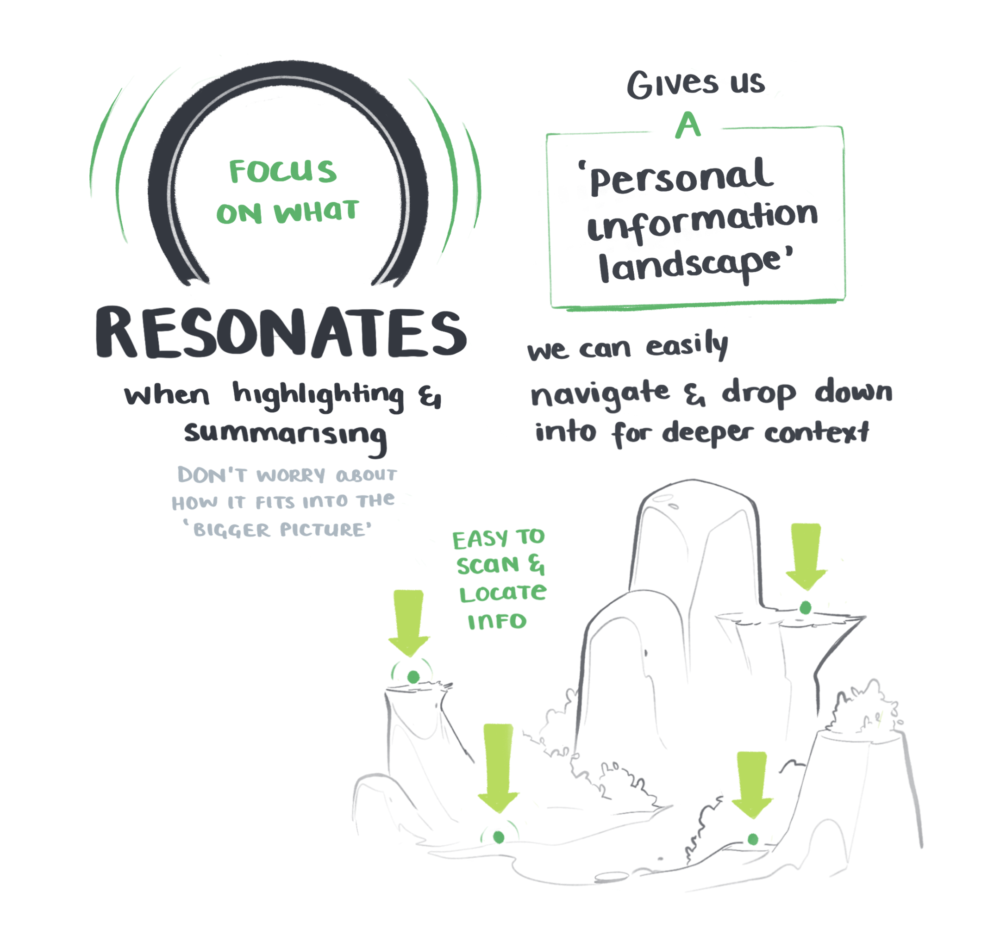
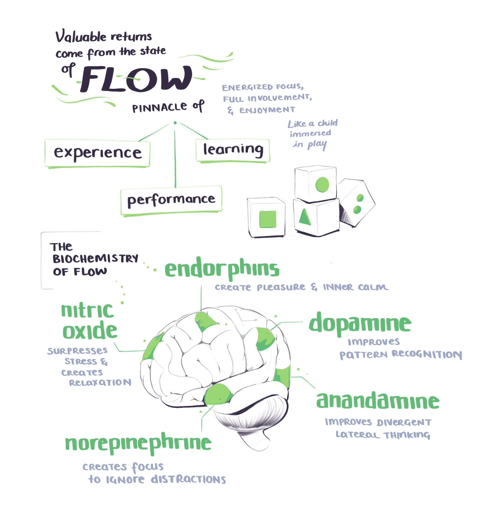
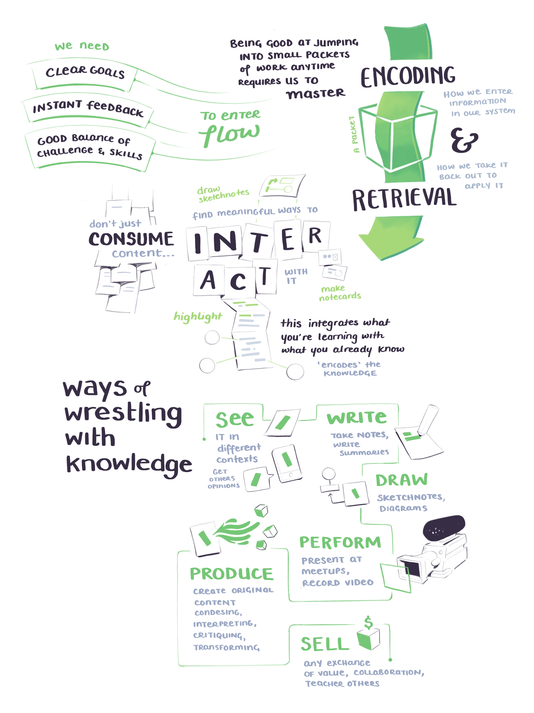

import FullSketchnote from '../../../src/components/mdx/FullSketchnote.js'
import SketchesContainer from '../../../src/components/mdx/SketchesContainer.js'
import Link from '../../../src/components/link'
import InlineSignUp from '../../../src/components/inlineSubscribe.js'

<SketchesContainer>

This is little different to my usual topics.  
It's not explicitly about how to build things on the internet.  
But I think you'll appreciate it anyway.

### I've been taking a course called <Link to='https://www.buildingasecondbrain.com'>Building a Second Brain</Link> by <Link to='https://twitter.com/fortelabs'>Tiago Forte</Link>.

Much like it sounds, Building a Second Brain is about creating a reliable system – outside your physical skin-and-bone bodily boundaries – for storing, organising, digesting, and eventually transforming information into Good Creative Output. 

Given that development work heavily involves designing systems and strutures, it's an approach to personal knowledge management that will feel intuitive for dev-like-minds.

Here are my sketchnotes from the first 4 parts of the course
###### (There's no Part I here as it's mostly tech setup and housekeeping details in the course)

---

---

---

---

---
To be clear there's no affiliate links or kickback involved in these notes. 
I'm not being paid to say nice things about the course.  

Tiago's ideas and systems are just **Good**.  
He thinks everything through deeply and thoroughly in a way that feels rare on the insta-internet.

I'm still only halfway through the course, but I'll add more notes here as I go.
Might be useful to bookmark this page if you want to check back in a couple weeks when they're all up.

Hope it gave you a bit of insight into the BASB system.
There's plenty more to explore on Tiago's [Forte Labs Blog](https://praxis.fortelabs.co/) and he's [very good at tweeting](https://twitter.com/fortelabs).

<InlineSignUp />

</SketchesContainer>