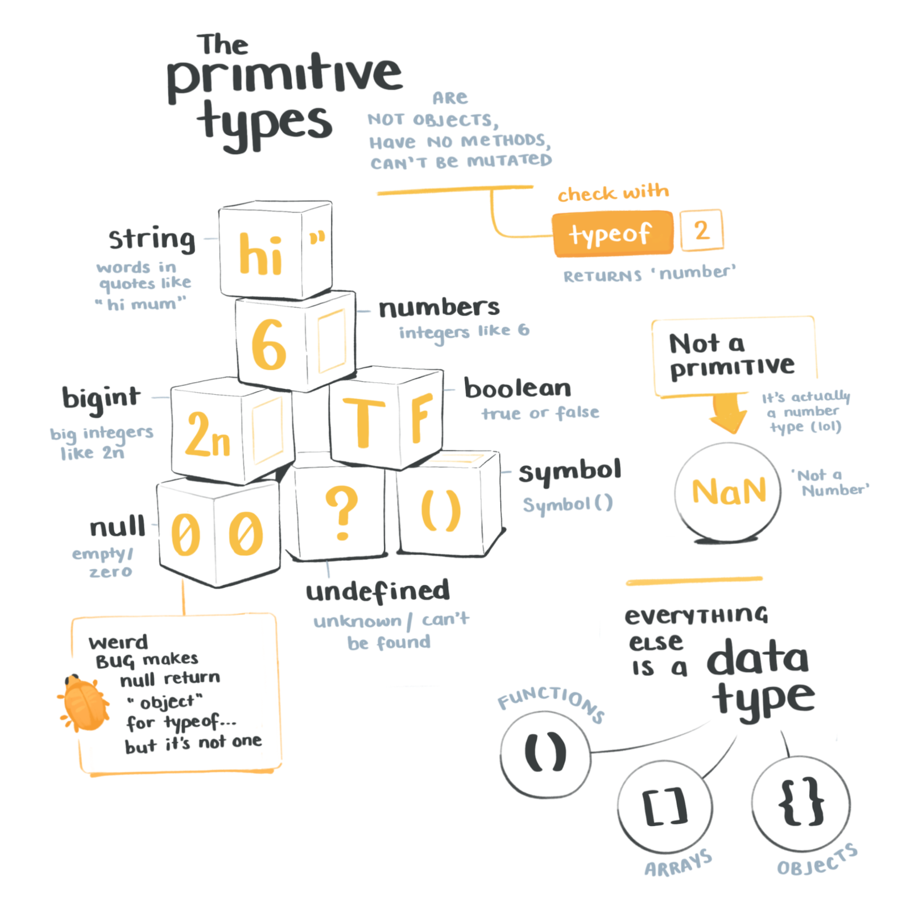
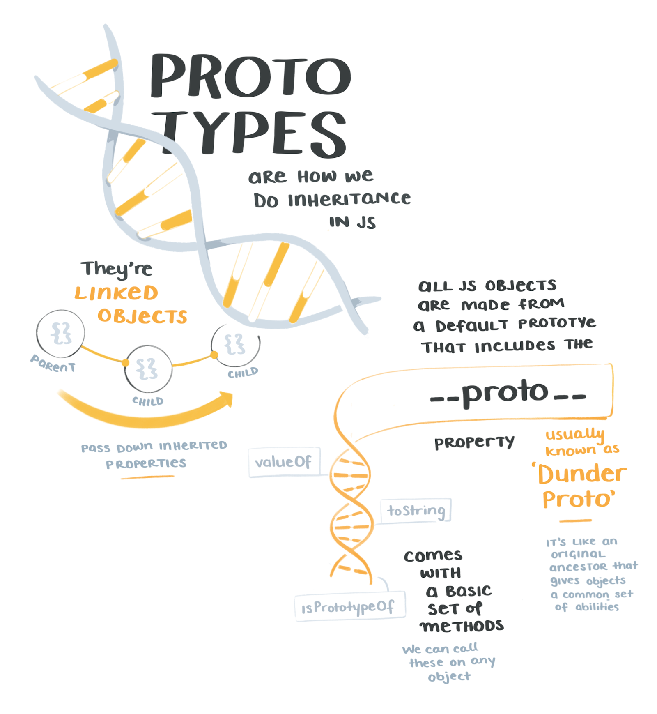
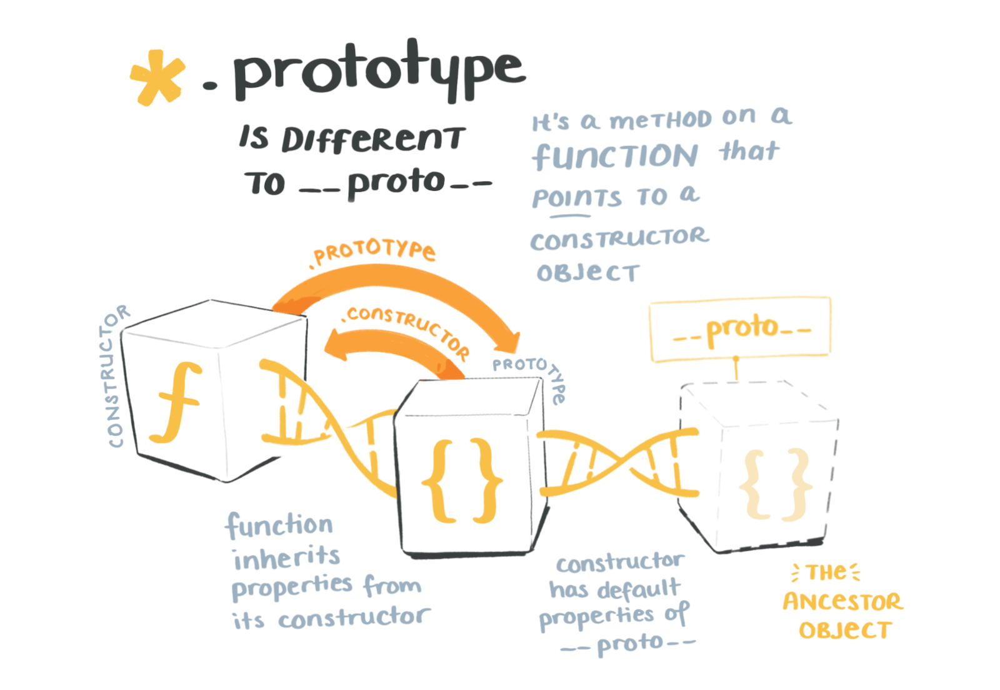
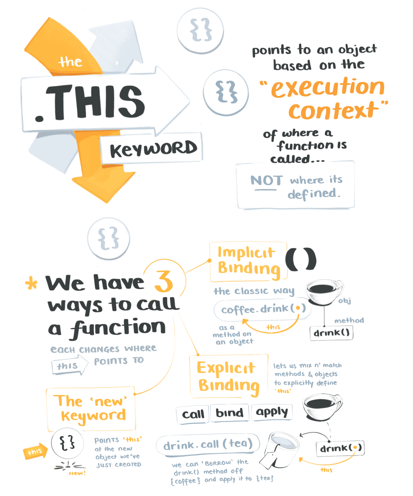

import FullSketchnote from '../../../src/components/mdx/FullSketchnote.js'
import SketchesContainer from '../../../src/components/mdx/SketchesContainer.js'

<SketchesContainer>

Being humans, we rarely learn things linearly.  
No one begins their JavaScript journey by reading [the TC39 language specification](https://www.ecma-international.org/ecma-262/5.1/) line-by-line like a pedantic masochist.

Instead we all cobble together a good-enough understanding, leaving holes here and there to fill in later.

So far I've stumbled along without 100% grokking prototypical inheritance, or how `call, apply,` and `bind` work on functions.  
It's fine. Stuff mostly works. Until it doesn't  ¯\_(ツ)_/¯

But at some point, it's useful to stop stumbling about and  peek back at those holes.

[Tyler Clark](https://twitter.com/iamtylerwclark)'s latest course on [Advanced JavaScript Foundations](https://egghead.io/courses/advanced-javascript-foundations?af=54fd64) is exactly that hole-filling opportunity.

Tyler runs through all the details that usually get skipped over in beginners tutorials.  The ones that make a huge difference when you're deep in a debugging session, and can't figure out where the f🍪🍩k `this` is pointing and why all your results are `undefined`.

Here's some of my sketch notes from the course – they include plenty of DNA inheritence metaphors 🧬 and a few cups of caffiene to keep you alert.

 

 

 

Hopefully these gave you a sense of the main concepts, and a small map of where your own JavaScript 🕳 holes are (or lack of holes if you've already diligently filled them in!) 

---

<FullSketchnote coursename="Advanced JavaScript Fundamentals" courselink="https://egghead.io/courses/advanced-javascript-foundations?af=54fd64">

</FullSketchnote>

</SketchesContainer>