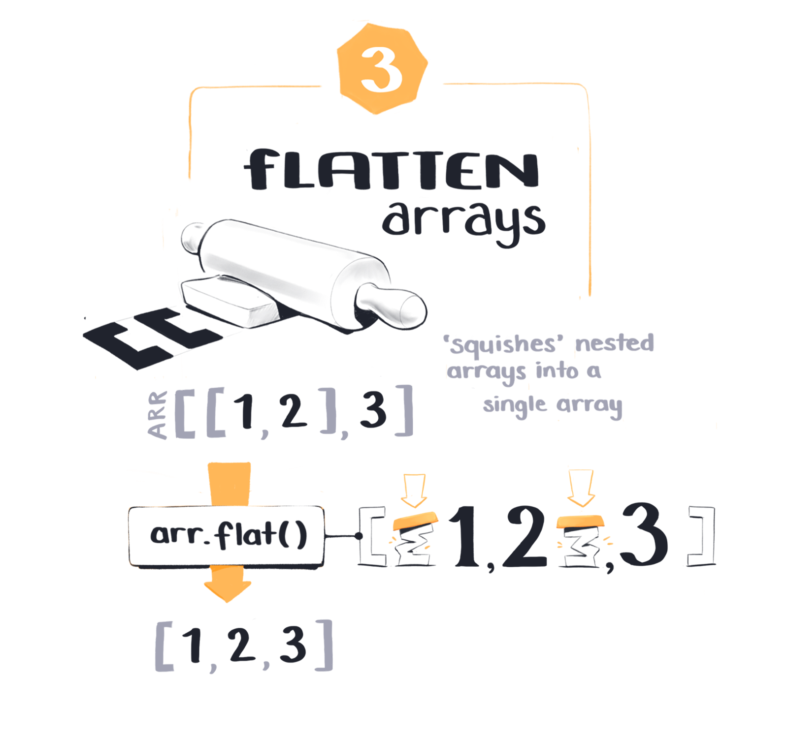
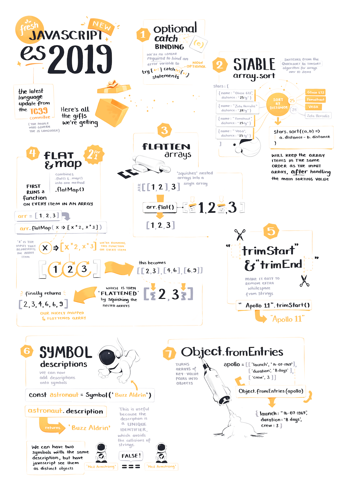

import FullSketchnote from '../../../src/components/mdx/FullSketchnote.js'
import SketchesContainer from '../../../src/components/mdx/SketchesContainer.js'
import Link from '../../../src/components/Link.js'

<SketchesContainer>

<h3 style="text-align: center;"> A new version of JavaScript has landed! </h3>

Every year JavaScript gets a handful of new features and functions for everyone to play with.

The [TC39 committee](https://tc39.es/) have now released the 2019 additions to [ECMAScript](https://www.ecma-international.org/memento/tc39.htm), which is the generally accepted version of JavaScript we all know and ~~love~~ tolerate.

You can take a look at the [TC39 Github](https://github.com/tc39) to track the progress of proposed features, including [all the ones they've accepted into the official language] (https://github.com/tc39/proposals/blob/master/finished-proposals.md).

Mike Sherov just put together a new egghead course on [Javascript ES2019 in Practice](https://egghead.io/courses/javascript-es2019-in-practice) which is a good summary of all the new shiny bits, as well as how they apply in IRL dev situations.

I drew up my own notes on the 7 big changes:

* Optional Catch Binding
* Stable `array.sort()`
* Flatten Arrays with `flat()`
* Flatten & Map Arrays with `flatMap()`
* Cut out Whitespace with `trimStart()` & `trimEnd()`
* Descriptions on Symbols
* Create Objects from Entries with `fromEntries()`

<h6 style="width: 80%; text-align: center; margin: 0 auto;">Note that the space theme going on here has less to do with ES2019 and more to do with me watching [Apollo 11](https://www.imdb.com/title/tt8760684/) last week.  
     _(Five stars, would recommend)_.</h6>

---

<FullSketchnote coursename="Javascript ES2019 in Practice" courselink="https://egghead.io/courses/javascript-es2019-in-practice">

</FullSketchnote>

</SketchesContainer>