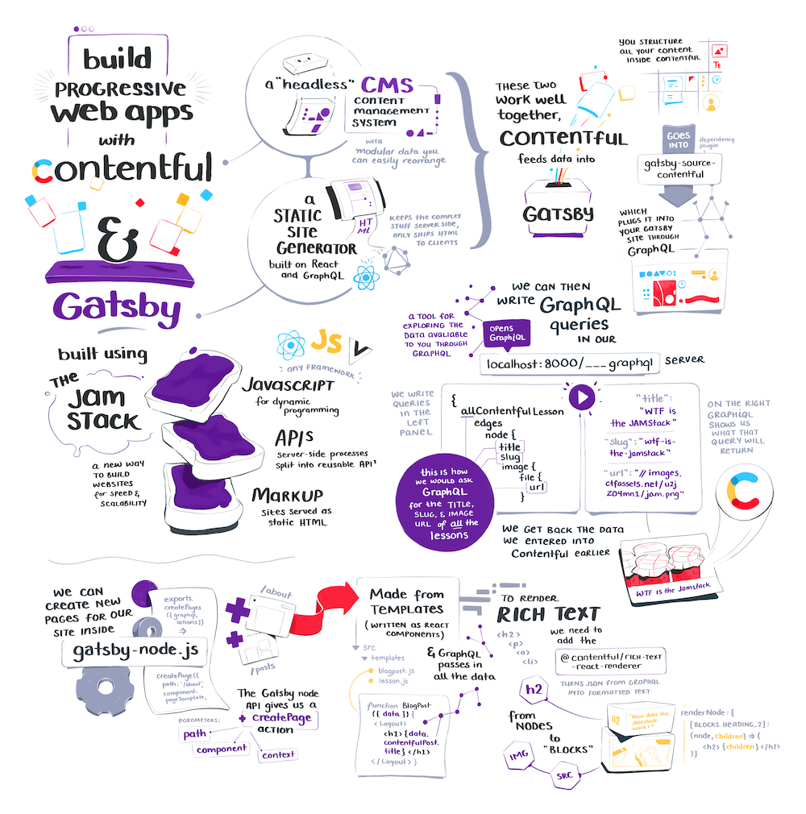

import FullSketchnote from '../../../src/components/mdx/FullSketchnote.js'
import SketchesContainer from '../../../src/components/mdx/SketchesContainer.js'
import Link from '../../../src/components/Link.js'

<SketchesContainer>

If you've been keeping up with the sweetest new static-site generation tools, you'll have heard of the JAMstack.
<h6>And if you haven't, <a target="_blank" href="https://jamstack.wtf/">Jamstack WTF</a> explains it well.</h6>

The TLDR here is that combining Javascript, APIs, and Markup (JAM) makes it easy to build sites that work well across all kinds of devices and data loading speeds. Which, like jam, makes everyone happy.

[Gatsby](https://www.gatsbyjs.org/) and [Contentful](https://www.contentful.com/) are  the power couple of the JAMstack. They're tools built for the task, and a fantastic combination if you're building with JAM for the first time.

[Khaled Garbaya](https://khaledgarbaya.net/) just released [a new egghead course](https://egghead.io/courses/build-content-rich-progressive-web-apps-with-gatsby-and-contentful) that walks you through hooking these two up.

<Link to="https://egghead.io/courses/build-content-rich-progressive-web-apps-with-gatsby-and-contentful">

</Link>

I'm keen on Gatsby since this whole site is built with it. Working through the course filled in quite a few holes I had around it's inner workings.

As usual, I made sure to take notes:

---

<FullSketchnote coursename="Build Web Apps with Gatsby and Contentful" courselink="https://egghead.io/courses/build-content-rich-progressive-web-apps-with-gatsby-and-contentful">

</FullSketchnote>

</SketchesContainer>