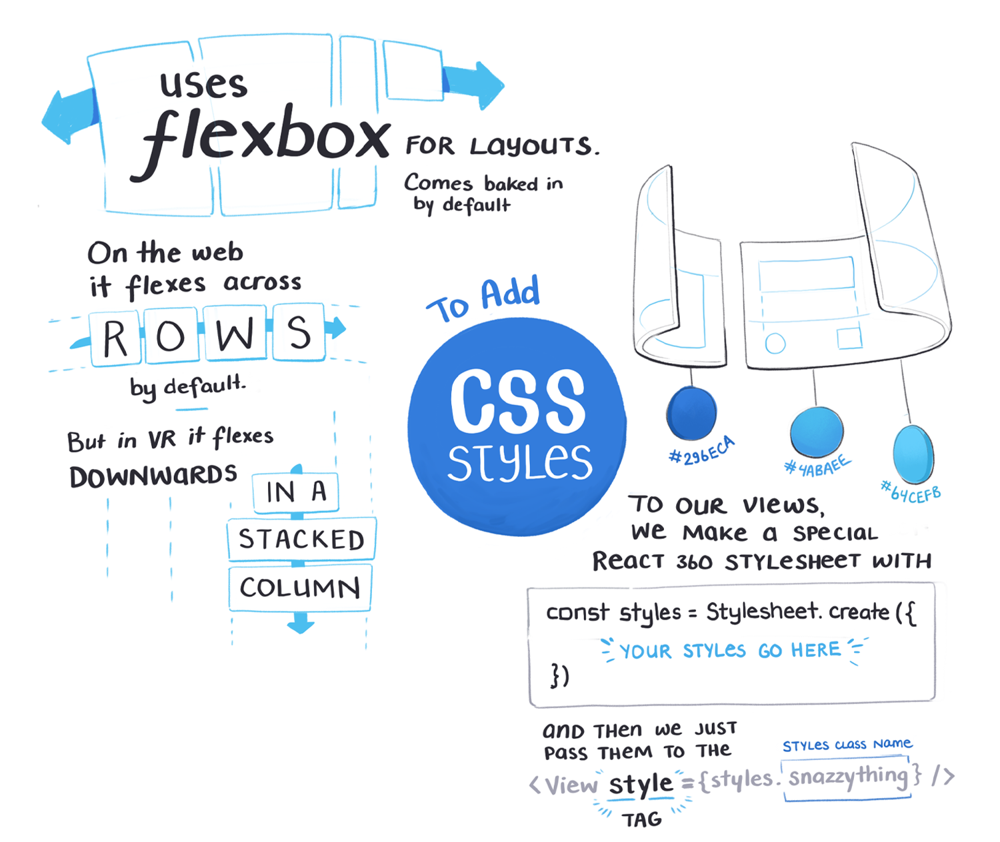

import Link from '../../../src/components/link.js'

Turns out you can build almost anything in React now... including VR and AR apps inside a web browser.

There's a version of React called '[React 360](https://facebook.github.io/react-360/)' that simplifies the otherwise niche and overly-complex challenge of making things fly around in virtual 3D space.

[Tomasz Lakomy](https://egghead.io/instructors/tomasz-lakomy) is putting together an egghead course all about it.

<Link to="https://egghead.io/courses/vr-applications-using-react-360?rc=272bjb">

</Link>

So I've been sketching out notes on some of the basic concepts while watching his lessons.

---

<h2 style="text-align: center;">The Full Sketchnote</h2>

 

Want to learn more?
A high-res version of the sketchnote plus the full [VR Applications Using React360](https://egghead.io/courses/vr-applications-using-react-360?rc=272bjb) course will be out soon. Best to keep an eye on that page if it's a topic you're into.

