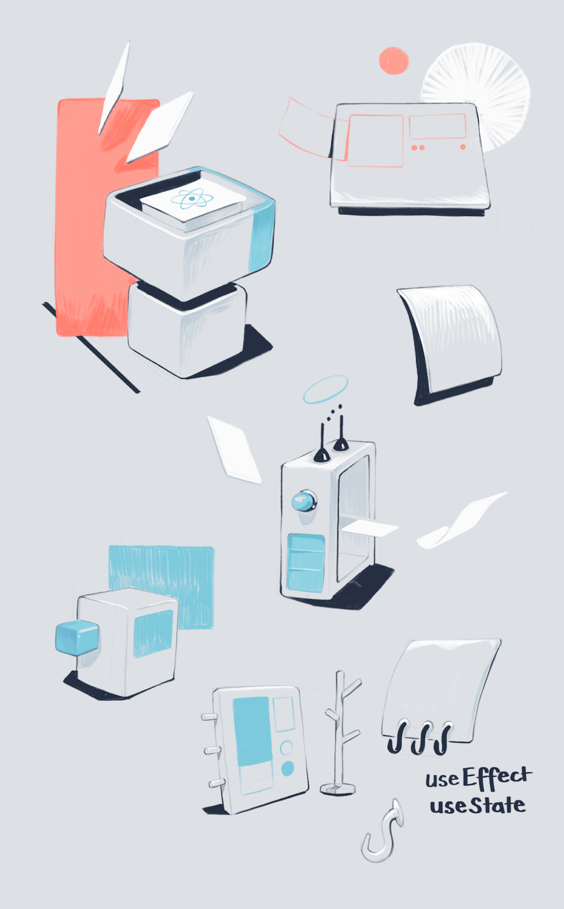

import TwoCol from '../../../src/components/mdx/TwoCol.js'
import SmallCenter from '../../../src/components/mdx/SmallCenter.js'

Earlier this year I was lucky enough to attend the [ReactJS Girls Conference](https://reactjsgirls.com/) here in London.  
As you might have guessed, it involved a lot of React and a lot of great female speakers.

While listening to [Manjula Dube](https://twitter.com/manjula_dube?lang=en) explain React hooks, and [Marcy Sutton](https://marcysutton.com/) walk us through making React components accessible, I spent the day doodling flying components and functions and props on my iPad.

<SmallCenter>

  

</SmallCenter>

<TwoCol>

</TwoCol>

I always enjoy fun-drawing at conferences where I'm just an attendee, and not there as an official sketchnoter (something I occasionally do professionally).

These aren't well-crafted summaries of the content.  
They're just a product of me relaxing while listening.  
Though they loosely relate to what's happening on stage.

<SmallCenter>

</SmallCenter>

