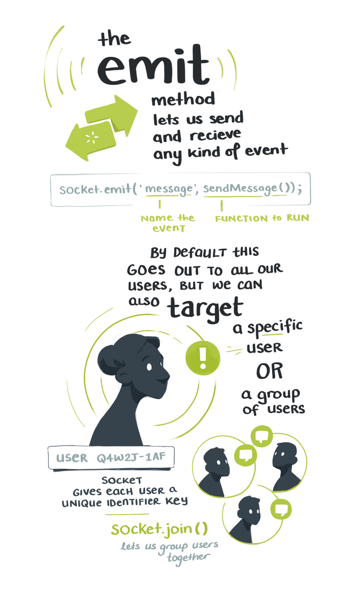

import FullSketchnote from '../../../src/components/mdx/FullSketchnote.js'
import SketchesContainer from '../../../src/components/mdx/SketchesContainer.js'
import Link from '../../../src/components/link.js'

<SketchesContainer>

The *intantness* of chat apps has always been a mystery to me.  
The technical details of moving emojis through The Internet Pipes and across continents in 0.004 miliseconds is well beyond my paygrade.

But I got a tiny window of insight into the magic this week while sketching notes for <Link to="https://egghead.io/courses/vue-and-socket-io-for-real-time-communication?af=54fd64">Mark Barton's new course</Link>

<Link to="https://egghead.io/courses/vue-and-socket-io-for-real-time-communication?af=54fd64">

</Link>

It's on building an instant chat app with [Vue.js](https://vuejs.org/) and [Socket.io](https://socket.io/).

Turns out it's not magic, but instead done through [websockets](https://en.wikipedia.org/wiki/WebSocket). Which are like little portals that hold open a consistent connection between two machines.

I obviously still haven't a clue what goes on inside that dark little portal. Thankfully using tools like Vue & Socket.io save us from that level of depth. 

---

<FullSketchnote coursename="Vue and Socket.io for Real-Time Communication" courselink="https://egghead.io/courses/vue-and-socket-io-for-real-time-communication?rc=272bjb">

</FullSketchnote>

</SketchesContainer>