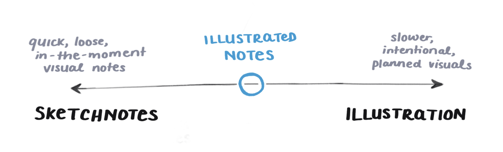

### What tools do you use to make these?
Primarily my brain and upper body limbs.  
With a little help from [Procreate](https://procreate.art/) on an iPad Pro. I'll do a smidgeon of final colour and brightness editing in Photoshop as well, but it's a pretty minor step.
<!-- I'm betting want more information than that, so I wrote you [a whole post about it](#). -->

### I want prints of these. Can I buy prints from you or print them myself?
You can indeed print versions of these for yourself!  
The image quality on the blog and twitter is pretty low for printing (72dpi).  
But if you join my email list I send out high-quality, downloadable versions on there (300dpi – big enough to print on the side of a wall if you so desire).  

I'm not fan of the carbon emissions involved in printing, storing, and shipping these from a central location. So if you want professional prints I suggest finding a local printer near you and sending them the high-res files.  
The prints are designed to fit a 13 x 19" / 33 x 48cm canvas.

### What does the powered by egghead badge on the homepage mean?
I am terribly lucky to work at [egghead](https://egghead.io/) full time, and my fellow eggos™️ help me out a lot with this site.  They offer guidance, support, feedback, and dev help when I break all the things in my *gatsby-config.js* file.  
You'll notice almost all my sketchnotes are of egghead courses, and we include them on the course pages on our main site.  
**Illustrated.dev** is a mini-offshoot project – they're distinct but deeply intertwined.

### Are these comics?
Not really - comics tell a narrative story over time.  
These explain non-narrative topics and explore ideas atemporarily out of time. They share a lot of comic-like qualities though, and I've spent countless hours studying & stealing techniques from comic artists like [Will Eisner](https://en.wikipedia.org/wiki/Will_Eisner), [Nick Sousanis](http://spinweaveandcut.com/), and [Scott McCloud](http://scottmccloud.com/).

### Are these infographics?
Not really - infographics have a particular aesthetic that makes my eyes bleed.
While technically these do communicate information through graphics, the word *infographic* comes with visual baggage. And I would like to run very, very far away from it.

### Are these sketchnotes?
Kind of – if we define 'sketchnoting' as drawing visual notes on a particular topic then yes, that aligns quite nicely.   
However, they're far more crafted and planned than stream-of-consciousness sketches drawn in one fell swoop.  
I collect a mountain of notes while researching, write some loose outlines and key points, draw tiny thumbnails on post-its, rearrange the post-its, rewrite the words, draw bigger rough sketches, get feedback, make another cup of tea and think about metaphors, plan a compositional flow, and eventually do a final line work pass over the top.  
 Like all things worth doing, the process is disappointingly slow 🙂  

<!-- Let's just say they're somewhere here:

 -->

### Okay fine. So what buzzword am I supposed to use to describe these?
I think about this too much, but I like **illustrated notes**, or **illustrated explainations**.  I also like *visual essays*, but use that to describe things I make that have a more opinionated point of view.  
Suggestions for better words [welcome and accepted](malito:maggie@illustrated.dev) 😉

---

export default ({ children }) => (
  <>
    {children}
  </>
)